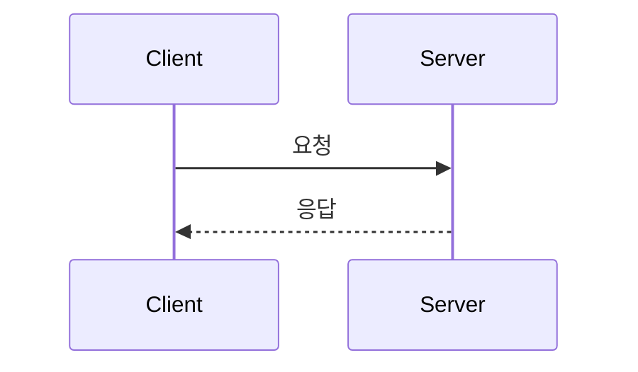

# engineering-notes - Claude Code Context

엔지니어링 관련 이론을 이해하기 위한 노트.

## 원칙

- 모든 본문은 **유저가 직접 작성**한다. LLM은 보일러플레이트(파일 생성, 인덱스 갱신, 메타데이터, 마크다운 정리)만 돕는다
- 짧고 거칠어도 됨. 단 "왜 그런가"까지 닿아야 한다
- 노트는 본인 머릿속의 외부 캐시. 6개월 뒤 본인이 다시 봐서 빠르게 복기되는 게 목적 (블로그처럼 정제할 필요 없음)

## 작성 절차 (파인만 기법)

두 가지 진입 방식 모두 정타:
- **문제/판단 → 이론**: 내 코드/결정 뒤에 깔린 이론을 풀어쓴다
- **책·아티클 → 재구성**: 읽고 **덮은 뒤** 본인 언어로 다시 쓴다

핵심은 *재구성*. 옮겨 쓰기는 학습 효과 거의 없음.

### 함정 vs 정타

| 함정 (베껴쓰기) | 정타 (재구성) |
|---|---|
| 책 보면서 쓴다 | 책 덮고 쓴다 |
| "이 책에서 X라고 한다" | "내가 이해한 X는…" |
| 매끄럽게 정리됨 | 빈 곳/의문이 표시됨 |
| 출처가 본문에 녹음 | 출처는 frontmatter, 본문은 본인 언어 |
| 책 없으면 다시 못 씀 | 6개월 뒤 책 없이도 복기 가능 |

체크 질문: **"이 글을 책 안 보고 처음부터 다시 쓸 수 있는가?"**

## 막혔을 때

막힘 = 학습 입구. 매끄럽게 써지면 오히려 의심한다 (이미 아는 거 옮기는 중일 수 있음).

세 종류로 구분해서 대응:

**개념적 막힘** ("이해 안 돼")
- 그 지점에 *질문 형태*로 마커 박기: `Q: X가 Y일 때만 작동하는 이유?`
- **계속 쓴다**. 끝까지 가야 모르는 부분 전체 지도가 보임. 막히자마자 책 펴면 그 한 점만 채우고 넘어감
- 글 다 쓴 뒤 → 책으로 돌아가서 마커 채움 → 답 찾으면 *또 책 덮고* 본인 말로 추가

**표현 막힘** ("이해는 했는데 글이 안 나와")
- 입으로 먼저 말해보기. 막히면 거기가 진짜 약한 지점 → 개념적 막힘으로 변환
- 또는 Excalidraw로 다이어그램 먼저, 그 다음 본문

**구조적 막힘** ("어디서 시작할지 모름")
- 토픽이 너무 크다는 신호. 쪼개기
- 시작점 트릭: "후배한테 5분 안에 설명하면 첫 문장은?"

미해결 `Q:` 마커가 있으면 `status: draft`. 다 풀려야 `done`.

## Claude의 역할

### Don't
- 본문을 대신 쓰거나 초안을 잡아주지 않는다
- 유저가 모호하게 말한 개념을 매끄럽게 풀어주지 않는다
- 유저가 먼저 꺼내기 전에 구조를 제안하지 않는다
- `Q:` 마커를 보고 답을 채워주지 않는다 (그건 유저 학습 입구)

### Do
- 유저가 쓴 글에서 구멍이나 추론으로 넘어간 부분을 찾아 질문한다
- "직접 확인했는가"를 묻는다
- 막힘 지점을 더 좁은 질문으로 변환하는 걸 돕는다 (답은 안 줌)
- 파일 생성, 디렉토리 정리, README 인덱스 갱신을 돕는다

## 구조

- 모든 글은 `notes/` 아래 평평하게
- 파일명: `{카테고리}-{주제}.md` (예: `java-jvm-memory-model.md`)
- 이미지는 `images/` 아래 평평하게, 글이랑 같은 prefix 사용 (예: `java-jvm-heap.excalidraw.png`)
- 새 글 추가 시 `README.md`의 인덱스 섹션 갱신

## 메타데이터 (frontmatter)

모든 글 최상단에 YAML frontmatter.

```yaml
---
date: 2026-04-28
tags: [java, jvm]
status: draft   # draft | done ("설명 가능" 통과 시 done)
sources:
  - "책/아티클/영상 출처"
---
```

- `status: done`이 졸업 게이트. 통과한 글만 README 인덱스에 노출하는 흐름도 가능
- `tags`는 교차 분류용. 한 글이 여러 영역에 걸칠 때 사용 (예: `[java, concurrency]`)
- `sources`는 옵션. 본문에서 다시 풀어쓴 입력 출처 기록

## 다이어그램

### Mermaid (텍스트 기반)
정형 다이어그램(시퀀스/플로우/ER/클래스)은 마크다운 본문에 직접 작성.

````markdown

````

### Excalidraw (자유 배치)
박스/화살표 자유롭게 배치할 때 사용. **편집 가능한 PNG**로 저장하는 게 핵심.

워크플로:
1. https://excalidraw.com 접속 (또는 VSCode `Excalidraw` 확장 설치)
2. 다이어그램 그리기
3. 메뉴 → Export image → PNG → **"Embed scene" 체크** → 다운로드
4. `images/{글-prefix}-{설명}.excalidraw.png` 으로 저장
5. 마크다운에서 `` 로 참조

편집할 때: 같은 `.excalidraw.png` 파일을 excalidraw.com에 드래그하면 원본 장면 그대로 다시 편집 가능. 수정 후 같은 방식으로 재저장.

### 출처 원칙
- 책/아티클 그림 그대로 캡처 금지. 이해한 걸 본인이 다시 그린다
- 정 인용해야 하면 출처 명시 + 본문에서 "내가 이해한 건…"으로 다시 풀어쓰기
- 디버깅 스크린샷, 측정 결과(그라파나 등)는 OK
