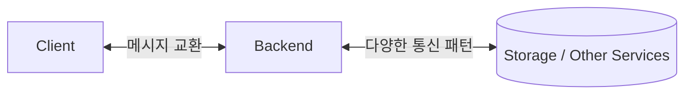
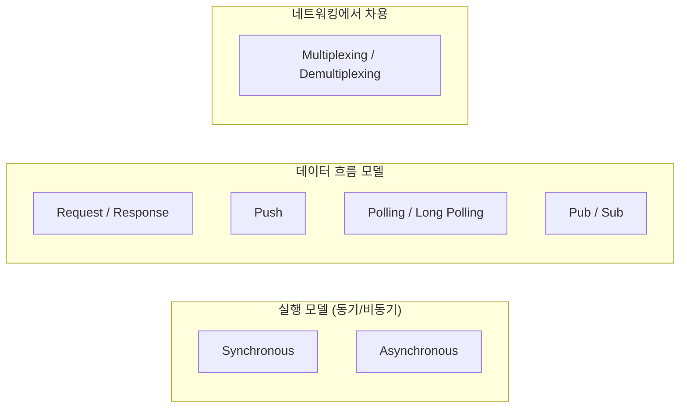

# 06. 백엔드 통신 설계 패턴 소개 (Backend Communication Design Patterns Intro)

## 개요

이 강의는 "백엔드 통신 설계 패턴(Backend Communication Design Patterns)" 섹션을 여는 인트로다. 강사는 17~18년 동안 소프트웨어를 만들면서 백엔드 애플리케이션을 구축할 때 **반복적으로 등장하는 통신 패턴**이 있다는 사실을 발견했고, 이 섹션에서는 그것을 **퍼스트 프린시플(first principles)** 관점에서 정리한다.

백엔드 엔지니어 입장에서 이 패턴들을 알아두면 좋은 이유:

- Netflix, Google, Twitter 같은 거대 서비스도 결국 이 기본 패턴들의 조합으로 구성된다.
- 새로운 기술/프레임워크가 나올 때마다 "이건 결국 어떤 패턴인가?"라는 관점에서 빠르게 분류할 수 있다.
- 향후 새 패턴이 등장하더라도 기본기를 알고 있으면 그 차이점을 명확히 이해할 수 있다.

이 섹션에서 다루는 주요 패턴은 다음과 같다.

- Request / Response (요청-응답)
- Synchronous vs Asynchronous 실행 모델
- Push 모델
- Polling / Long Polling 모델
- Publish / Subscribe (Pub/Sub)
- Multiplexing / Demultiplexing (네트워킹에서 백엔드로 옮겨온 개념)

---

## 1. 왜 "백엔드" 통신 패턴인가?

**백엔드(backend)** 라는 단어 자체가 "뒤에서 클라이언트와 통신하는 무언가"를 뜻한다. 즉, 어떤 백엔드 애플리케이션이든 본질적으로 **클라이언트와 메시지를 주고받는 일**을 한다.

> **요약**: 백엔드 시스템은 결국 통신이다. 그래서 "백엔드 설계 = 통신 패턴 설계"라고 봐도 무방하다.

수많은 백엔드 애플리케이션을 들여다보면, 통신 방식에는 몇 가지 **반복적으로 나타나는 형태**가 있다. 강사는 자신의 경험, 다양한 문서, 그리고 대형 서비스의 아키텍처 관찰을 종합해 그 패턴들을 이 섹션에서 압축적으로 정리한다.

---

## 2. 이 섹션에서 다루는 패턴

### 2.1 Request / Response

가장 기본적이고 우아한(elegant) 모델. 클라이언트가 요청을 보내면 서버가 응답을 돌려주는 형태. HTTP의 근간이며 대부분의 API가 이 모델을 따른다.

### 2.2 Synchronous vs Asynchronous

요청을 보낸 쪽이 **응답을 기다리는지(sync)**, **다른 일을 하다가 나중에 결과를 받는지(async)** 의 차이. 단순히 통신뿐만 아니라 **실행(execution)** 전반에 적용되는 개념이다.

### 2.3 Push 모델

서버가 클라이언트의 요청 없이 **먼저 데이터를 밀어 보내는** 방식. 예: WebSocket을 통한 실시간 알림.

### 2.4 Polling / Long Polling

클라이언트가 주기적으로 서버에 "새로운 게 있나?"라고 묻는 방식(Polling). Long Polling은 새 데이터가 생길 때까지 서버가 응답을 늦춰 잡고 있다가, 데이터가 생기면 비로소 응답하는 변형이다.

### 2.5 Publish / Subscribe (Pub/Sub)

발행자(publisher)와 구독자(subscriber)를 분리해 **다대다 통신**을 가능하게 만드는 모델. Kafka, RabbitMQ 같은 메시지 브로커가 대표적인 구현체.

### 2.6 Multiplexing / Demultiplexing

원래 네트워킹(전송 계층 등) 개념이지만, 강사는 **백엔드 통신 프로토콜에서도 이 개념이 등장**하기 시작했다고 본다. 예: HTTP/2의 스트림 멀티플렉싱. 그래서 이 섹션에 포함시켰다.

### 패턴 한눈에 보기

| 패턴 | 누가 시작하는가 | 응답 대기 방식 | 대표 예시 |
|------|----------------|---------------|----------|
| Request / Response | 클라이언트 | 즉시 응답 | HTTP REST API |
| Synchronous | 클라이언트 | 결과 나올 때까지 블록 | 동기 함수 호출 |
| Asynchronous | 클라이언트 | 즉시 반환, 결과는 나중에 | 메시지 큐, async/await |
| Push | 서버 | 클라이언트가 받기만 함 | WebSocket 알림 |
| Polling | 클라이언트 | 주기적으로 재질의 | 상태 폴링 API |
| Long Polling | 클라이언트 | 데이터 생길 때까지 대기 | 채팅 구버전, 알림 시스템 |
| Pub / Sub | 발행자 | 구독자가 자동 수신 | Kafka, Redis Pub/Sub |
| Multiplexing | 양방향 | 하나의 연결로 다중 스트림 | HTTP/2, gRPC |

---

## 3. "이게 전부인가?" — 패턴은 계속 진화한다

강사는 "이 패턴들이 백엔드 통신의 전부냐?"라는 질문에 **아니다**라고 명확히 답한다.

- 새로운 패턴은 앞으로도 등장할 것이다.
- 지금 강의를 보고 있는 학생 중 누군가가 미래에 새로운 패턴을 발명할 수도 있다.
- 그러나 **모든 새로운 패턴은 결국 이 퍼스트 프린시플 위에 세워진다**고 본다.

> **요약**: 패턴 목록을 외우는 것이 목적이 아니라, **기본 원리(first principles)** 를 이해해 어떤 새로운 통신 방식이 나와도 분해해 볼 수 있게 되는 것이 이 섹션의 목표다.

---

## 4. 왜 네트워킹 개념까지 포함했는가?

원래 멀티플렉싱/디멀티플렉싱은 전송 계층(Transport Layer) 같은 네트워킹 개념이다. 그러나 최근 백엔드 통신 프로토콜(HTTP/2, gRPC, QUIC 등)에서 **하나의 연결로 여러 논리적 스트림을 다중화**하는 형태로 동일한 개념이 그대로 적용되고 있다.

즉, "네트워킹 따로, 백엔드 따로"가 아니라 **두 세계가 점점 합쳐지고 있다**는 의미이며, 따라서 이 섹션에 자연스럽게 포함된다.

---

## 핵심 한 줄 정리

- 백엔드는 본질적으로 **통신**이다. 그리고 그 통신에는 **반복적으로 등장하는 패턴**이 있다.
- 이 섹션은 Request/Response, Sync/Async, Push, Polling, Long Polling, Pub/Sub, Multiplexing 같은 **퍼스트 프린시플 수준의 패턴**을 정리한다.
- 패턴 목록 자체보다, 새 기술이 나올 때 "어떤 패턴의 조합인가?"를 분해할 수 있는 **사고 도구**를 얻는 것이 목적이다.

---

## 다음 학습 주제

다음 강의(07)에서는 가장 기본이자 핵심인 **Request / Response 모델**을 본격적으로 다룬다.
