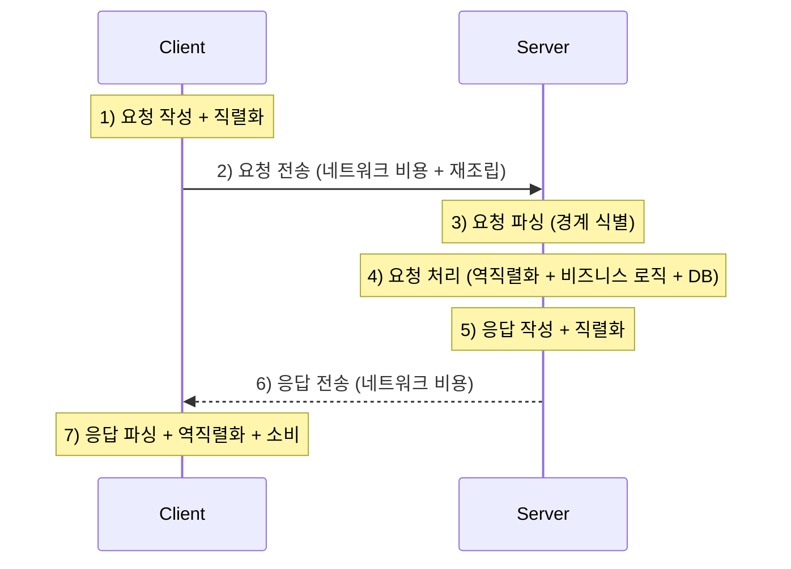
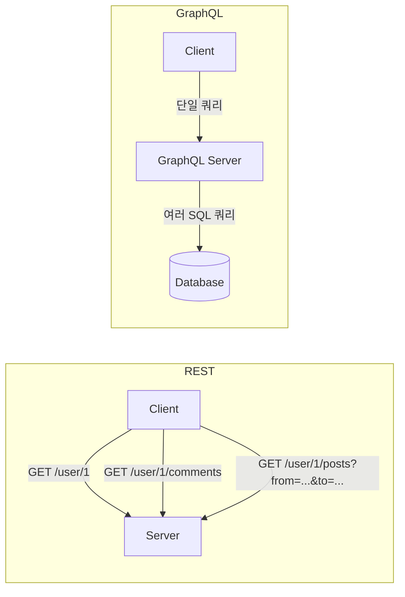
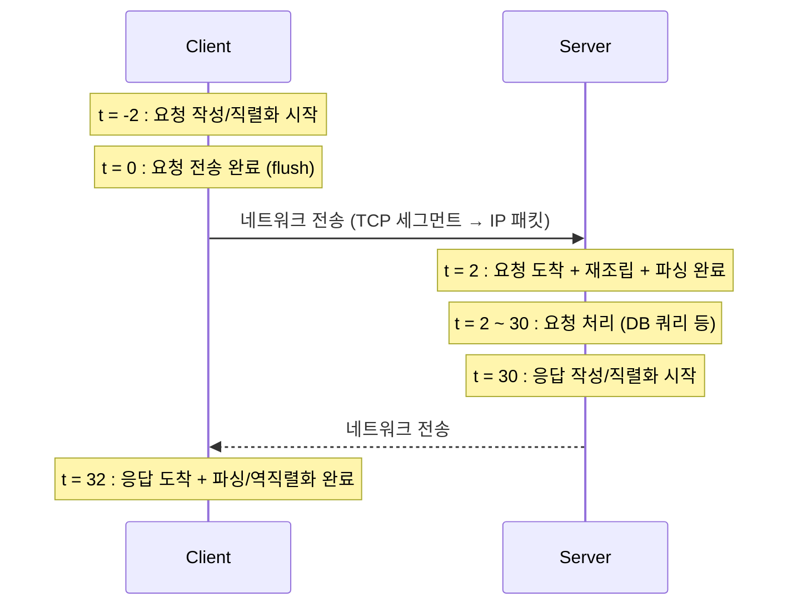
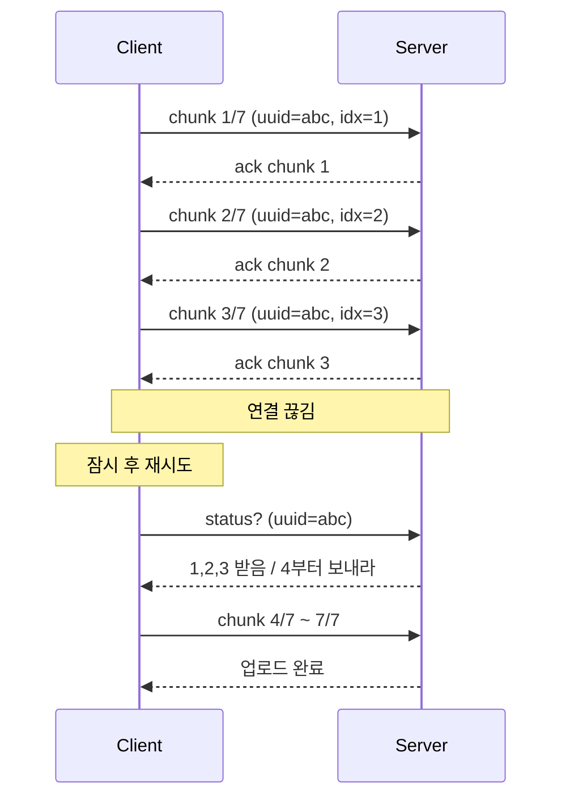
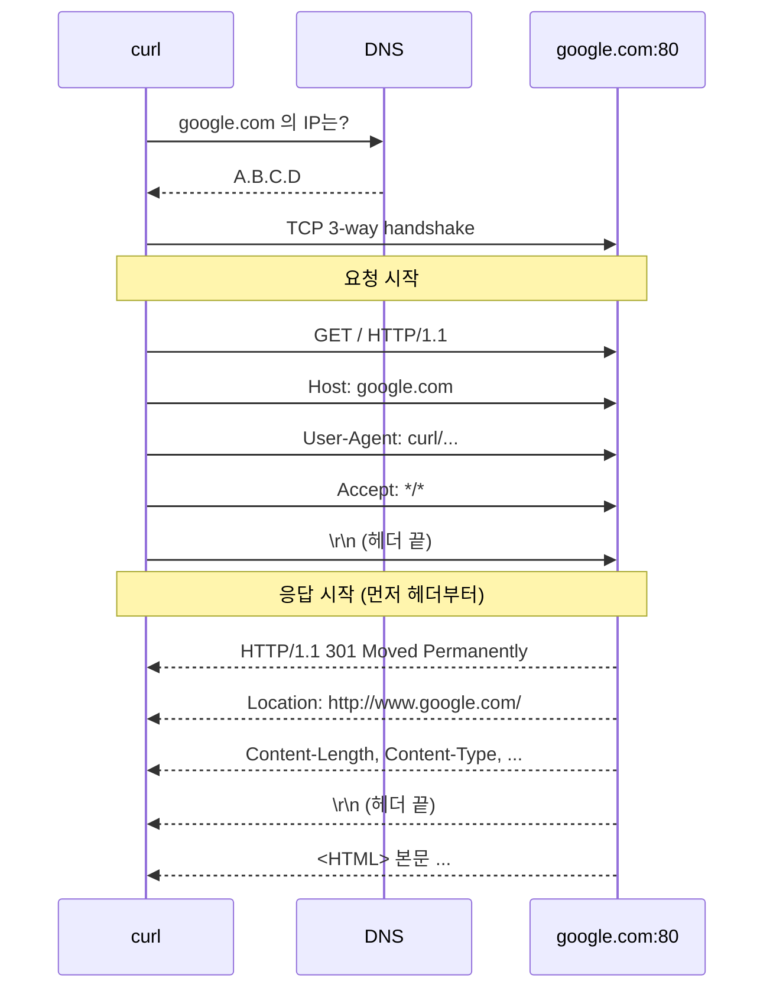

# 07. 요청-응답 패턴 (Request Response)

## 개요

**Request Response**는 백엔드 통신 설계 패턴 중 가장 오래되고, 가장 널리 쓰이며, 가장 우아한 모델이다. HTTP, DNS, SSH, RPC, SQL, REST, SOAP, GraphQL 등 우리가 일상적으로 마주치는 거의 모든 프로토콜과 API는 이 모델 위에 세워져 있다.

겉보기에는 "클라이언트가 요청을 보내면 서버가 응답을 돌려준다"는 단순한 문장으로 끝나지만, 그 안에는 **요청의 경계(boundary) 정의, 파싱, 직렬화/역직렬화, 처리, 응답 작성, 네트워크 전송 시간** 같은 수많은 비용이 숨어 있다. 백엔드 엔지니어로서 이 비용 구조를 이해해야, 어떤 라이브러리가 무엇을 대신해 주는지, 어디서 병목이 생기는지를 짚어낼 수 있다.

이 문서에서 다루는 내용은 다음과 같다.

- 요청-응답 모델의 정의와 동작 원리
- 파싱(parsing) vs 처리(processing) vs 직렬화/역직렬화의 구분
- 이 패턴이 쓰이는 대표 사례 (HTTP, DNS, RPC, SQL, REST/SOAP/GraphQL)
- 요청/응답의 구조와 경계(boundary)
- 시간 축에서 본 요청-응답의 전체 비용
- 큰 페이로드(이미지 업로드)를 처리하는 두 가지 전략 — 통째 전송 vs 청크 전송
- 이 패턴이 잘 안 맞는 상황 (알림, 채팅, 매우 긴 작업)
- `curl --trace`로 본 HTTP 요청-응답의 실제 모습

---

## 1. Request Response 모델이란?

### 1.1 정의

> **클라이언트가 요청(request)을 보내고, 서버가 그것을 파싱·처리한 뒤 응답(response)을 돌려주는 통신 모델이다.**

문장은 단순하지만 그 안에 여러 단계가 숨어 있다.



### 1.2 왜 "요청의 정의"부터 시작해야 하는가

TCP는 **연속적인 바이트 스트림**이다. 메일처럼 "한 통" 단위로 깔끔하게 도착하지 않는다. 따라서 서버는 들어오는 바이트의 어디가 요청의 시작이고, 어디가 끝인지를 직접 식별해야 한다.

- 클라이언트가 한 번에 3개의 요청을 연속으로 보낸 경우, 이것이 **3개의 요청인지, 1개의 큰 요청인지** 구분하는 일은 전적으로 서버의 책임이다.
- 이 경계(boundary)는 **프로토콜과 메시지 포맷**으로 정의된다. HTTP는 텍스트와 CRLF 기반으로, 바이너리 프로토콜은 길이 헤더 등으로 경계를 잡는다.

> **요약**: 요청의 경계를 정의하고, 그 경계를 양쪽이 동일하게 이해하는 것이 Request Response의 출발점이다.

### 1.3 파싱 vs 처리 vs 직렬화의 구분

강의에서 강사가 강조하는 핵심은, **"파싱"과 "처리"는 다른 단계**라는 점이다.

| 단계 | 의미 | 예시 |
|------|------|------|
| **파싱(Parsing)** | 요청의 경계와 메타 구조를 식별 | "이건 GET 요청이고, 경로는 `/`, 헤더는 여기까지" |
| **역직렬화(Deserialization)** | 바이트/문자열 페이로드를 언어 객체로 변환 | JSON 문자열 → JS 객체 / Protobuf → C++ struct |
| **처리(Processing)** | 실제 비즈니스 로직 수행 | DB 쿼리, API 호출, 계산 |
| **직렬화(Serialization)** | 응답 객체를 전송 가능한 형태로 변환 | 객체 → JSON/Protobuf |

> 강사는 직렬화/역직렬화도 넓은 의미의 "처리"에 포함시키지만, **파싱과는 분리해서 봐야** 비용 구조를 정확히 분석할 수 있다고 강조한다.

### 1.4 메시지 포맷 선택의 비용

| 포맷 | 가독성 | 크기 | 파싱 속도 |
|------|--------|------|-----------|
| XML (SOAP) | 좋음 | 큼 | 느림 |
| JSON | 좋음 | 중간 | 보통 (JavaScript에서는 네이티브에 가까워 빠름) |
| Protocol Buffers | 사람이 읽기 어려움 (바이너리) | 작음 | 매우 빠름 |

- SOAP/XML → REST/JSON으로 이동한 큰 이유 중 하나는 **XML 파싱 비용**이 너무 비쌌기 때문이다.
- JSON도 페이로드가 커지면 **2초 가까이** 걸리는 경우가 실제 운영 환경에서 관찰된다. 이런 한계가 Protocol Buffers 같은 고속 바이너리 포맷이 등장한 배경이다.
- "가독성"은 공짜가 아니다. 크기와 파싱 비용으로 대가를 치른다.

---

## 2. Request Response가 쓰이는 곳

### 2.1 거의 모든 곳

| 분야 | 어떻게 Request Response인가 |
|------|--------------------------------|
| **HTTP / Web** | 클라이언트가 GET/POST 요청 → 서버 응답 |
| **DNS** | UDP 데이터그램으로 "google.com의 IP는?" → 응답 (Query ID로 매칭) |
| **SSH** | `ls` 명령 → 디렉토리 목록 응답 |
| **RPC** | 원격 메서드 호출 요청 → 결과 응답 |
| **SQL** | SQL 쿼리 → 데이터베이스의 결과 응답 |
| **REST / SOAP / GraphQL** | 모두 HTTP 위의 요청-응답 변형 |

### 2.2 DNS와 "순서를 믿지 말 것"

DNS는 UDP 기반이지만 그 위에 **Query ID**를 둬서 어느 응답이 어느 요청에 대응하는지 식별한다.

- 클라이언트가 동시에 100개의 DNS 요청을 보낼 수 있다.
- 응답은 **순서대로 오지 않는다.** 그래서 Query ID로 매칭한다.

> **백엔드 엔지니어링의 철칙**: **응답이 보낸 순서대로 올 거라 절대 가정하지 마라.**
>
> HTTP 파이프라이닝이 폐기된 것도, head-of-line blocking이 문제가 되는 것도 결국 같은 맥락이다.

### 2.3 RPC와 누수되는 추상화 (Leaky Abstraction)

RPC가 인기를 끈 이유는 단순하다. **원격 함수를 로컬 함수처럼 호출하게 해 주는 추상화**다.

하지만 추상화는 공짜가 아니다.

- 로컬 함수처럼 보이지만 실제로는 네트워크를 건너간다.
- "이 함수는 왜 갑자기 느리지?"라는 의문이 생기는 순간, **추상화가 새기 시작**한다 (leaky abstraction).
- 결국 개발자는 "이건 원격 호출이구나"를 의식하게 되고, 추상화의 장점이 무너진다.

### 2.4 REST vs GraphQL — 챗ti니스(chattiness) 문제

REST는 자원(resource) 단위로 설계되어 있어, 화면 하나를 그리는 데 여러 요청이 필요하다. 각 요청-응답마다 네트워크 왕복 비용을 또 한 번 지불해야 한다.

GraphQL은 이 문제를 다른 각도에서 해결한다.



- **REST**: 여러 요청이 클라이언트 ↔ 서버 사이를 왕복.
- **GraphQL**: 단일 요청 안에 필요한 데이터를 모두 기술. 다중 쿼리는 **클라이언트 ↔ 서버 구간에서 서버 ↔ DB 구간으로 이동**한다.
- 잘 구성된 GraphQL은 컨텍스트를 알고 있으므로 일부 SQL 쿼리를 **합치거나 생략**할 수도 있다.

> GraphQL이 "마법처럼 빨라지는" 것이 아니라, **챗tiness의 위치를 옮기고 최적화 기회를 얻는다**는 것이 핵심이다.

---

## 3. 요청/응답의 구조 (Anatomy)

요청 구조는 **프로토콜이 정해 둔 약속**이다. 클라이언트와 서버 모두 그 약속을 따라야 한다.

### 3.1 HTTP GET 요청의 구조

```
GET /path HTTP/1.1\r\n
Host: example.com\r\n
User-Agent: curl\r\n
Accept: */*\r\n
\r\n
[body — GET에는 보통 없음]
```

- 첫 줄: 메서드 + 경로 + 프로토콜 버전
- 헤더들: `Key: Value\r\n`의 반복
- 빈 줄(`\r\n`): 헤더의 끝을 표시
- 그 뒤: 바디 (POST 등에서 사용)

### 3.2 라이브러리가 대신해 주는 일

우리는 보통 이 파싱 작업을 직접 하지 않는다. Express(Node.js), Spring, Django 등은 내부적으로 HTTP 라이브러리를 사용해 다음을 처리해 준다.

- TCP 세그먼트 → HTTP 요청으로 재조립
- 메서드/경로/헤더/바디 파싱
- 우리 코드에는 깔끔한 `req` 객체로 전달

> 강사의 메시지: **"라이브러리가 무엇을 대신해 주는지"를 아는 것이 좋은 엔지니어가 되는 길이다.** 코드에 보이지 않는 작업이 실제로는 굉장히 많다.

### 3.3 응답도 동일하게 경계가 중요

응답 역시 시작과 끝이 명확해야 클라이언트가 파싱할 수 있다. HTTP에서는 `Content-Length` 헤더나 chunked transfer encoding으로 본문의 끝을 알린다.

---

## 4. 시간 축에서 본 비용 (Anatomy in Time)

요청-응답 한 번의 비용은 다음과 같이 분해된다.



각 구간에서 발생하는 비용:

| 구간 | 비용 |
|------|------|
| `t = -2 → 0` (클라이언트) | 요청 객체 직렬화 (JSON/Protobuf 등) |
| `t = 0 → 2` (네트워크) | TCP 세그먼트 분할, IP 패킷 라우팅, **순서가 뒤바뀐 패킷 재조립** |
| `t = 2` (서버) | 요청 파싱 (경계 식별) |
| `t = 2 → 30` (서버) | 역직렬화 + 비즈니스 로직 + DB 쿼리 |
| `t = 30` (서버) | 응답 직렬화 |
| `t = 30 → 32` (네트워크 + 클라이언트) | 전송 + 클라이언트의 파싱/역직렬화 |

> **요약**: "API 응답이 100ms 걸렸다"는 결과 하나의 뒤에는 **직렬화, 네트워크 전송, 파싱, 처리, 다시 직렬화, 다시 전송, 다시 파싱**이라는 7개 구간의 합산이 숨어 있다.

---

## 5. 큰 페이로드 처리 — 통째 전송 vs 청크 전송

이미지 업로드 같은 큰 페이로드를 어떻게 다룰지 두 가지 전략이 있다.

### 5.1 전략 비교

| 항목 | 통째 전송 (Whole Upload) | 청크 전송 (Chunked Upload) |
|------|--------------------------|----------------------------|
| 구현 난이도 | 매우 단순 | 비교적 복잡 (청크 ID, 상태 관리) |
| 페이로드 크기 한계 | 크기 제한, 메모리/타임아웃 부담 | 사실상 무제한 |
| 실패 시 복구 | **불가** — 처음부터 다시 | **가능** — 받은 청크부터 이어서 |
| 진행률(progress) 표시 | 어려움 | 자연스러움 |

### 5.2 청크 전송의 흐름



핵심 트릭:

- 각 청크에 **고유 식별자(업로드 ID)** 와 **인덱스**를 부여한다.
- 서버는 어디까지 받았는지 상태를 보존한다.
- 클라이언트는 로컬에 "어디까지 보냈는지"를 기록하면 좋다.
- 끊김 발생 시 서버에 상태를 묻고 **이어서 업로드(resume)** 한다.

> **포인트**: 청크 전송도 본질은 여전히 Request Response다. 다만 **실행 스타일**이 달라졌을 뿐이다.

---

## 6. Request Response가 잘 안 맞는 상황

요청-응답은 강력하지만 **클라이언트가 먼저 물어봐야 무언가가 일어난다**는 구조적 한계가 있다. 다음과 같은 상황에서는 한계가 드러난다.

### 6.1 알림(Notification) 서비스

- "누가 로그인했어?", "누가 내 글에 댓글 달았어?"는 **서버가 먼저 아는** 정보다.
- 클라이언트가 요청해야만 응답이 오는 구조와 본질적으로 맞지 않는다.
- 임시 해결: **폴링(polling)** — "있어? 없어? 있어? 없어?"를 반복해서 묻기.
- 문제: 잘 확장되지 않고, 네트워크에 빈 요청을 도배한다.

### 6.2 채팅(Chat)

- "누가 방금 말했어?"를 1초마다 폴링하면 지연이 크고 네트워크가 혼잡해진다.
- 빈 요청들이 네트워크를 막아 **다른 트래픽에까지 영향**을 줄 수 있다.

### 6.3 매우 긴 작업 (Long-running Request)

- 요청 처리에 수십 초~수 분이 걸린다면, 클라이언트가 그동안 그저 기다린다.
- 중간에 클라이언트가 끊어졌다 다시 접속하면 "끝났어? 안 끝났어?"를 알 수 없다.
- 이런 경우는 **비동기 처리(asynchronous processing)** 패턴이 더 적합하다.

> 강사는 이런 한계들을 해결하기 위한 **대안 디자인 패턴**들 — 폴링, 푸시, 롱 폴링, Pub/Sub, 비동기 처리 등 — 을 이어지는 강의에서 차근차근 풀어 나갈 예정이다.

---

## 7. `curl --trace`로 본 실제 HTTP 요청-응답

데모는 `curl -v --trace out.txt http://google.com`을 실행한 결과를 분석한다. HTTPS가 아닌 일부러 HTTP를 사용한 이유는 TLS 협상을 빼고 **요청-응답 자체**에만 집중하기 위해서다.

### 7.1 흐름



### 7.2 관찰 포인트

- **항상 헤더가 먼저**, 그 다음 본문이 온다. HTTP의 일반 규칙이다.
- 301 응답이지만, curl은 기본적으로 리다이렉트를 따라가지 않으므로 그 자리에서 끝난다.
- `--trace` 출력에서 **→ 화살표는 클라이언트가 보낸 바이트**, **← 화살표는 서버에서 받은 바이트**를 의미한다.
- 헤더가 한 줄씩 차례로 보이는 것은 curl의 표시 방식일 뿐, 실제 네트워크에서는 한꺼번에 도착했을 가능성이 높다.

---

## 8. 핵심 한 줄 정리

- **Request Response**는 백엔드 통신의 **가장 기본이자 가장 보편적인** 패턴이다.
- 진짜 비용은 "요청-응답"이라는 단어 뒤에 숨은 **경계 정의, 파싱, 직렬화, 네트워크 전송, 처리, 재직렬화, 재파싱**의 합산이다.
- 클라이언트가 먼저 물어봐야 동작하는 구조이므로, **알림·채팅·긴 작업**처럼 서버가 먼저 알아야 하는 상황에는 한계가 있고, 다른 패턴이 필요하다.

---

## 다음 학습 주제

다음 강의(**08. Synchronous vs Asynchronous Workloads**)에서는 Request Response의 한계를 풀어내기 위한 첫 단추인 **동기 vs 비동기 작업** 모델을 다룬다. 긴 작업, 백그라운드 처리, 비차단(non-blocking) I/O 같은 주제로 자연스럽게 이어진다.
