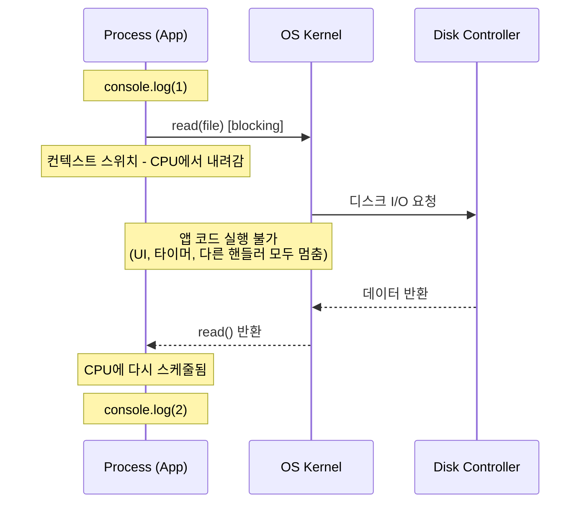
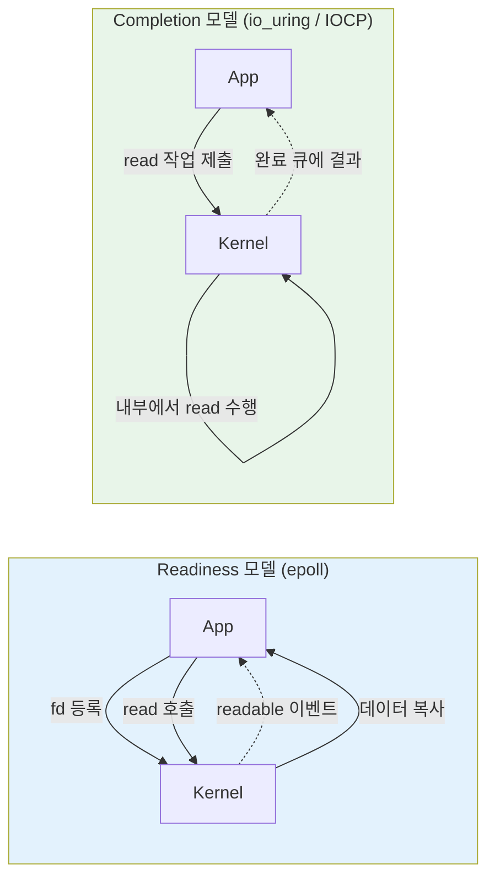
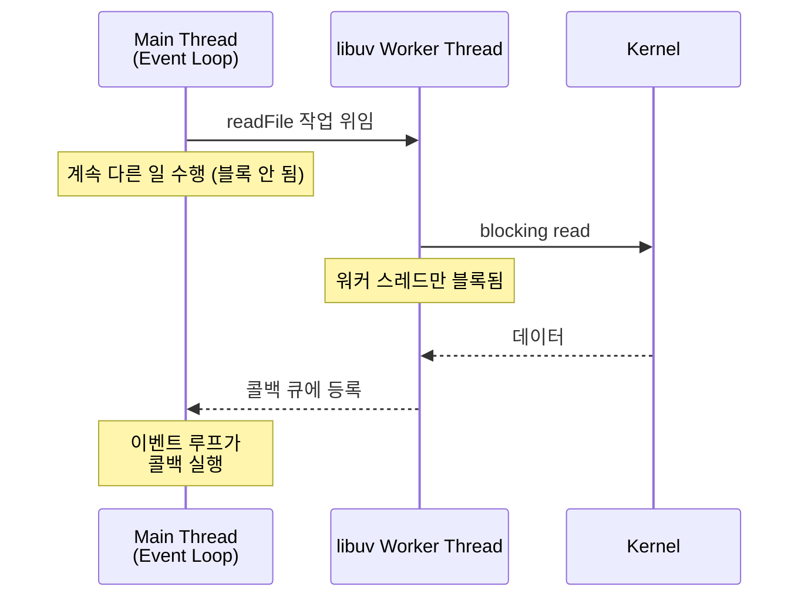
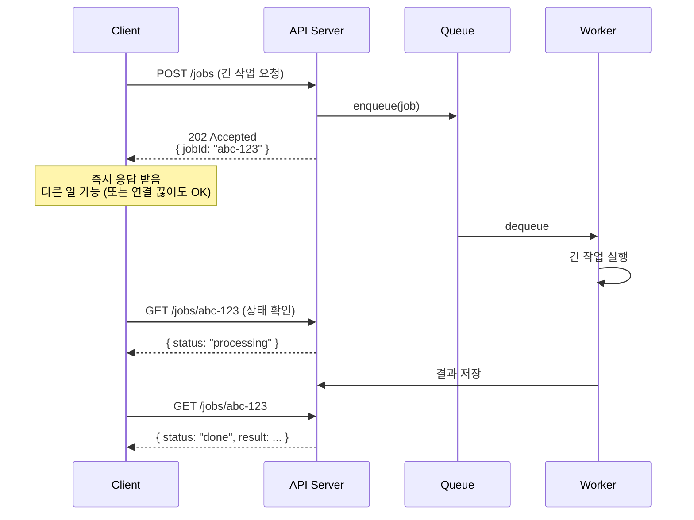
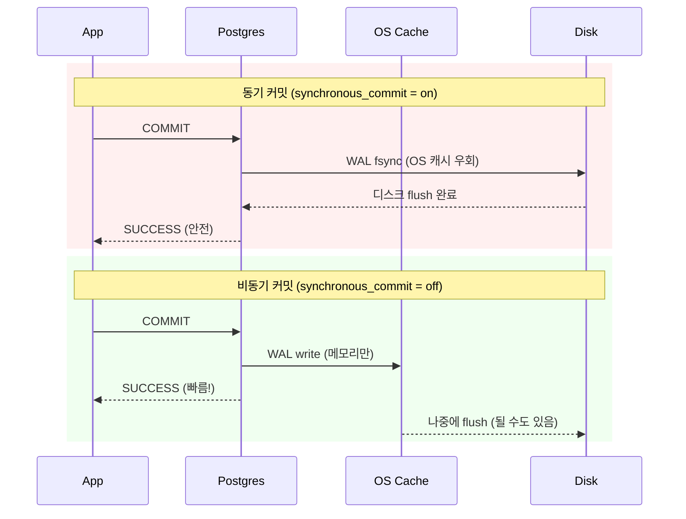
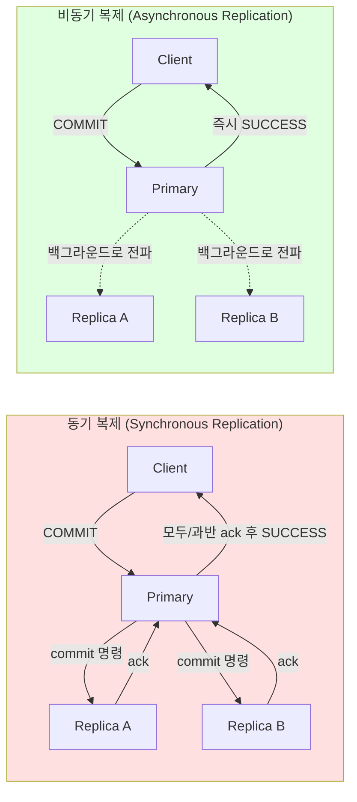
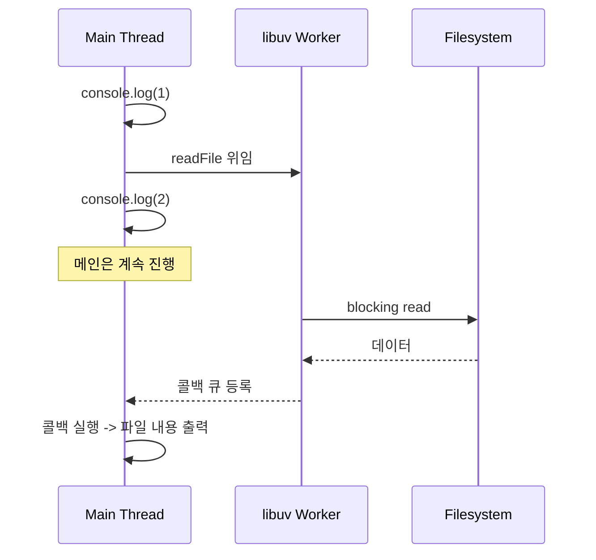

# 08. 동기 vs 비동기 워크로드 (Synchronous vs Asynchronous Workloads)

## 개요

**동기(synchronous)** 와 **비동기(asynchronous)** 는 백엔드 엔지니어가 평생 마주치는 가장 근본적인 개념 중 하나다. 메서드 호출, 네트워크 통신, OS의 I/O, 데이터베이스 커밋, 복제(replication), 디스크 캐시까지 — 컴퓨팅의 거의 모든 계층에서 이 두 가지 모델이 충돌하고 협업한다.

핵심 질문은 단 하나다.

> **"무엇인가를 시작한 뒤, 그 결과를 기다리는 동안 다른 일을 할 수 있는가?"**

- 할 수 있다 → **비동기 (asynchronous)**
- 할 수 없다 (블록됨) → **동기 (synchronous)**

이 문서에서 다루는 내용은 다음과 같다.

- 동기/비동기의 정의와 어원 (sine wave 비유)
- 동기 I/O 동작 원리와 컨텍스트 스위칭
- 비동기 I/O의 두 가지 방식: **Readiness (epoll)** vs **Completion (io_uring, IOCP)**
- Node.js 이벤트 루프와 워커 스레드의 트릭
- 콜백 → Promise → async/await 의 진화
- 클라이언트 관점의 동기/비동기 (request/response)
- 비동기 백엔드 처리 (큐 + Job ID 패턴)
- PostgreSQL의 비동기 커밋과 비동기 복제
- OS 파일시스템 캐시와 fsync

---

## 1. 동기/비동기의 본질

### 1.1 정의

> **동기 (synchronous)**: 호출자(caller)가 응답이 올 때까지 **다른 일을 할 수 없는** 실행 모델.
>
> **비동기 (asynchronous)**: 호출자가 응답을 기다리는 동안에도 **다른 일을 계속할 수 있는** 실행 모델.

### 1.2 어원: sine wave

"synchronous"는 본래 두 sine 파형이 **같은 위상(phase)** 으로 함께 움직이는 것을 뜻한다. 즉 호출자와 수신자가 같은 리듬으로 함께 진행한다는 의미다.

반대로 "asynchronous"는 두 주체가 같은 위상을 공유하지 않는 상태 — 각자 알아서 따로 움직이는 상태를 뜻한다.

- **전기/물리계**: 두 신호가 동기화되어야 안정적으로 동작 (비동기는 재앙)
- **소프트웨어 세계**: 오히려 비동기가 훨씬 유리한 경우가 많음

클라이언트와 서버가 굳이 같은 리듬으로 움직일 필요가 없기 때문이다. 각자 자신의 일을 하다가, 필요한 시점에만 동기화하면 된다.

> **요약**: 비동기는 "내가 너의 답을 기다리는 동안 다른 일을 할 수 있다"는 한 줄로 요약된다.

---

## 2. 동기 I/O (Synchronous I/O)

### 2.1 동작 흐름

호출자(프로세스)가 디스크나 네트워크에서 데이터를 읽을 때, 응답이 올 때까지 **프로세스 전체가 블록된다.**



### 2.2 컨텍스트 스위칭 (Context Switching)

프로세스는 결국 "명령어의 집합"이다. CPU가 한참 프로세스를 실행하다가 그 프로세스가 I/O를 요청하면, CPU는 "넌 더 이상 실행할 명령이 없으니 내려가라"고 판단해 다른 프로세스를 올린다.

- 이 교체 과정을 **컨텍스트 스위칭(context switching)** 이라고 한다.
- 마이크로초 단위의 비용이지만, 자주 일어나면 누적 효과가 크다.

### 2.3 옛날 GUI의 비극

90년대 단일 스레드 VB5 같은 환경을 떠올려 보면 이 모델의 문제가 와닿는다.

- 긴 루프나 큰 파일 읽기를 시작하면 **버튼 클릭조차 반응하지 않음**
- UI 이벤트 핸들러 코드는 메인 스레드가 풀려나기 전까지 실행될 수 없음
- VB5에는 이를 우회하려고 `DoEvents`라는 메서드가 있었음 (블로킹 중에도 UI에 잠깐 제어권을 양보)

### 2.4 자원 낭비

동기 I/O가 비효율적인 본질적 이유는 다음과 같다.

- 디스크에서 데이터를 가져오는 실제 작업은 **디스크 컨트롤러**가 한다.
- 그 사이 **앱도, 커널도, CPU도** 그냥 기다리고만 있다.
- 즉 CPU를 점유하지 않은 채 시간만 흘려보낸다 → **완전한 시간 낭비**.

이 비효율을 해결하기 위해 등장한 것이 비동기 I/O다.

---

## 3. 비동기 I/O (Asynchronous I/O)

### 3.1 핵심 아이디어

요청을 보낸 뒤 **블록되지 않고 다른 일을 한다.** 그런데 그렇다면 "응답이 왔다"는 사실은 어떻게 알 수 있을까?

방법은 두 가지로 나뉜다.

| 방식 | 의미 | 대표 구현 |
|------|------|-----------|
| **Readiness (준비 알림)** | "데이터가 읽힐 준비가 되었는지" 확인. 실제 read는 내가 직접 수행 | Linux: `select`, `poll`, **`epoll`** |
| **Completion (완료 알림)** | OS가 "읽기가 완료되었다"고 결과를 큐에 넣어 줌. read도 OS가 대신 수행 | Windows: **IOCP**, Linux: **io_uring** |

### 3.2 두 모델 비교



- **epoll**: "데이터가 도착했다 — 이제 직접 가져가라"
- **io_uring / IOCP**: "이미 가져다 두었다 — 결과 큐에서 받아 가라"

### 3.3 Node.js의 트릭: epoll + 워커 스레드

Node.js는 플랫폼에 따라 다음을 사용한다.

- Linux: **epoll** (libuv 내부)
- Windows: **IOCP (Completion Ports)**

그러나 모든 작업이 epoll로 처리 가능한 건 아니다. 특히 **파일 I/O는 epoll로 비동기화하기 어렵다** (epoll은 파일을 잘 다루지 못한다 — 그래서 io_uring이 등장했다).

이 한계를 우회하기 위해 Node.js는 다음과 같은 트릭을 쓴다.



- libuv는 기본적으로 **4개의 워커 스레드**를 띄운다 (설정 가능).
- "내가 블록될 수 없으면, **다른 누군가가 대신 블록되게** 만든다" — 이것이 비동기의 본질적 트릭이다.
- CPU 개수를 초과하는 워커는 의미가 없다 (CPU 바운드 작업은 별개로 고려).

> **요약**: 비동기는 마법이 아니라 **"어디선가는 누군가가 기다린다"**. 단지 그 기다림이 **사용자 코드 흐름을 막지 않도록** 다른 곳으로 옮겨놓을 뿐이다.

---

## 4. 콜백 → Promise → async/await

비동기 코드를 작성하는 방식은 시간이 지나며 점점 더 가독성이 좋은 방향으로 진화했다.

### 4.1 콜백 (Callback)

```js
doWork();
fs.readFile('data.bin', (err, data) => {
  // 파일 읽기가 끝나면 호출됨
  onReadFinished(data);
});
// readFile 호출 직후 바로 다음 라인으로 진행
```

- `readFile`은 즉시 반환. 파일이 다 읽힌 게 아니다.
- 워커 스레드가 읽기를 마치면 등록한 콜백이 이벤트 루프에서 호출된다.

### 4.2 Promise

```js
fs.promises.readFile('data.bin')
  .then(data => { /* ... */ });
```

- C++의 `future`와 유사한 개념.
- `.then`으로 콜백을 등록한다 — 본질적으로 콜백이지만 체이닝이 깔끔해진다.

### 4.3 async/await

```js
async function run() {
  const data = await fs.promises.readFile('data.bin');
  // 마치 동기처럼 보이지만 메인 스레드는 블록되지 않음
}
```

- 보기에는 동기처럼 보이지만 **실제로 메인 스레드는 블록되지 않는다.**
- "후속 코드가 결과 값에 의존할 때, 코드 순서를 직관적으로 유지하려는" 문법적 설탕(syntactic sugar)이다.

| 방식 | 장점 | 단점 |
|------|------|------|
| 콜백 | 단순, 가장 원초적 | 콜백 지옥(callback hell) |
| Promise | 체이닝, 에러 전파 깔끔 | 여전히 `.then` 중첩 가능 |
| async/await | 동기 코드처럼 읽힘 | 잘못 쓰면 직렬화로 성능 손해 |

---

## 5. 클라이언트/서버 관점의 동기/비동기

### 5.1 동기성(synchronicity)은 **클라이언트의 속성**

서버는 사실 자신이 "동기"인지 "비동기"인지 알 필요가 없다. 중요한 것은 **호출자가 응답을 기다리는 동안 다른 일을 할 수 있는가**이기 때문이다.

현대 웹 클라이언트 라이브러리(`fetch`, Axios 등)는 거의 모두 비동기다. 네트워크 호출은 본질적으로 느리기 때문에, 응답을 기다리는 동안 다른 요청도 보내고 UI도 갱신해야 하기 때문이다.

### 5.2 일상 비유로 이해하기

| 상황 | 동기/비동기 | 이유 |
|------|------------|------|
| **회의에서 직접 질문** | 동기 | 즉시 답해야 하고, 침묵은 어색함 |
| **이메일** | 비동기 | 보내놓고 다른 일을 해도 무방 |
| **Slack/Teams 채팅** | 경우에 따라 다름 | 길게 두면 비동기, 빠르게 핑퐁이면 동기에 가까움 |

---

## 6. 비동기 백엔드 처리 (큐 + Job ID 패턴)

긴 작업을 처리해야 할 때, 시스템 전체를 비동기로 만드는 가장 강력한 패턴이다.

### 6.1 문제 상황

- 클라이언트는 fetch를 async/await로 부르므로 "비동기"다.
- 하지만 서버 핸들러가 긴 작업을 끝까지 들고 있으면, **클라이언트는 결국 응답을 기다린다** → 시스템 전체로 보면 동기.

### 6.2 큐 + Job ID 패턴



- 클라이언트는 작업을 의뢰하고 **즉시 Job ID** 를 받는다 (마치 로컬에서 Promise를 받는 것과 똑같다).
- 클라이언트는 연결을 끊고 나중에 다시 와서 결과를 조회해도 된다.
- 결과 조회 방식은 다양하다: **Push, Pull, Long Poll, Pub/Sub** (다음 강의들 주제).

> **요약**: 동기를 비동기로 바꾸는 핵심 도구는 **큐(queue)** 다. 큐가 "기다림"을 흡수해 주기 때문에 클라이언트는 즉시 떠날 수 있다.

---

## 7. PostgreSQL의 비동기 커밋과 비동기 복제

비동기는 데이터베이스 내부에도 깊이 침투해 있다.

### 7.1 WAL (Write-Ahead Log) 기초

PostgreSQL은 트랜잭션 변경을 두 곳에 기록한다.

| 자료구조 | 특성 |
|---------|------|
| **Pages** | 실제 행/열 데이터가 들어있는 큰 자료구조 |
| **WAL (write-ahead log)** | 변경 내역만 적힌 작고 압축된 저널 |

커밋 시점에는 **WAL만 디스크에 flush**되어도 충분하다. 크래시가 나도 마지막 안정 페이지에 WAL을 재적용하면 일관된 상태로 복구할 수 있기 때문이다 — 이것이 ACID의 **Durability(내구성)** 이다.

### 7.2 동기 커밋 vs 비동기 커밋



| 항목 | 동기 커밋 | 비동기 커밋 |
|------|----------|------------|
| 응답 시점 | WAL이 **디스크에 fsync 완료된 후** | WAL을 **메모리에 쓰자마자** |
| 속도 | 느림 (디스크 I/O) | 빠름 |
| 안전성 | 강함 (크래시에도 보장) | 약함 — 크래시 시 **커밋된 데이터 소실 가능** (dirty read 위험) |
| 용도 | 금융/거래 등 강한 일관성 | 작은 트랜잭션 다량 / 일부 손실 허용 |

### 7.3 동기 복제 vs 비동기 복제



- **동기 복제**: 클라이언트는 모든(또는 과반) 레플리카가 커밋을 ack할 때까지 대기 → 강한 일관성, 느림. **2PC, 3PC, Paxos** 같은 합의 알고리즘과 연결됨.
- **비동기 복제**: 프라이머리는 즉시 응답하고, 레플리카에는 백그라운드로 전파 → 빠르지만 **일시적 불일치(replication lag)** 발생 가능.

### 7.4 fsync와 OS 캐시 우회

OS는 일반적으로 모든 write를 **파일시스템 캐시**에 모아두었다가 묶어서 디스크에 flush한다. 이는 다음을 위해 좋다.

- 디스크 단편화 감소
- SSD의 erase 블록 수명 보호 (같은 페이지를 자주 쓰면 닳음)

하지만 데이터베이스 입장에서는 곤란하다.

> "내가 WAL을 썼다고 했으면 **지금 당장** 디스크에 박혀 있어야 한다. OS 캐시에 머무는 200ms도 못 기다린다."

그래서 DB는 `fsync`를 호출해 OS 캐시를 우회하고 디스크에 즉시 동기화한다.

(여담: Linus Torvalds는 DB 개발자들이 OS의 우아한 비동기 흐름을 망친다며 종종 불평한다.)

---

## 8. Node.js 실습: sync vs async

### 8.1 `sync.js` (동기)

```js
const fs = require('fs');
console.log(1);
const result = fs.readFileSync('test.txt');  // 블로킹
console.log(result.toString());
console.log(2);
```

실행 순서:

1. `1` 출력
2. **파일 다 읽힐 때까지 메인 스레드 정지**
3. 파일 내용 출력
4. `2` 출력

### 8.2 `async.js` (비동기)

```js
const fs = require('fs');
console.log(1);
fs.readFile('test.txt', (err, data) => {
  console.log(data.toString());
});
console.log(2);
```

실행 순서:

1. `1` 출력
2. `readFile`은 **즉시 반환** → 워커 스레드에서 읽기 진행
3. `2` 출력 (블록되지 않음)
4. (조금 뒤) 워커가 끝나면 콜백이 이벤트 루프에 의해 실행 → 파일 내용 출력



> **요약**: 동일한 작업도 동기 버전은 **출력 순서 = 코드 순서**, 비동기 버전은 **콜백이 가장 늦게** 찍힌다.

---

## 9. 핵심 한 줄 정리

- **동기**: 기다리는 동안 아무것도 못 한다.
- **비동기**: 기다리는 동안 다른 일을 할 수 있다 — 그 "기다림"은 사라진 것이 아니라 **다른 곳(워커 스레드, 커널, 큐)** 으로 옮겨졌을 뿐이다.

동기/비동기는 단지 언어 문법(`async/await`)에만 있는 것이 아니라, **OS I/O, DB 커밋, 복제, 디스크 캐시, 백엔드 잡 처리** 등 모든 계층에 스며들어 있다. 어떤 시스템을 분석할 때든 "어디서 기다리고, 누가 그 기다림을 떠안는가?"를 묻는 것이 출발점이다.

---

## 다음 학습 주제

다음 강의에서는 비동기 백엔드 처리에서 **결과를 어떻게 알릴 것인가**의 첫 번째 방법인 **Push 모델**을 다룬다. (이후 Polling, Long Polling, Pub/Sub로 이어진다.)
