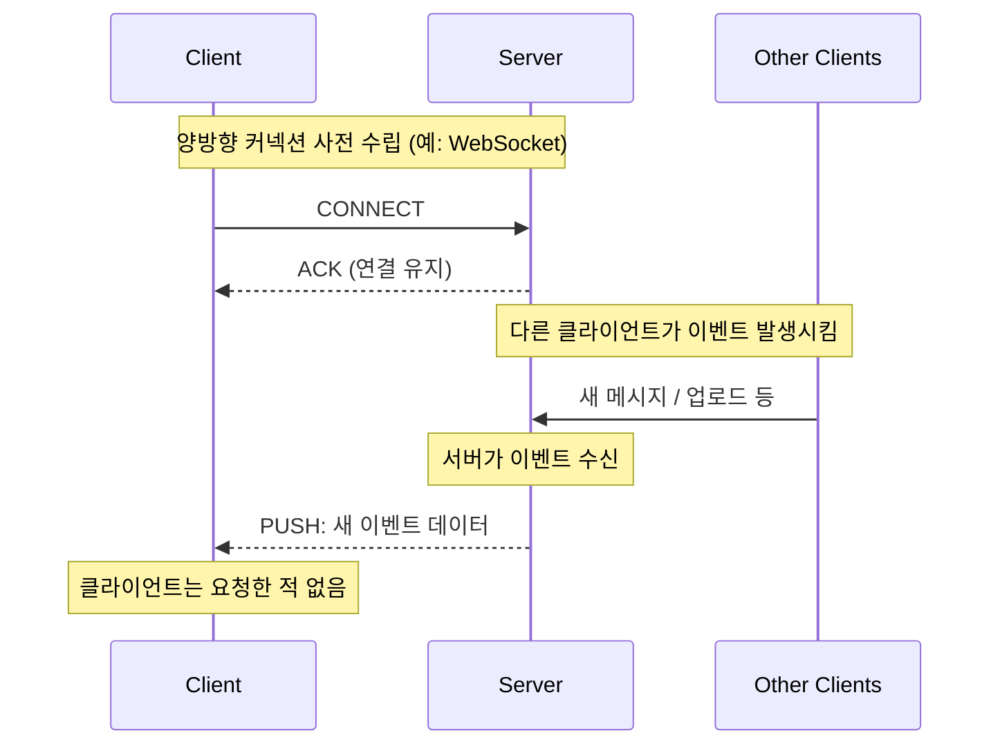
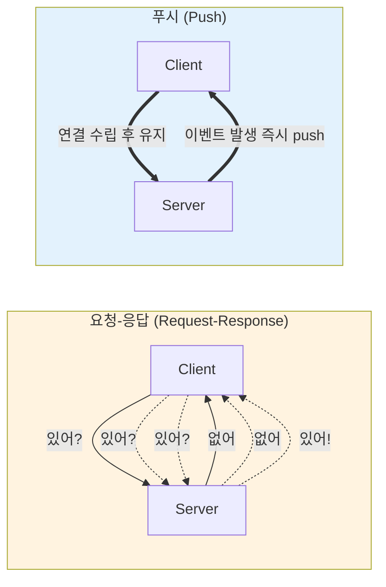
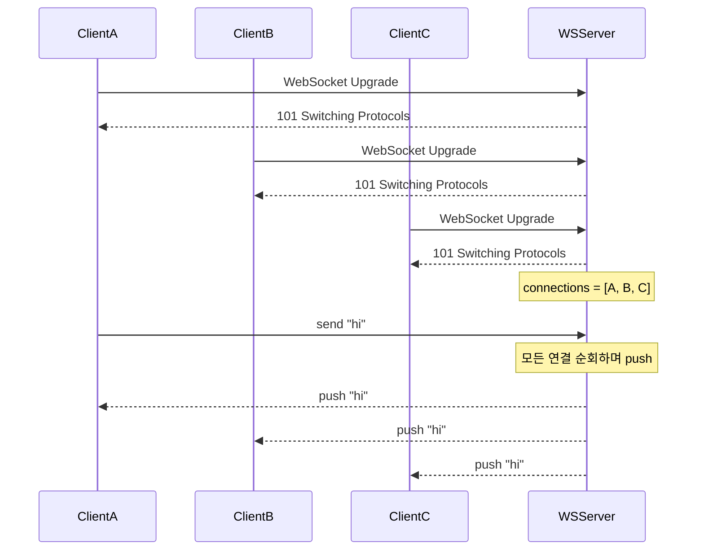

# 09. 푸시 (Push)

## 개요

**푸시(Push)** 는 백엔드가 클라이언트의 요청을 기다리지 않고, **이벤트가 발생하는 순간 서버가 먼저 클라이언트에게 데이터를 전송하는** 통신 패턴이다. 채팅, 실시간 알림, 라이브 피드처럼 "서버만 알 수 있는 이벤트"를 빠르게 전달해야 하는 경우에 적합하다.

요청-응답(request-response) 모델은 클라이언트가 먼저 "물어봐야" 답을 받을 수 있다. 하지만 "누가 방금 로그인했다", "누가 방금 YouTube 영상을 올렸다" 같은 이벤트는 클라이언트가 알 수 없으므로 끊임없이 "있어?", "있어?", "있어?" 라고 폴링해야 하고, 이는 확장성이 떨어진다. 푸시는 이런 문제를 정반대 방향에서 푼다.

이 문서에서 다루는 내용은 다음과 같다.

- 푸시 모델의 정의와 동작 방식
- 요청-응답 vs 푸시 비교
- 푸시가 적합한 사용 사례 (채팅, 알림, RabbitMQ 등)
- 푸시의 단점 (클라이언트 온라인 필수, 양방향 프로토콜 필요, 클라이언트 과부하)
- WebSocket을 이용한 푸시 예제
- Kafka가 푸시 대신 폴링을 선택한 이유

---

## 1. 푸시란?

### 정의

> **푸시(Push)는 클라이언트의 요청 없이, 서버가 능동적으로 데이터를 클라이언트에게 보내는 통신 모델이다.**

요청-응답에서는 클라이언트가 "데이터 주세요"라고 말해야 서버가 응답한다. 푸시는 그 흐름이 반대다. 서버가 이벤트가 생기는 즉시 "여기 데이터요"라고 클라이언트에게 직접 전달한다.

### 동작에 필요한 전제

1. **연결(connection)이 미리 수립되어 있어야 한다.** 서버가 데이터를 흘려보낼 통로가 필요하기 때문이다.
2. **프로토콜은 사실상 양방향(bidirectional)이어야 한다.** TCP는 본질적으로 양방향이라 푸시에 사용할 수 있고, 그 위에 WebSocket이나 gRPC server-side streaming 같은 양방향 프로토콜이 올라간다.

> 엄밀히 말하면 "서버 → 클라이언트"라는 단방향 스트림처럼 보이지만, 그 스트림을 열고 유지하려면 양방향 채널이 필요하다. gRPC는 실제로 server-side streaming이라는 단방향 모드를 제공한다.

### 흐름

---

## 2. 요청-응답 vs 푸시

### 왜 요청-응답으로는 부족한가?

다음과 같은 이벤트는 클라이언트가 "발생했는지" 알 길이 없다.

- 다른 사용자가 방금 로그인했다
- 누군가 방금 영상/트윗을 올렸다
- 채팅방에 새 메시지가 도착했다

이를 요청-응답으로 알아내려면 클라이언트가 "새 알림 있어?"를 반복해서 물어야 하는데, 이는 확장이 어렵다.

### 비교 다이어그램

### 표로 정리

| 항목 | 요청-응답 | 푸시 |
|------|-----------|------|
| 누가 먼저 말하는가 | 클라이언트 | 서버 |
| 이벤트 감지 | 클라이언트가 폴링으로 발견 | 서버가 즉시 전달 |
| 지연(latency) | 폴링 주기에 의존 | 거의 실시간 |
| 트래픽 효율 | "없어요" 응답이 다수 → 낭비 | 이벤트가 있을 때만 발생 |
| 프로토콜 | HTTP 단방향이면 충분 | 양방향(WebSocket 등) 필요 |
| 클라이언트 오프라인 시 | 다시 물어보면 됨 | **푸시 불가** |

> **요약**: 푸시는 이벤트의 주체가 서버일 때, 거의 실시간이 필요할 때 강력하다. 단, 클라이언트가 항상 연결되어 있어야 한다.

---

## 3. 푸시의 장점

- **실시간성**: 이벤트가 발생하는 그 순간 클라이언트에 도달한다. 폴링 주기 같은 인위적 지연이 없다.
- **단순한 구현 원리**: 마법이 아니다. 서버는 이미 열려 있는 클라이언트 소켓에 데이터를 쓸 뿐이다.
- **불필요한 빈 폴링 제거**: "있어?", "없어요"로 낭비되던 라운드트립이 사라진다.

---

## 4. 푸시의 단점

### 4.1 클라이언트가 반드시 온라인이어야 한다

푸시는 **서버와 물리적으로 연결되어 있는 클라이언트에게만** 도달한다. 오프라인 클라이언트에게는 푸시할 수 없다. 메시지를 서버에 쌓아 두었다가 나중에 접속할 때 전달하는 방식은 가능하지만, 그 순간만큼은 "실시간 푸시"가 아니다.

### 4.2 클라이언트의 처리 능력을 서버가 모른다

서버는 그저 "여기 있다"라고 데이터를 던질 뿐이다.

- TCP 레벨의 flow control 외에는 클라이언트가 얼마나 빠르게 처리할 수 있는지 알 수 없다.
- 서버가 빠르게 push, push, push, push 하면 가벼운 클라이언트는 처리 속도를 따라가지 못하고 **크래시**할 수도 있다.

이것이 바로 **Kafka가 RabbitMQ식 푸시 대신 long polling(롱 폴링)** 으로 간 이유다. 컨슈머가 자기 속도에 맞춰 가져가도록("당기는" pull) 하면 과부하를 스스로 제어할 수 있다.

### 4.3 양방향 프로토콜이 필요하다

HTTP/1.x의 단순 요청-응답으로는 불가능하다. WebSocket, gRPC streaming, HTTP/2 server push, raw TCP 등 양방향 채널을 다룰 수 있는 프로토콜이 필요하다.

### 4.4 연결 유지 비용

100만 클라이언트에게 푸시하려면 100만 개의 활성 연결을 유지해야 한다. 메모리, 파일 디스크립터, OS 자원 등이 모두 비용이다.

> **YouTube의 푸시 알림 사례**: PewDiePie/Mr. Beast급 채널이 영상을 올릴 때마다 1억 명에게 직접 푸시한다는 것은 현실적으로 불가능하다. 그래서 YouTube는 알림을 **자기 서버에서 직접 클라이언트로 보내지 않고**, Apple/Google 푸시 클라우드(APNs / FCM)에 위임한다. 그쪽 인프라가 자기 페이스로 디바이스에 전달한다. (그리고 YouTube의 push notification은 기본값이 off다.)

### 장단점 표

| 장점 | 단점 |
|------|------|
| 실시간 전달 | 클라이언트가 오프라인이면 전달 불가 |
| 폴링 트래픽 제거 | 클라이언트 과부하 시 제어 불가 |
| 서버가 이벤트의 주인이라는 모델에 자연스러움 | 양방향 프로토콜 필요 |
| 구현 자체는 단순 (소켓에 write) | 다수 연결 유지 비용 |

---

## 5. 사용 사례

### 5.1 채팅 애플리케이션

가장 대표적인 예. 서버는 새 메시지가 들어올 때마다, 같은 방의 다른 참여자들에게 즉시 푸시한다.

### 5.2 실시간 알림 (Notification)

"누가 댓글을 달았다", "누가 좋아요를 눌렀다" 등.

### 5.3 RabbitMQ (메시지 브로커)

RabbitMQ는 푸시 모델을 채택한 대표적인 메시지 브로커다.

- 큐에 메시지가 들어오는 **즉시**, 연결된 컨슈머에게 푸시한다.
- 컨슈머는 별도로 polling할 필요가 없다.

반면 **Kafka**는 컨슈머가 직접 가져가는 pull(long polling) 모델을 쓴다. 이 차이가 두 시스템의 운영 특성을 크게 좌우한다.

| 항목 | RabbitMQ (Push) | Kafka (Pull / Long Polling) |
|------|-----------------|------------------------------|
| 전달 방식 | 브로커 → 컨슈머 push | 컨슈머가 브로커에서 pull |
| 컨슈머 과부하 제어 | 어려움 | 컨슈머가 페이스 조절 가능 |
| 지연 | 거의 실시간 | 폴링 주기 또는 long poll 대기에 의존 |

### 5.4 gRPC server-side streaming

gRPC는 서버가 한 번의 호출에 대해 여러 응답을 연속으로 푸시하는 모드를 지원한다. 단방향 스트림이지만 그 아래는 양방향 채널이다.

---

## 6. 예제: WebSocket 기반 채팅 서버

WebSocket은 TCP 위에서 동작하는 양방향 프로토콜이라 푸시에 자연스럽게 맞는다. 강의에서 보여준 Node.js 예제의 핵심 흐름은 다음과 같다.

### 구조

1. Express HTTP 서버를 띄우고, 그 위에 WebSocket 서버를 마운트한다.
2. 클라이언트가 WebSocket 업그레이드 요청을 보내면 핸드셰이크가 성립한다.
3. 서버는 모든 활성 커넥션을 배열에 보관한다.
4. 한 클라이언트가 메시지를 보내면, 서버는 배열을 순회하며 **모든 클라이언트에게 그 메시지를 푸시(브로드캐스트)** 한다.

### 다이어그램

### 사용자 식별 트릭

강의에서는 사용자 식별자로 **TCP 커넥션의 source port**를 사용했다. TCP 4-tuple(소스 IP, 소스 포트, 목적지 IP, 목적지 포트)에서 각 클라이언트는 서로 다른 source port를 가지므로, 추가 로그인 없이도 유일성을 확보할 수 있다.

### 주의할 점 (강의에서 노출된 버그)

- 누군가 연결을 끊었을 때, 서버는 그 커넥션을 배열에서 즉시 제거하지 않으면 **닫힌 소켓에 write를 시도**하다 오류가 발생할 수 있다.
- 해결책: 푸시 루프에서 `if (conn.connected)` 같은 가드를 추가하거나, 닫힘 이벤트에서 배열에서 제거한다. 단순히 가드만 두면 죽은 커넥션을 계속 순회하는 비용이 남으므로, **disconnect 시점에 배열에서 빼는 편**이 깔끔하다.

### 중앙집중 모델

모든 클라이언트가 서로 직접 연결되는 P2P가 아니라, **단일 중앙 서버에 모두 연결**되어 있다는 점도 중요한 관찰이다. 서버는 단순 메시지 라우터/브로드캐스터 역할을 한다.

---

## 7. 푸시 vs 폴링: 언제 무엇을 쓰는가?

| 상황 | 추천 모델 |
|------|-----------|
| 채팅, 실시간 알림처럼 즉시성이 중요 | **푸시** |
| 클라이언트가 가볍고, 처리 속도가 들쭉날쭉 | **폴링 / long polling** (자기 페이스 조절) |
| 대량의 이벤트가 폭주할 수 있고, 컨슈머가 부담을 자주 받음 | **Kafka 스타일 pull** |
| 클라이언트가 자주 오프라인이 됨 | 폴링 + 메시지 저장 |
| 이벤트가 드문드문 발생하고, 클라이언트 수가 매우 많음 | 푸시(연결 비용)와 폴링(폴링 비용) 사이의 트레이드오프 평가 |

> **요약**: "이벤트의 주인이 누구인가, 클라이언트가 그 부하를 감당할 수 있는가, 항상 연결되어 있을 수 있는가" 이 세 가지 질문이 푸시/풀 선택의 핵심이다.

---

## 8. 핵심 한 줄 정리

- **푸시는 서버가 이벤트의 주체일 때, 양방향 연결 위에서 클라이언트를 기다리지 않고 즉시 데이터를 흘려보내는 모델이다.**
- 실시간성이 무기지만, **클라이언트가 항상 연결되어 있어야 하고**, **클라이언트의 처리 한계를 서버가 모른다**는 한계가 있다.
- WebSocket / gRPC streaming / RabbitMQ가 대표적인 푸시 구현이며, Kafka는 같은 문제를 **pull / long polling**으로 풀었다.

---

## 다음 학습 주제

다음 강의에서는 **폴링(Polling)** — 클라이언트가 주도적으로 서버에 데이터를 가져가는 모델, 그리고 그 변형인 long polling을 살펴본다. 푸시의 한계(클라이언트 과부하, 오프라인)가 폴링 쪽에서 어떻게 다르게 다뤄지는지가 비교 포인트다.
