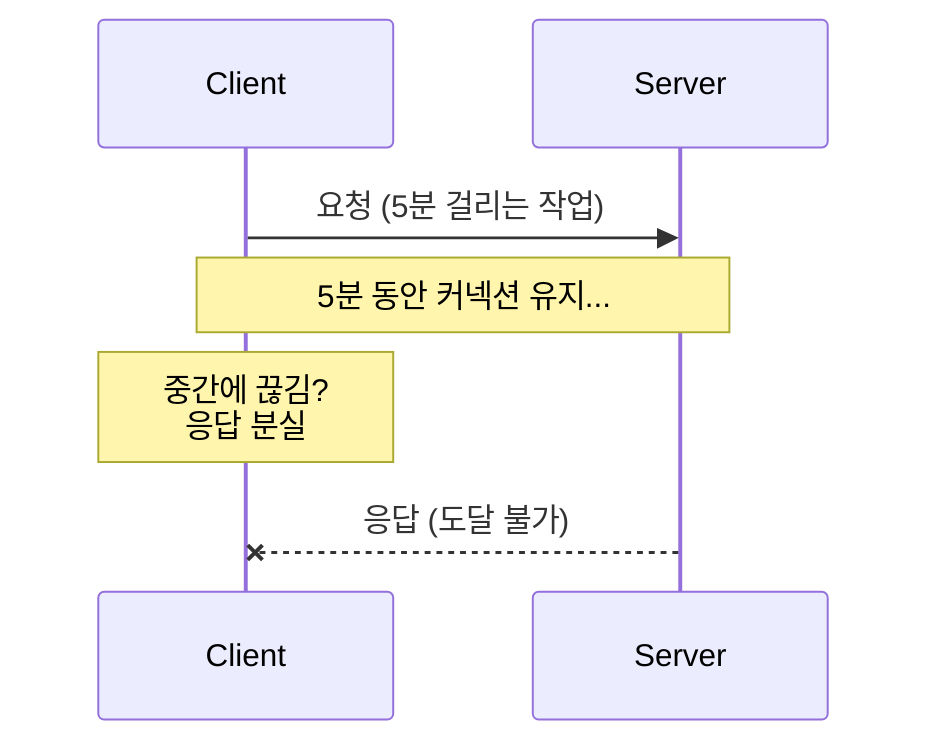
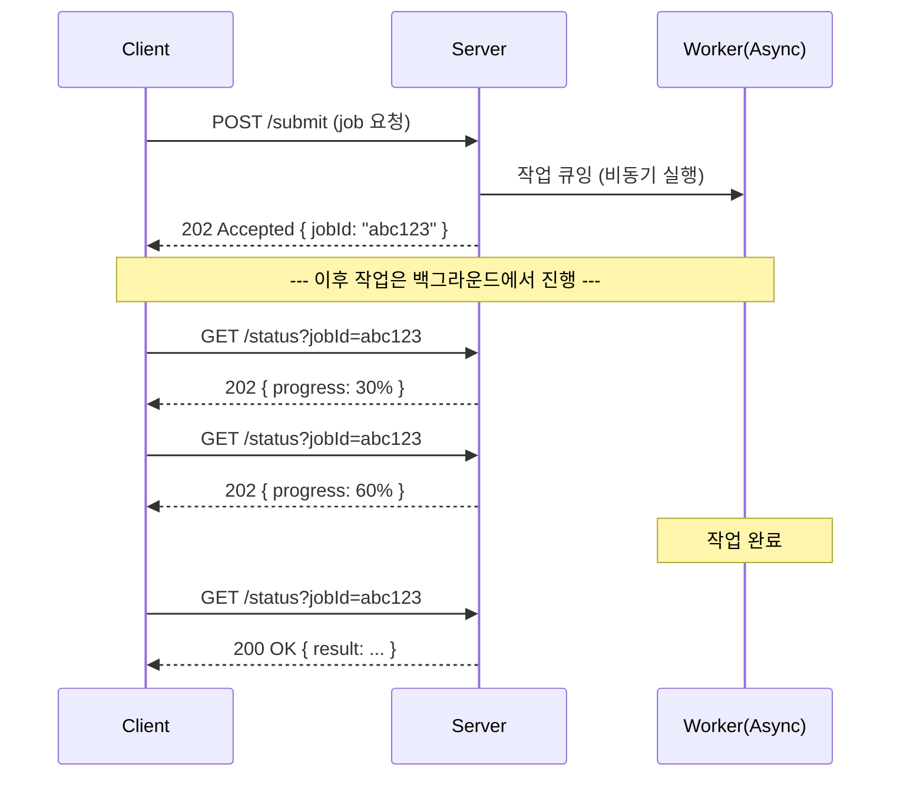
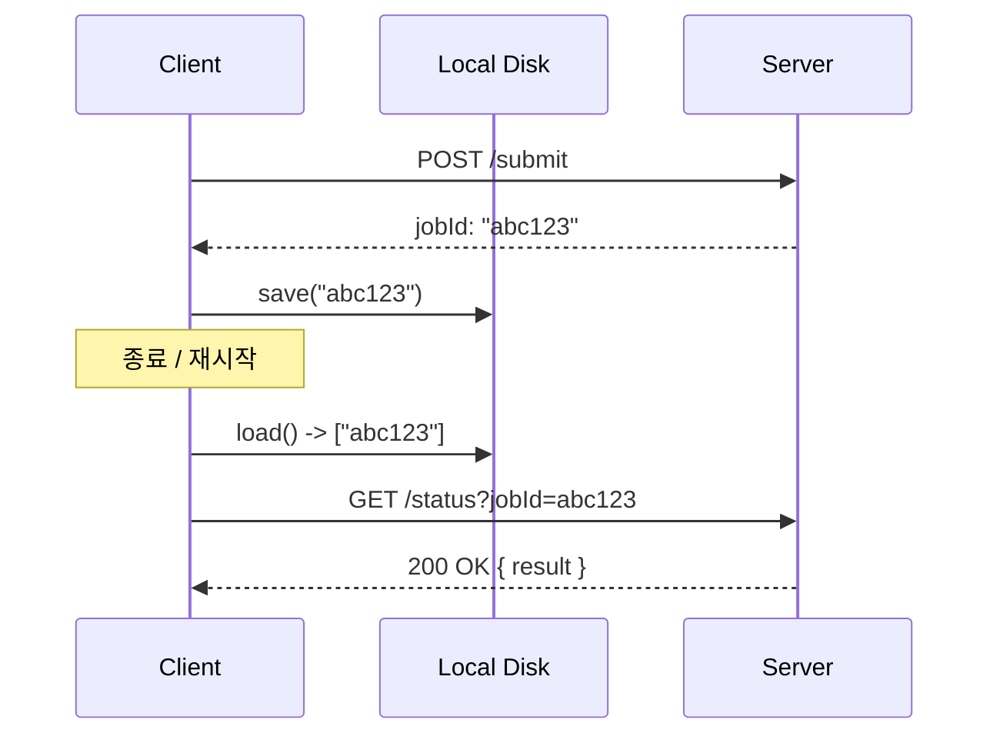
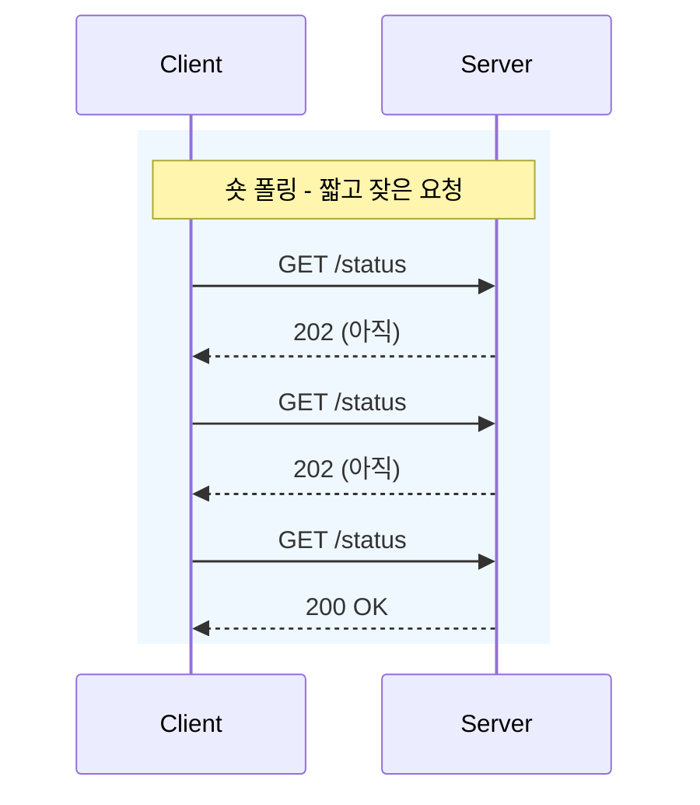

# 10. 폴링 (Polling)

## 개요

**폴링(Polling)** 은 백엔드 통신 패턴 중에서도 가장 흔하고, 가장 구현하기 쉬운 스타일이다. 사람들이 그냥 "폴링"이라고 부를 때는 보통 **숏 폴링(short polling)** 을 의미한다. "숏(short)"이라고 부르는 이유는, 폴링 요청 자체가 매우 짧은 시간 안에 끝나기 때문이다. 클라이언트는 단지 "이 작업 끝났어?"를 빠르게 묻고 끊는다.

폴링은 **요청이 처리되는 데 오래 걸리는 상황**에서 진가를 발휘한다. 예를 들어 유튜브에 영상을 올리는 경우, 업로드가 완료될 때까지 한 번의 HTTP 응답을 붙들고 기다리는 것은 비현실적이다. 대신 백엔드가 작업을 **비동기적으로(asynchronously)** 처리하면서, 클라이언트에게는 **핸들(handle)** — 흔히 job ID, task ID, request ID — 을 즉시 돌려준다. 클라이언트는 그 핸들을 들고 주기적으로 상태를 묻는다.

이 문서에서 다루는 내용은 다음과 같다.

- 폴링(숏 폴링)이 무엇이고 왜 등장했는가
- 어떤 상황에서 폴링이 적합한가 (장기 실행 작업)
- 동작 흐름과 시퀀스 다이어그램
- 장단점 (구현 단순함 vs. 네트워크/백엔드 자원 낭비)
- 폴링 vs 푸시 vs 롱 폴링 비교

---

## 1. 왜 단순 Request-Response로는 부족한가

전통적인 동기적 요청-응답 모델은 다음과 같은 상황에서 잘 동작하지 않는다.

- **요청 처리 시간이 매우 길다.** (예: 동영상 업로드, 비디오 인코딩, 대규모 배치 작업)
- 클라이언트가 그 시간 동안 연결을 유지하기 어렵다. (모바일 네트워크 변동, 브라우저 종료 등)
- 만약 그동안 연결이 끊긴다면, **서버는 응답을 줄 곳을 잃고**, 클라이언트는 결과를 받지 못한다.

> **요약**: 처리 시간이 긴 작업에는 "요청을 던지면, 비동기로 처리하고, 나중에 상태를 따로 묻는" 구조가 필요하다. 이것이 폴링이다.

---

## 2. 숏 폴링의 동작 원리

숏 폴링의 흐름은 다음 3단계로 정리된다.

1. **작업 제출 (submit)**: 클라이언트가 요청을 보낸다. 서버는 **즉시** `job ID`(핸들)를 반환하며, 실제 작업은 큐/디스크/메모리에 보관해 둔 채 비동기로 처리한다.
2. **상태 조회 (poll)**: 클라이언트는 그 `job ID`로 주기적으로 "이거 끝났어?"를 물어본다. 서버는 매번 빠르게 확인하고 "아직"이라고 답한다.
3. **완료 응답**: 어느 시점에서 작업이 완료되면, **다음 폴링 요청**이 결과를 즉시 받는다.

### 핵심 포인트

- 폴링 한 번 한 번은 **그 자체로 일반적인 request-response**다. 좁게 보면 폴링은 request-response의 반복이다.
- 그러나 시스템 전체로 보면, 하나의 큰 동기 요청을 **여러 개의 짧은 요청-응답**으로 쪼갠 비동기 처리 모델이다.
- **클라이언트는 안전하게 끊어졌다가 다시 붙어도 된다.** `job ID`만 디스크에 저장해 두면, 재실행 시 디스크에서 pending job 목록을 읽어 다시 폴링하면 된다.

> **요약**: 숏 폴링 = (즉시 핸들 받기) + (그 핸들로 짧은 요청을 반복).

---

## 3. 장점 (Pros)

### 3.1 구현이 매우 단순하다

- 클라이언트: 그냥 주기적으로 GET을 보내면 끝.
- 서버: 작업 큐와 상태 저장소만 있으면 된다.
- 별도의 양방향 프로토콜(WebSocket, SSE 등)이 필요 없다.

### 3.2 장기 실행 작업에 적합하다

요청 한 건의 처리 시간이 긴 경우, 동기 요청-응답을 폴링 시스템으로 바꾸기만 해도 시스템이 훨씬 견고해진다.

- 백엔드는 비동기로 처리하고,
- 클라이언트는 핸들만 받아서 보관하면 된다.

### 3.3 클라이언트 분리(disconnect) 가능

클라이언트가 도중에 종료되더라도 **`job ID`만 디스크에 저장**해두면, 재기동 시 다시 폴링을 이어갈 수 있다. 모바일 환경처럼 연결이 불안정한 곳에서 유용하다.

> 단, 백엔드가 **완료된 작업을 얼마나 오래 보관할지**는 운영자가 정해야 한다. 너무 짧게 잡으면 클라이언트가 재접속했을 때 결과가 사라져 있을 수 있다.

---

## 4. 단점 (Cons)

### 4.1 너무 수다스럽다 (Chatty)

폴링의 가장 큰 약점은 **불필요한 요청이 너무 많다**는 점이다.

- 클라이언트 1대가 폴링하는 건 별 문제가 아니다.
- 하지만 클라이언트 수천 대 × 각자 폴링 10~40번 = **압도적인 트래픽**.

대부분의 폴링 응답은 "아직 안 끝났어"라는 **사실상 쓸모없는 응답**이다. 작업이 완료되는 순간은 폴링 횟수 대비 극히 드물다.

### 4.2 네트워크 대역폭 낭비

- 모든 폴링은 결국 **TCP 커넥션**(또는 QUIC 위 UDP)으로 환산된다.
- 클라우드 환경에서 네트워크 대역폭은 **곧 비용**이다. 백엔드 청구서가 폴링 빈도에 비례해 늘어난다.

### 4.3 백엔드 자원 낭비

서버는 폴 요청(`poll request` — GitHub의 *pull request*가 아니다)을 받을 때마다 상태를 조회해야 한다. 이 조회 자체도 CPU/IO 자원을 쓰며, **그 자원은 진짜로 의미 있는 요청에 쓸 수 있었던 자원**이다.

### 4.4 완화책

- 폴링 주기를 늘린다 (예: 5초 → 30초).
- 지수 백오프(exponential backoff)를 적용한다.
- 그래도 근본적으로는 "물어보러 가는 모델"이라는 한계가 있다.

> **요약**: 숏 폴링은 단순하지만, 대규모 환경에서는 네트워크와 백엔드 자원을 갉아먹는다.

---

## 5. 폴링 vs 푸시 vs 롱 폴링 비교

| 항목 | 숏 폴링 (Short Polling) | 롱 폴링 (Long Polling) | 푸시 (Push, e.g. WebSocket/SSE) |
|------|------------------------|------------------------|--------------------------------|
| 통신 주도권 | 클라이언트 | 클라이언트 | 서버 |
| 커넥션 유지 | 짧음 (요청마다 종료) | 길게 유지 (이벤트 발생 시 응답) | 지속 (양방향/단방향 스트림) |
| 네트워크 효율 | 매우 낮음 (수다스러움) | 보통 | 높음 |
| 구현 난이도 | 가장 쉬움 | 중간 | 어려움 (상태 관리 필요) |
| 실시간성 | 낮음 (폴링 주기에 의존) | 좋음 (응답 즉시) | 매우 좋음 |
| 클라이언트 disconnect 처리 | 매우 쉬움 (`jobId` 저장 후 재폴링) | 어려움 (커넥션 끊김 시 재연결 필요) | 어려움 (재연결 + 누락 이벤트 복구) |
| 대표 예시 | YouTube 업로드 진행률, CI 빌드 상태 | Kafka consumer, 일부 채팅 백엔드 | WebSocket 채팅, SSE 알림 |

> **요약**: 폴링은 가장 단순하지만 가장 비효율적이다. 효율을 높이려면 다음 강의의 **롱 폴링**, 또는 그 이후의 **푸시(WebSocket/SSE)** 로 발전시켜야 한다.

---

## 6. 데모 요약 (Node.js + Express)

강의에서 직접 보여준 데모를 한 줄로 압축하면 다음과 같다.

- `POST /submit` → 서버가 `Date.now()` 기반 `jobId`를 만들어 `jobs[jobId] = 0`(progress 0%)으로 저장하고, 5초마다 progress를 +10씩 올리는 비동기 루프를 시작한다.
- 응답으로 `jobId`를 즉시 반환한다.
- `GET /checkStatus?jobId=...` → 현재 progress를 반환한다.
- 클라이언트는 `curl` 또는 `httpie`로 주기적으로 `/checkStatus`를 호출해 10% → 20% → ... → 100%까지 확인한다.
- 여러 작업을 병렬로 제출해도 각각의 `jobId`로 독립적으로 폴링할 수 있다.

핵심은 **"제출 즉시 핸들 반환, 이후엔 클라이언트가 알아서 상태를 묻는다"** 라는 패턴 그 자체다.

---

## 7. 핵심 한 줄 정리

- **숏 폴링은, 긴 작업을 비동기로 처리하기 위해 "핸들(jobId)을 즉시 받고 → 짧은 상태 조회 요청을 반복"하는 가장 단순한 비동기 통신 패턴이다.**
- 구현은 쉽지만, 수다스러움(chattiness) 때문에 네트워크와 백엔드 자원을 낭비한다.
- 그래서 다음 단계로 **롱 폴링 → 푸시(WebSocket/SSE)** 로 발전시킨다.

---

## 다음 학습 주제

다음 강의에서는 폴링의 비효율을 줄이는 **롱 폴링(Long Polling)** 을 다룬다. Kafka가 사용하는 방식이기도 하다. 클라이언트가 요청을 보내면 서버가 **이벤트가 생기거나 타임아웃이 날 때까지** 응답을 보류함으로써, 폴링 횟수를 극적으로 줄인다.
