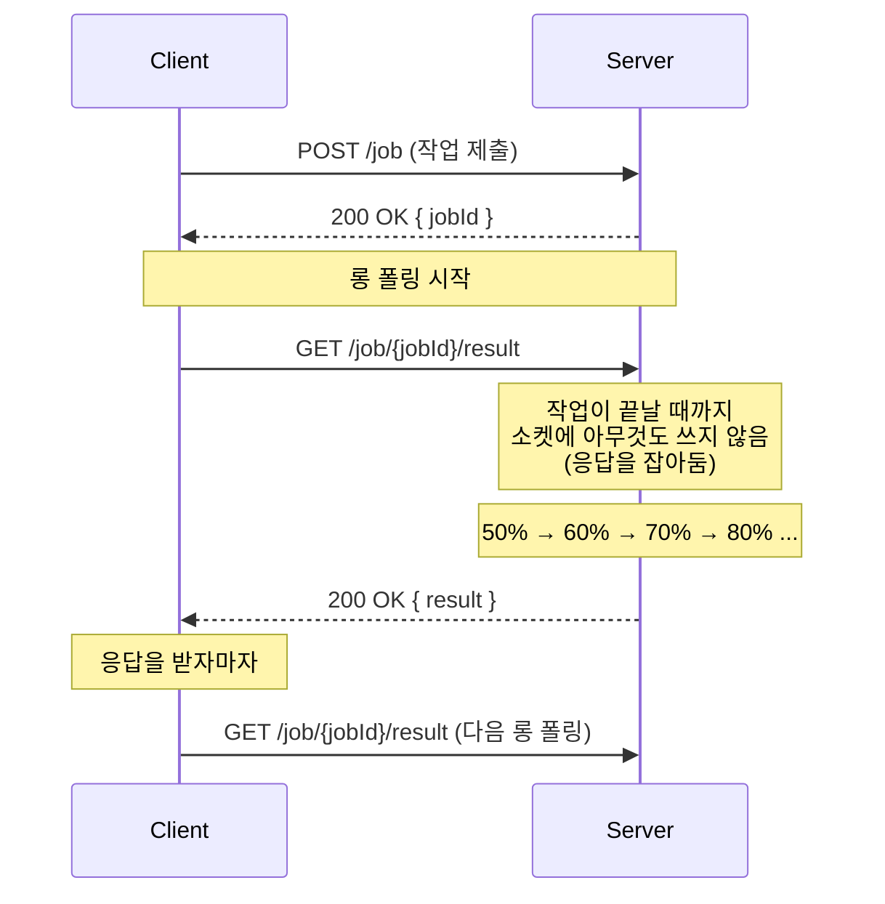
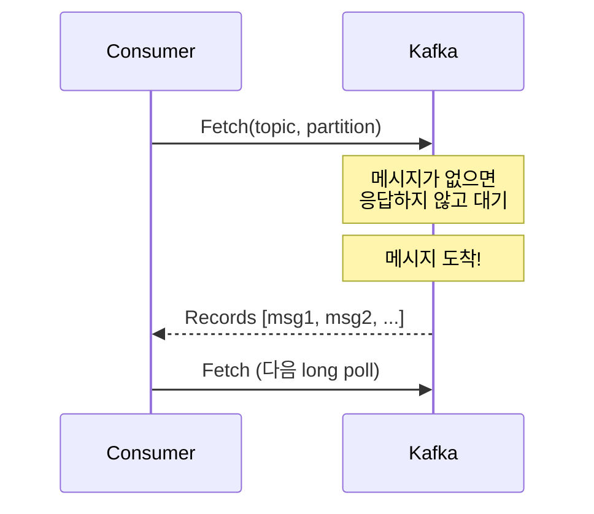
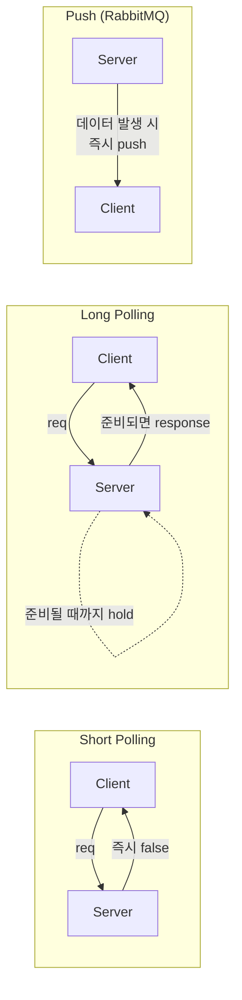

# 11. 롱 폴링 (Long Polling)

## 개요

**롱 폴링(Long Polling)** 은 클라이언트가 서버에 요청을 보낸 뒤, 서버가 응답할 데이터가 준비될 때까지 **응답을 잡아두는(hold)** 통신 패턴이다. 일반적인 (짧은) 폴링이 가진 **수다스러움(chattiness)** 을 줄이면서도, 푸시 모델처럼 서버가 클라이언트를 압박(throttle)하지 않는 균형점을 제공한다.

대표적으로 **Kafka 컨슈머**가 토픽을 구독할 때 이 패턴을 사용한다. RabbitMQ가 데이터를 클라이언트의 목구멍으로 밀어 넣는 push 모델을 채택한 반면, Kafka는 "클라이언트가 자신의 페이스로 가져가게 하자(let the client poll at their leisure)"는 철학에 따라 long polling을 채택했다.

이 문서에서 다루는 내용은 다음과 같다.

- 롱 폴링의 정의와 핵심 트릭
- 일반 폴링(short polling) 및 푸시(push) 모델과의 차이
- Kafka가 롱 폴링을 선택한 이유
- 서버 측 타임아웃과 블로킹 동작
- 장단점과 트레이드오프
- 다른 통신 패턴(SSE, WebSocket)과의 비교

---

## 1. 롱 폴링이란?

### 정의

> **롱 폴링은 클라이언트가 폴링 요청을 보내고, 서버는 응답할 데이터가 준비될 때까지 응답을 보내지 않고 소켓을 잡아두는(block) 통신 방식이다.**

겉모습은 일반 HTTP request-response이지만, 서버가 **즉시 응답하지 않고 기다린다**는 점이 다르다. 그 결과 사실상 "아주 긴 request-response"처럼 동작한다.

### 핵심 트릭

- 클라이언트는 폴링 요청을 보낸다. 모양은 일반 polling과 동일하다.
- 서버는 작업이 끝나지 않았다면 **소켓에 아무것도 쓰지 않고** 대기한다.
  - "아직 안 됐어, 다시 와"라고 즉시 응답하지 **않는다.**
- 작업/메시지가 준비되는 순간 서버가 응답을 써 보낸다.
- 클라이언트는 응답을 받자마자 곧바로 다음 long polling 요청을 보낸다.



> **요약**: "지금 줘"가 아니라 **"준비되면 그때 말해줘"**. 서버는 준비될 때까지 응답하지 않는 것이 핵심이다.

---

## 2. 일반 폴링 / 푸시와의 차이

### Short Polling (일반 폴링)

- 클라이언트가 주기적으로 "준비됐어?"라고 요청한다.
- 서버는 매번 즉시 응답한다 (`false` 또는 결과).
- 준비 안 됐다는 응답이 반복되면 **수다스럽다(chatty)**: 네트워크 / 백엔드 리소스 낭비.

### Long Polling

- 클라이언트가 한 번 요청을 보내면 **준비될 때까지 한 커넥션이 유지**된다.
- "준비 안 됐음"이라는 응답 자체가 없으므로 불필요한 왕복이 사라진다.
- 그래도 **연결을 끊을 수 있는(disconnect 가능한) 일반 HTTP 요청**이라는 점은 유지된다.

### Push (RabbitMQ 스타일)

- 데이터가 생기는 즉시 서버가 클라이언트에게 밀어 넣는다.
- 가장 실시간성에 가깝지만, **소비자가 처리 속도를 따라잡지 못하면(consumer can't handle the volume)** 무너진다.
- 흐름 제어(flow control)가 서버 쪽에 있다.

> **요약**: 롱 폴링은 polling의 단순함과 push의 효율 사이에서 균형을 잡는 패턴이다. **데이터 흐름의 제어권을 클라이언트가 쥔다.**

---

## 3. 왜 Kafka는 롱 폴링을 쓰는가?

Kafka 컨슈머가 토픽을 구독할 때 내부적으로 일어나는 일은 다음과 같다.

1. 컨슈머가 브로커에 "이 토픽/파티션에 메시지 있어?"라고 요청을 보낸다.
2. 메시지가 **없으면** Kafka는 **응답을 보내지 않고 대기한다(block).**
3. 메시지가 도착하는 순간 Kafka가 응답으로 메시지를 써 보낸다.
4. 컨슈머는 받자마자 다시 long polling 요청을 보낸다.



### Push가 아닌 이유

- Push는 컨슈머의 처리 능력에 무관하게 메시지를 밀어 넣는다 → 백프레셔(backpressure) 문제 발생.
- Long polling은 **컨슈머가 준비되었을 때만** 다음 요청을 보내므로 자연스러운 흐름 제어가 된다.
- 동시에 polling 특유의 수다스러움도 없다(메시지가 없으면 그냥 한 커넥션이 조용히 대기).

> **요약**: Kafka는 push의 백프레셔 문제와 polling의 수다스러움을 동시에 피하기 위해 long polling을 채택했다.

---

## 4. 서버 측 타임아웃과 구현 노트

### 영원히 기다리지는 않는다

이론상 서버는 데이터가 준비될 때까지 무한히 기다릴 수 있지만, 실제로는 **클라이언트 타임아웃 / 서버 타임아웃**이 설정된다.

- 클라이언트 타임아웃: 너무 오래 응답이 없으면 끊고 재요청.
- 서버 타임아웃: 일정 시간 후 "아직 데이터 없음" 응답을 돌려보내고 클라이언트가 다시 요청하게 함.

### Node.js로 구현할 때의 함정

강의에서는 다음과 같은 형태를 보여준다.

- `checkJobComplete(jobId)`: 준비되지 않았다면 `false`를 반환하는 Promise 기반 함수.
- 라우트 핸들러에서 `await checkJobComplete(...)` 결과가 `false`이면 `while` 루프로 반복.

이때 **루프 안에서 `await`로 인위적인 지연(예: 1초)** 을 주지 않으면 이벤트 루프가 막힌다.

```js
// 의사 코드 - 안 좋은 예
while (!(await checkJobComplete(jobId))) {
  // 아무 대기도 없음 → 동기적 busy-wait처럼 동작
}

// 의사 코드 - 의도된 형태
while (!(await checkJobComplete(jobId))) {
  await sleep(1000); // 이벤트 루프에 숨 쉴 틈을 준다
}
```

> "지연을 추가하면 결국 서버 측 폴링 아니냐?" 맞다. **실제로 long polling은 폴링을 클라이언트에서 서버로 옮긴 것에 가깝다.** 다만 pub/sub 같은 readiness 신호가 있다면, 서버가 실제로 폴링할 필요 없이 이벤트가 오면 즉시 응답할 수 있다.

---

## 5. 장단점

### 장점 (Pros)

- **수다스러움 감소(less chatty)**: 빈 응답 왕복이 사라진다.
- **백엔드 친화적**: 불필요한 요청으로 백엔드를 두드리지 않는다.
- **연결을 끊을 수 있다**: 일반 HTTP 위에서 동작하므로 클라이언트가 자유롭게 disconnect 가능.
- **클라이언트 제어**: 데이터 흐름의 페이스를 컨슈머가 잡는다 (Kafka의 핵심 장점).

### 단점 (Cons)

- **완전한 실시간은 아니다**: 응답을 받고 다음 long poll 요청을 다시 만들기까지의 **틈(gap)** 사이에 새 메시지가 도착해도 즉시 받지 못한다.
- **커넥션 점유**: 응답을 기다리는 동안 서버 측 커넥션 자원이 묶인다.
- **타임아웃 정책 필요**: 무한 대기는 비현실적이라 클라이언트/서버 양쪽 타임아웃을 설계해야 한다.
- **단순하지 않다**: "Very simple"이라 했다가 강사가 곧바로 정정한다 — 실제 코딩에는 이벤트 루프, 타임아웃, 재시도 등 여러 디테일이 얽힌다.

---

## 6. 다른 통신 패턴과의 비교

| 항목 | Short Polling | Long Polling | SSE (Server-Sent Events) | WebSocket |
|------|---------------|--------------|---------------------------|-----------|
| 방향 | 클라이언트 → 서버 (반복) | 클라이언트 → 서버 (긴 대기) | 서버 → 클라이언트 (단방향 스트림) | 양방향 |
| 프로토콜 | HTTP | HTTP | HTTP (text/event-stream) | WS (HTTP 업그레이드) |
| 실시간성 | 폴링 주기에 의존 (가장 낮음) | 거의 실시간 (gap 존재) | 실시간 | 실시간 |
| 수다스러움 | **높음** | 낮음 | 매우 낮음 | 매우 낮음 |
| 흐름 제어 주체 | 클라이언트 | 클라이언트 | 서버 | 양쪽 |
| 백프레셔 위험 | 없음 (클라가 호출 조절) | 없음 | 있음 (서버 push) | 있음 |
| Disconnect 용이성 | 매우 쉬움 | 쉬움 | 보통 | 보통 |
| 대표 사용처 | 상태 확인 (가벼움) | **Kafka 컨슈머**, 알림 | 주식 시세, 로그 스트림 | 채팅, 게임, 협업 |



---

## 7. 핵심 한 줄 정리

- **롱 폴링은 "응답을 보내지 않고 잡아두는" 트릭으로 polling의 수다스러움을 제거하고, push의 백프레셔 문제를 회피하는 절충안이다.**
- Kafka 컨슈머가 이 패턴을 채택한 이유는 **흐름 제어를 클라이언트에게 맡기기 위해서**다.
- 표준 HTTP 위에서 동작하므로 disconnect 가능하다는 점, 그러나 완전한 실시간은 아니라는 점이 가장 중요한 트레이드오프다.

---

## 다음 학습 주제

다음 강의에서는 **Server-Sent Events (SSE)** 를 다룬다. Long polling이 "서버가 응답을 잡아두는" 방식이었다면, SSE는 한 번의 HTTP 응답 위에서 서버가 **여러 이벤트를 스트리밍**으로 흘려보내는 방식으로, 실시간성을 더 끌어올린 모델이다.
