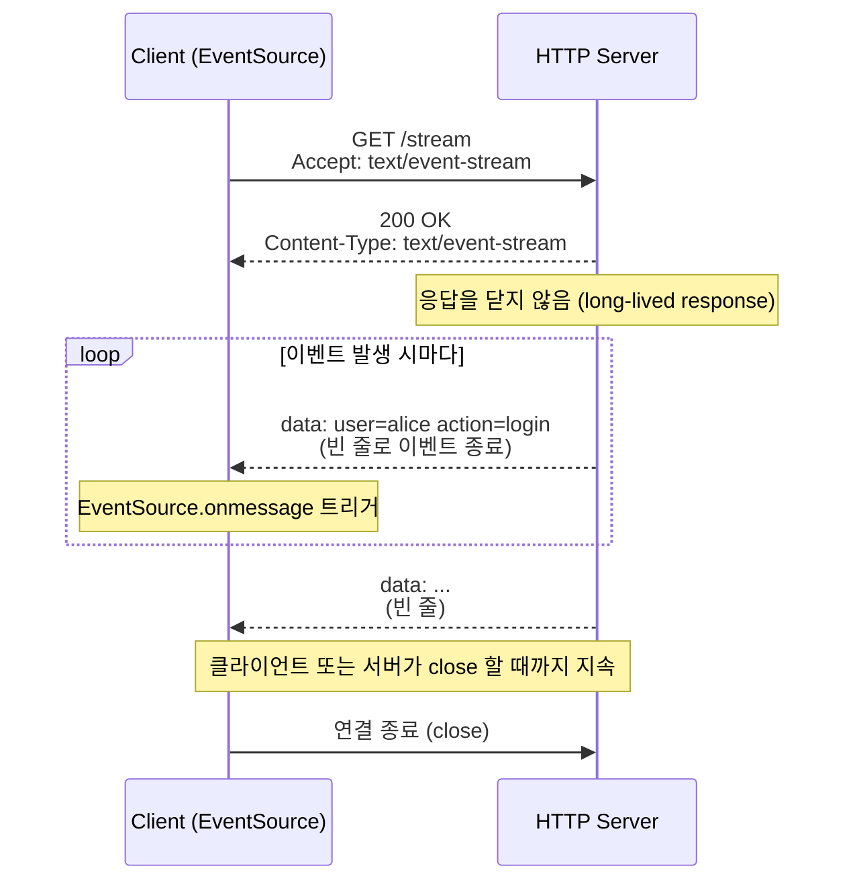
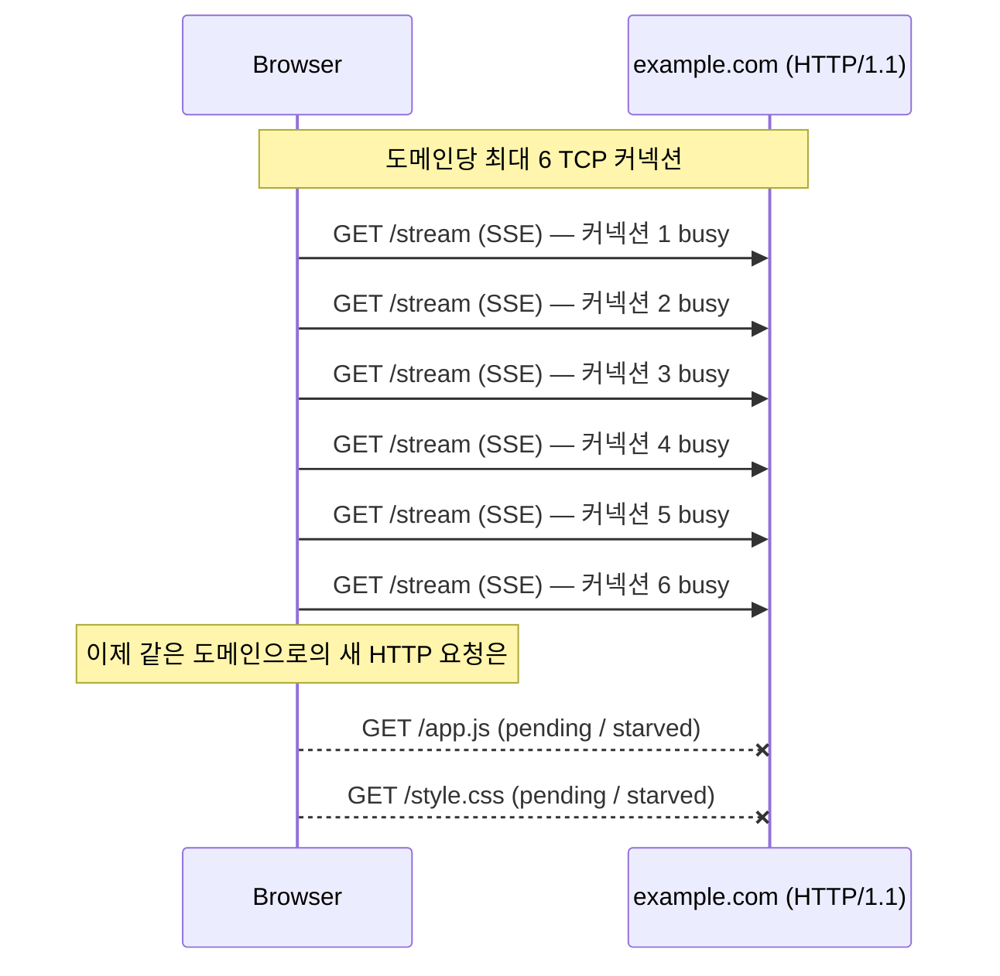

# 12. Server Sent Events (SSE)

## 개요

**Server Sent Events (SSE)** 는 강의자가 "가장 좋아하는 패턴 중 하나"라고 부를 만큼 우아한 설계다. HTTP의 본질은 *요청-응답(request-response)* 이지만, SSE는 그 안에서 **한 번의 요청** 으로 **끝나지 않는 응답** 을 흘려보내는 트릭으로 서버 → 클라이언트 단방향 스트리밍을 구현한다. WebSocket처럼 별도의 프로토콜이나 서버가 필요하지 않고, 어떤 평범한 HTTP 서버도 SSE를 지원할 수 있다는 점이 핵심 매력이다.

이 문서에서 다루는 내용은 다음과 같다.

- SSE란 무엇이고 왜 등장했는가
- HTTP 위에서 어떻게 동작하는가 (`text/event-stream`, 청크 스트리밍)
- 사용 사례 (LLM 토큰 스트리밍, 주식 시세, 알림 등)
- 한계 (단방향, HTTP/1.1의 커넥션 6개 제한 문제)
- WebSocket / Long-polling과의 비교

---

## 1. SSE란 무엇인가

> **SSE는 "한 개의 HTTP 요청에 대해, 끝나지 않는 응답을 청크 단위로 흘려보내는" 단방향 스트리밍 패턴이다.**

기본 HTTP 요청-응답 모델은 다음 두 가지 제약이 있다.

- 응답은 시작(`HTTP/1.1 200 OK ...`)과 끝(헤더 종료 후 본문, 그리고 종료)이 명확하다.
- 서버가 클라이언트에게 *자발적으로* 무언가를 푸시할 방법이 없다.

이 제약을 우회하기 위해 SSE는 다음과 같은 트릭을 쓴다.

1. 클라이언트가 `Accept: text/event-stream` 헤더로 일반 HTTP 요청을 보낸다.
2. 서버는 `Content-Type: text/event-stream` 으로 응답을 시작한다.
3. 서버는 응답 본문을 **닫지 않은 채** 지속적으로 청크를 흘려보낸다. 각 청크는 `data: ...` 로 시작하고 **빈 줄(개행 2개)** 로 끝난다.
4. 브라우저의 **EventSource** 객체가 청크를 파싱해, 각 청크를 하나의 "이벤트(message)"로 애플리케이션에 전달한다.

> **요약**: SSE는 *새로운 프로토콜* 이 아니라, *HTTP 응답을 끝내지 않고 청크로 흘려보내는 관습* 이다. 서버 입장에서는 "엄청 긴 응답"을 쓰는 것일 뿐이다.

---

## 2. HTTP 위에서 어떻게 동작하는가

### 기본 흐름



핵심은 다음과 같다.

- **단 하나의 요청**: 클라이언트는 `GET /stream` 한 번만 보낸다.
- **끝나지 않는 응답**: 서버는 응답 본문에 청크를 계속 쓰지만 절대 "이 응답은 끝났다"는 표시를 하지 않는다.
- **이벤트 경계 규약**: `data: <payload>` 줄 다음에 빈 줄이 오면 하나의 이벤트로 인식된다. 약간 "hacky" 해 보이지만, 동작하기만 하면 그만이다.

### 간단한 서버 예시 (Express)

```js
// 서버: localhost:8888
app.get('/stream', (req, res) => {
  res.setHeader('Content-Type', 'text/event-stream');
  // res.end() 를 호출하지 않는 것이 포인트

  let counter = 0;
  setInterval(() => {
    res.write(`data: hello from server ${counter++}\n\n`);
  }, 1000);
});
```

### 간단한 클라이언트 예시 (브라우저)

```js
const sse = new EventSource('http://localhost:8888/stream');
sse.onmessage = (msg) => {
  console.log(msg.data); // "hello from server 0", "hello from server 1", ...
};
```

> **요약**: 서버는 `text/event-stream` 으로 응답을 시작한 뒤 `data: ...\n\n` 패턴으로 청크를 계속 흘려보내고, 클라이언트는 EventSource로 그 청크들을 메시지 단위로 받아 처리한다.

---

## 3. 사용 사례

SSE가 빛나는 지점은 **서버 → 클라이언트로의 일방향 실시간 푸시** 가 필요하지만, WebSocket을 도입할 만큼의 양방향 통신은 필요 없는 경우다.

| 사용 사례 | 설명 |
|-----------|------|
| **LLM 토큰 스트리밍** | ChatGPT/Claude 류 응답이 한 글자씩 흘러나오는 동작은 대부분 SSE 기반. 토큰이 생성될 때마다 `data:` 이벤트로 푸시. |
| **주식/암호화폐 시세 (Stock ticker)** | 가격이 갱신될 때마다 서버가 즉시 푸시. 클라이언트는 폴링할 필요가 없다. |
| **실시간 알림 (Notifications)** | "메시지 도착", "결제 완료", "댓글 알림" 등 서버 발생 이벤트 푸시. |
| **로그/메트릭 스트리밍** | CI/CD 로그, 빌드 진행 상황, 모니터링 대시보드 등. |
| **피드/타임라인 업데이트** | 새 게시물이 올라올 때마다 클라이언트에 알림. |

> 공통점: 모두 **서버가 자발적으로 보내야 할 데이터** 가 있고, **클라이언트는 받기만 하면 되는** 일방향 워크플로다.

---

## 4. 한계와 주의사항

### 4.1 단방향 통신 (Server → Client)

- 클라이언트는 같은 SSE 커넥션 위에서 서버로 메시지를 보낼 수 없다.
- 양방향이 필요하다면 별도의 HTTP 요청이나 WebSocket이 필요하다.

### 4.2 클라이언트가 온라인 상태여야 함

- "요청 한 번에 응답을 계속 받는" 구조이므로, 클라이언트가 끊기면 그 이벤트는 받지 못한다.
- 끊긴 동안의 이벤트를 어떻게 처리할지 서버가 별도로 책임져야 하며, 이는 추가 부하가 된다.
- 가벼운 클라이언트 / 단순한 유스케이스라면 **폴링(long/short polling)** 이 오히려 적절할 수 있다.

### 4.3 HTTP/1.1의 커넥션 6개 제한 (Connection Pinning)

이 한계가 SSE의 가장 큰 함정이다.

- 브라우저(Chrome 등)는 **동일 도메인당 최대 6개의 TCP 커넥션** 만 허용한다.
- HTTP/1.1에서는 **한 커넥션에 한 번에 하나의 요청** 만 가능하며, 그 요청이 처리되는 동안 커넥션은 "busy" 상태가 된다.
- SSE는 **응답이 끝나지 않는 요청** 이므로, 한 번 연 SSE 커넥션은 끝까지 **busy** 상태로 묶여 있다 (커넥션을 "pin" 한다).
- 만약 같은 도메인으로 SSE 6개를 열면, **나머지 모든 요청(JS, CSS, 이미지 등)이 starvation 상태가 된다.**



**해결책: HTTP/2 사용**

- HTTP/2는 **단일 TCP 커넥션 위에서 다중 스트림(multiplexing)** 을 지원한다.
- 하나의 커넥션으로 SSE 스트림 여러 개와 일반 요청을 동시에 처리할 수 있다.
- 동시 스트림 한도(예: 200)는 설정 가능하다.

> **요약**: HTTP/1.1 환경에서 SSE를 여러 개 열면 같은 도메인의 다른 요청이 굶는다. SSE를 적극 사용한다면 **HTTP/2 이상** 위에서 운영해야 한다.

### 4.4 이벤트 경계가 텍스트 규약

- `data: ...\n\n` 은 결국 텍스트 약속이다. 바이너리를 그대로 보내기는 적합하지 않다 (Base64 등으로 인코딩 필요).
- 무거운 바이너리 스트리밍이라면 WebSocket이나 gRPC 스트리밍이 더 자연스럽다.

---

## 5. 다른 패턴과의 비교

| 항목 | SSE | WebSocket | Long Polling |
|------|-----|-----------|--------------|
| 프로토콜 | HTTP (text/event-stream) | WebSocket (HTTP Upgrade) | HTTP |
| 방향 | **단방향 (Server → Client)** | **양방향 (Full-duplex)** | 단방향에 가까움 (요청-응답 반복) |
| 연결 수명 | 매우 김 (서버가 끝낼 때까지) | 매우 김 (양쪽 누구든 닫을 때까지) | 응답마다 종료, 즉시 재요청 |
| 서버 요구사항 | **일반 HTTP 서버로 충분** | WebSocket 지원 서버 필요 | 일반 HTTP 서버 |
| 메시지 포맷 | 텍스트 (UTF-8) | 텍스트 + 바이너리 | 응답 본문 자유 |
| 자동 재연결 | **브라우저 EventSource가 기본 제공** | 직접 구현 필요 | 매 요청이 새 연결 |
| HTTP/1.1 커넥션 핀닝 | **있음 (6개 제한 위험)** | 있음 (하지만 통상 1~2개만 사용) | 없음 (요청마다 끝남) |
| 대표 사용처 | LLM 토큰 스트리밍, 알림, 시세 | 채팅, 게임, 협업 도구 | 구형 알림 시스템 |

> **선택 기준**:
> - 서버 푸시만 필요하다 → **SSE**
> - 양방향 실시간이 필요하다 → **WebSocket**
> - 호환성/단순성이 최우선이다 → **Long polling**

---

## 6. SSE의 장단점 정리

### 장점

- **실시간성**: 서버가 데이터가 생기는 즉시 푸시한다.
- **HTTP 호환**: 별도 프로토콜이 아니므로 모든 HTTP 인프라(프록시, 로드 밸런서, 인증)와 쉽게 통합된다.
- **클라이언트 구현이 단순**: 브라우저의 `EventSource` 한 줄로 끝난다.
- **자동 재연결**: EventSource는 끊긴 경우 알아서 재시도한다.

### 단점

- **단방향**: 클라이언트 → 서버 통신은 불가.
- **클라이언트 온라인 의존**: 끊기면 그 동안의 이벤트는 별도 보관/재전송 로직 필요.
- **HTTP/1.1 커넥션 핀닝**: 같은 도메인의 다른 요청을 굶길 수 있다.
- **텍스트 전용**: 바이너리에 부적합.

---

## 7. 핵심 한 줄 정리

> **SSE = "끝나지 않는 HTTP 응답"이라는 트릭으로 서버 → 클라이언트 단방향 실시간 푸시를 구현한 우아한 패턴.**

- 한 번의 요청, 영원히 열려 있는 응답.
- 별도 프로토콜 없이 평범한 HTTP 서버와 `text/event-stream` 만 있으면 동작.
- 단, HTTP/1.1 위에서는 커넥션 핀닝으로 다른 요청을 starvation 시킬 수 있으니 **HTTP/2 이상에서 운영하는 것을 권장**.

---

## 다음 학습 주제

다음 강의에서는 → **13. Publish-Subscribe 패턴** 을 다룬다. SSE/WebSocket이 "한 클라이언트와 서버 사이의 스트리밍"이라면, Pub-Sub은 "한 발행자가 다수 구독자에게 비동기로 메시지를 뿌리는" 다대다 분산 구조다.
