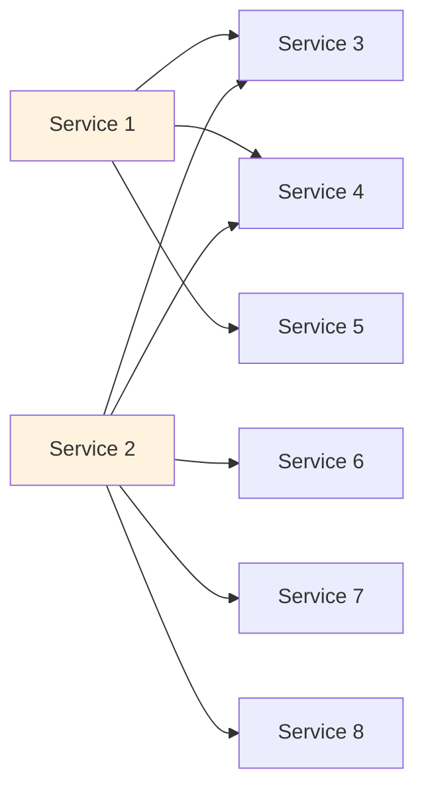
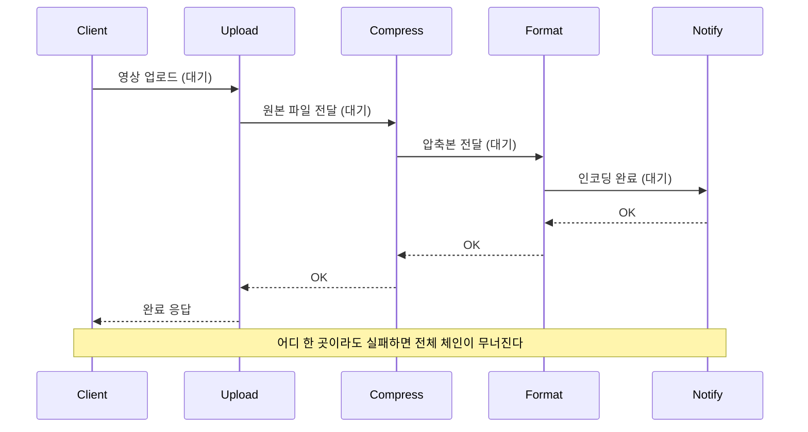
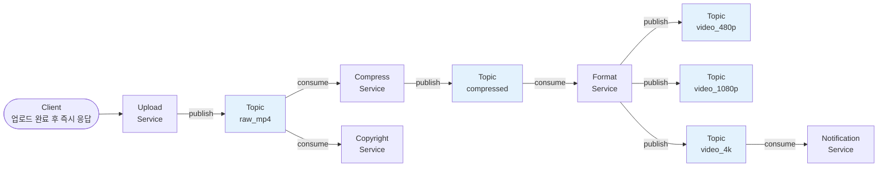
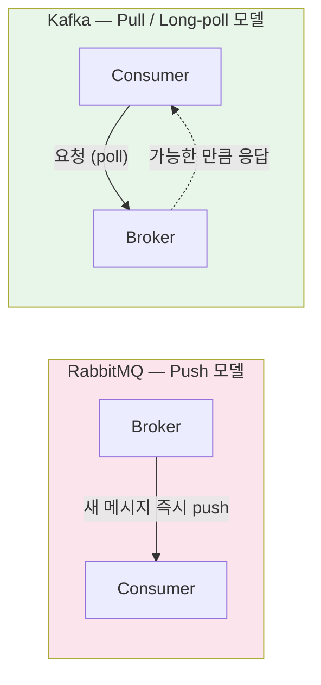

# 13. 발행/구독 (Publish Subscribe, Pub/Sub)

## 개요

**Pub/Sub(발행/구독)** 은 백엔드 통신에서 가장 널리 쓰이는 **비동기 메시징 패턴**이다. 서비스가 늘어날수록 **요청/응답(request-response)** 만으로는 다대다(N×N) 의존성, 강한 결합, 긴 동기 호출 체인 같은 문제가 빠르게 누적된다. Pub/Sub은 **브로커(broker)** 와 **토픽(topic)** 을 가운데에 두고 발행자와 소비자를 분리해, 이 복잡도를 해소한다.

이 문서에서 다루는 내용은 다음과 같다.

- 마이크로서비스에서 mesh 형태의 의존성이 만들어 내는 문제
- YouTube 업로드 파이프라인을 요청/응답으로 구현했을 때 무엇이 깨지는가
- Pub/Sub 모델: 브로커 + 토픽 + 다중 소비자
- Kafka의 **pull** 과 RabbitMQ의 **push** 전달 모델 비교
- 장단점과 적용 기준
- 메시지 전달 보장(at-least-once 등)과 운영상 트레이드오프

---

## 1. 왜 Pub/Sub이 필요한가 — 서비스 mesh의 폭증

마이크로서비스 환경에서는 서비스 수가 늘어날수록 서로 직접 호출하는 관계가 폭발적으로 늘어난다. 클라이언트 1이 데이터를 클라이언트 3, 4, 5, 6, 7, 8에 보내야 한다면 1은 모든 상대와 직접 연결을 맺어야 하고, 받는 쪽도 모든 송신자를 알아야 한다.

> **요약**: 직접 호출만 사용하면 N개의 서비스가 최대 N² 의 연결 관계를 갖게 되어, 변경/장애 전파가 통제 불가능해진다.

---

## 2. 요청/응답으로는 무엇이 깨지나 — YouTube 업로드 예시

YouTube에 영상을 올린다고 해보자. 백엔드에서는 다음 순서가 필요하다.

1. **Upload**: 원본 영상 업로드
2. **Compress**: 원본을 압축
3. **Format**: 480p / 720p / 1080p / 4K로 인코딩
4. **Notification**: 사용자에게 알림 전송
5. **Copyright**: 저작권 검사

이것을 단순한 동기 요청/응답 체인으로 구현하면 다음과 같이 된다.

문제는 명확하다.

- 클라이언트는 인코딩과 알림까지 **모두 끝날 때까지 응답을 받지 못한다.**
- 체인 중간 어느 한 서비스라도 실패하면 **전체 워크플로가 무너진다.**
- **Copyright 같은 추가 의존성**을 끼워 넣으려면 호출 순서와 분기를 재설계해야 한다.
- 서비스 간 결합도가 매우 높아져, 회로 차단(circuit breaking), 재시도, 체이닝 같은 복잡한 로직이 따라붙는다(이래서 service mesh / 사이드카 프록시가 등장).

> **요약**: 요청/응답은 우아하고 확장도 잘 되지만, **다중 수신자**와 **긴 비동기 파이프라인**에는 부적합하다.

---

## 3. Pub/Sub 해법 — 브로커 + 토픽 + 다중 소비자

Pub/Sub에서는 **브로커**(Kafka, RabbitMQ 등)라는 중앙 서버를 두고, 그 안에 **토픽(topic)** 이라 부르는 논리적 큐를 둔다. 발행자는 토픽에 메시지를 던지고 곧바로 손을 뗀다. 누가 그 메시지를 언제 소비하는지는 발행자가 알 필요가 없다.

YouTube 파이프라인을 Pub/Sub으로 다시 그리면 이렇게 된다.

흐름은 다음과 같다.

1. 클라이언트가 영상을 업로드하면 Upload 서비스는 원본을 `raw_mp4` 토픽에 publish하고 **즉시 클라이언트에 ID를 응답**한다.
2. Compress 서비스가 `raw_mp4`에서 메시지를 가져와 처리한 뒤, 결과를 `compressed` 토픽에 publish한다.
3. Format 서비스가 `compressed`를 소비해서 480p / 1080p / 4K 토픽으로 publish한다.
4. Notification 서비스는 `video_4k` 토픽을 구독하다가 4K가 준비되면 사용자에게 알린다. (UX 정책에 따라 다른 화질을 구독해도 됨.)
5. Copyright 서비스는 동일한 `raw_mp4` 토픽을 **독립적으로** 구독해서 저작권 검사를 수행한다 — 다른 파이프라인을 막지 않는다.

### 발행자/소비자 역할

| 서비스 | 역할 |
|--------|------|
| Upload | Publisher |
| Compress | Consumer + Publisher |
| Format | Consumer + Publisher |
| Notification | Consumer |
| Copyright | Consumer |

> **요약**: 토픽이 중간에 끼어들면서 서비스끼리 직접 알 필요가 없어진다. 새로운 소비자(Copyright, Analytics 등)는 **기존 코드를 건드리지 않고** 추가할 수 있다.

---

## 4. 전달 모델: Kafka(Pull) vs RabbitMQ(Push)

브로커가 메시지를 소비자에게 어떻게 "전달"하느냐는 구현마다 다르며, 대표적으로 두 가지 방식이 있다.

| 항목 | RabbitMQ (Push) | Kafka (Pull / Long-poll) |
|------|-----------------|--------------------------|
| 메시지 전달 주도권 | 브로커가 소비자에게 푸시 | 소비자가 브로커에 요청해 가져감 |
| 소비자 부하 제어 | 소비자가 감당 못 하면 백프레셔 필요 | 소비자가 자기 속도에 맞춰 가져감 |
| 지연(latency) | 일반적으로 낮음 | 폴링 주기/long-poll에 따라 다름 |
| 적합한 상황 | 작업 큐, 즉시 처리, 비교적 짧은 메시지 | 이벤트 스트림, 재처리, 대용량 로그 |

> **요약**: 어떤 모델이 "옳다"는 답은 없다. 처리량/지연/소비자 처리 패턴에 따라 결정해야 한다 — 이 지점이 백엔드 엔지니어링의 본질이다.

### 메시지 전달 보장과 acknowledgement (RabbitMQ 예시)

RabbitMQ 데모에서 확인한 동작:

- 컨슈머 A가 작업 `107`을 받아 처리 중이지만 **ack를 보내지 않으면**, 브로커는 그 메시지를 "아직 처리 안 됨"으로 본다.
- 같은 시점에 컨슈머 B가 큐에 붙어 있어도 새 메시지가 따로 없으면 받지 못한다.
- 컨슈머 A 연결이 끊어지면 브로커는 "이 메시지 ack 안 받음"으로 판단해 **컨슈머 B에게 같은 메시지를 재전달**한다.

이런 동작 덕분에 메시지 손실은 줄어들지만, 대신 **같은 메시지가 두 번 처리될 수 있다**. 이게 흔히 말하는 **at-least-once 전달 보장**이다.

---

## 5. Pub/Sub의 장단점

| 구분 | 내용 |
|------|------|
| 장점 | 다중 수신자(fan-out)에 자연스러움 |
| 장점 | 서비스 간 **느슨한 결합**(loose coupling) — 발행자는 소비자를 모름 |
| 장점 | 소비자가 일시적으로 죽어도 발행은 계속 가능 (큐가 메시지를 보관) |
| 장점 | 새 소비자를 기존 시스템 수정 없이 추가 가능 |
| 장점 | 마이크로서비스 / 이벤트 기반 아키텍처에 적합 |
| 단점 | **메시지 전달 보장**이 본질적으로 어렵다 (Two Generals 문제) |
| 단점 | **중복 소비** 가능성 — 멱등성(idempotency) 설계가 필수 |
| 단점 | 브로커 자체가 새로운 운영 부담 (HA, 파티셔닝, 모니터링) |
| 단점 | 폴링 모델일 경우 클라이언트가 많아지면 **네트워크 포화** 발생 가능 |
| 단점 | 시스템 전체의 흐름이 분산되어 **디버깅/추적이 까다로움** |

> **주의**: "정확히 한 번(exactly-once)" 전달은 일반적으로 매우 어렵다. Kafka, RabbitMQ 모두 기본은 **at-least-once** 라고 보고 애플리케이션을 **멱등하게** 설계하는 편이 안전하다.

---

## 6. 언제 Pub/Sub을 쓰는가

- **사후 처리 파이프라인**: 업로드 후 압축/인코딩/알림 등 비동기 후속 작업
- **이벤트 기반 마이크로서비스**: 도메인 이벤트를 여러 서비스가 각자의 관점에서 소비
- **fan-out**: 동일 이벤트를 여러 소비자가 독립적으로 처리해야 할 때 (알림, 검색 색인, 분석, 감사 로그 등)
- **버퍼링 / 부하 평활화**: 트래픽 스파이크를 큐로 흡수하고 컨슈머는 자기 속도로 처리
- **서비스 간 결합도를 의도적으로 낮춰야 할 때**

반대로 다음과 같은 경우에는 **요청/응답이 더 낫다**.

- 즉각적인 응답이 필요한 단일 호출 (ex. 로그인, 결제 승인 확인)
- 다중 수신자가 없고 호출 체인이 짧을 때
- 메시지 손실/중복을 다루는 비용보다 단순한 동기 호출의 단순성이 더 중요할 때

---

## 7. 핵심 한 줄 정리

- **요청/응답**: 클라이언트가 서버를 알고, 응답을 기다린다. 단순하지만 **다중 수신자/긴 파이프라인**에서 깨진다.
- **Pub/Sub**: 발행자와 소비자 사이에 **브로커 + 토픽**을 두어, 시간/위치/식별 측면 모두에서 결합을 끊는다.
- 비용은 **메시지 전달 보장의 어려움**과 **브로커 운영 부담** 으로 치환된다. → 그래서 멱등성과 at-least-once를 기본 가정으로 설계한다.

---

## 다음 학습 주제

다음 강의에서는 **Multiplexing(다중화) vs Demultiplexing(역다중화)** 을 다룬다. 하나의 커넥션 위에서 여러 논리적 스트림을 어떻게 동시에 흘려보내고 다시 분리해 내는지, HTTP/2, gRPC, QUIC 같은 현대 프로토콜의 기반이 되는 개념을 정리한다.
