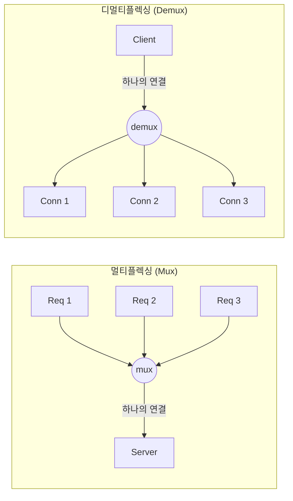
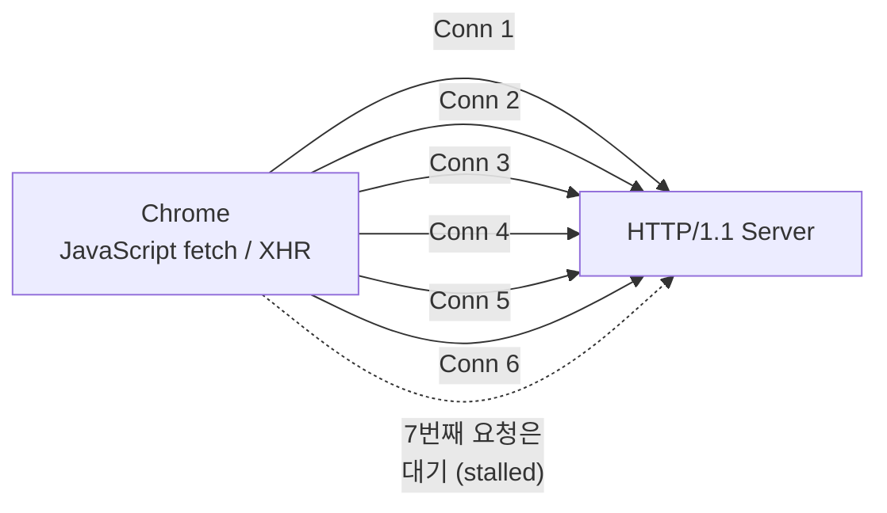
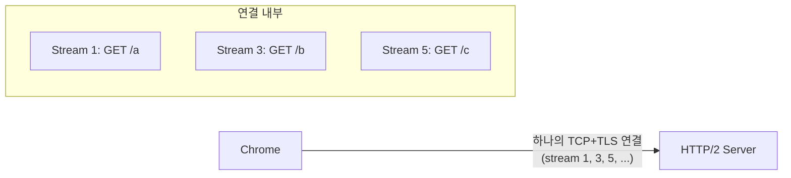
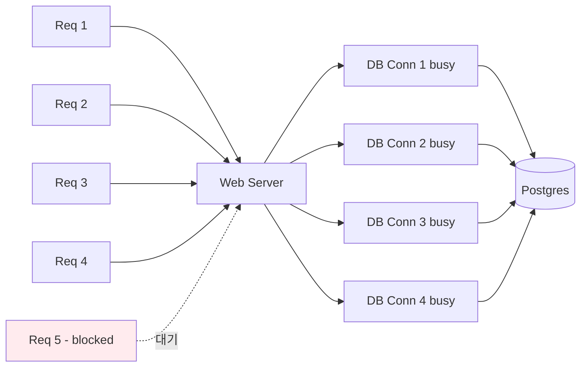
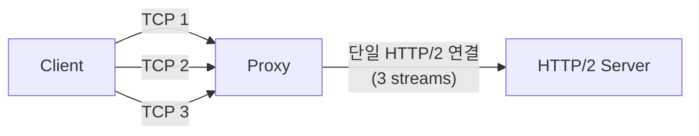
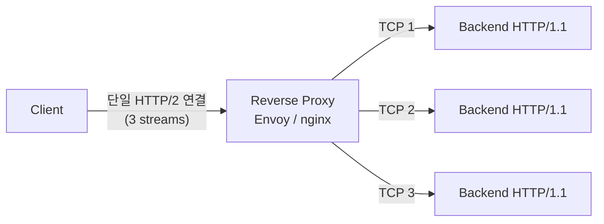

# 14. 멀티플렉싱 vs 디멀티플렉싱 (Multiplexing vs Demultiplexing — h2 proxying vs Connection Pooling)

## 개요

**멀티플렉싱(Multiplexing)** 과 **디멀티플렉싱(Demultiplexing)** 은 본래 통신 공학에서 쓰이는 용어지만, 백엔드 통신 설계에서도 그대로 적용된다. HTTP/2의 스트림, QUIC, Multipath TCP, 그리고 연결 풀(Connection Pool)까지 — 흔히 다른 이름으로 불리지만 본질은 모두 "여러 신호를 하나의 선으로 모으는가(mux), 하나의 선에서 여러 신호로 흩는가(demux)"라는 두 패턴의 변주다.

이 문서에서 다루는 내용은 다음과 같다.

- 멀티플렉싱 / 디멀티플렉싱의 정의
- HTTP/1.1의 한계: 연결당 하나의 요청, 도메인당 6개 연결 제한
- HTTP/2의 멀티플렉싱: 하나의 TCP+TLS 연결 위 여러 스트림
- 프록시에서의 Connection Pool (디멀티플렉싱)
- h2 proxying (멀티플렉싱)
- 각 패턴이 빛나는 지점과 트레이드오프

---

## 1. 멀티플렉싱과 디멀티플렉싱이란?

- **멀티플렉싱(mux)**: 여러 입력 라인을 **하나의 라인으로 묶어** 보내는 동작. 예) 3개의 TCP 연결을 1개의 HTTP/2 연결 위 3개의 스트림으로 합치는 것.
- **디멀티플렉싱(demux)**: 반대 방향. **하나의 라인으로 들어온** 요청을 **여러 라인으로 분배**하는 동작. 예) 클라이언트로부터 들어온 여러 요청을 백엔드의 여러 연결로 흩뿌리는 것.

> **요약**: mux는 "여러 개 → 하나로", demux는 "하나 → 여러 개로". 같은 메커니즘을 어느 방향에서 보느냐의 차이다.

---

## 2. HTTP/1.1의 한계 — 연결당 요청 하나

HTTP/1.1은 **하나의 TCP 연결 위에서 한 번에 하나의 요청만** 처리한다. (파이프라이닝은 실패한 실험이라 사실상 쓰이지 않는다.)

브라우저는 이 제약을 우회하기 위해 **도메인당 최대 6개의 TCP 연결**을 동시에 연다.

### 결과적인 문제

- 7번째 이상의 요청은 **앞선 요청이 끝날 때까지 클라이언트 측에서 stall**된다.
- 장시간 응답을 잡고 있는 **롱 폴링(long polling)** 같은 시나리오에서는 6개 슬롯이 금방 가득 차서, 일반 요청(예: 새 작업 제출)조차 막혀 버린다.
- 이는 SSE(Server-Sent Events) 강의에서 다룬 6개 연결 제한과 같은 뿌리의 문제다.

> **요약**: HTTP/1.1은 연결당 직렬 처리 + 도메인당 6개 연결이라는 이중 제약이 있어, 다수 요청을 동시에 보내야 하는 시나리오에서 병목이 된다.

---

## 3. HTTP/2의 멀티플렉싱 — 하나의 연결 위 여러 스트림

HTTP/2는 **하나의 TCP + TLS 연결 위에서** 여러 요청을 동시에 처리한다. 각 요청은 별개의 **스트림(stream)** 으로 식별되며, 같은 파이프 안에서 인터리브된다.

### 특징

- 클라이언트는 **단 하나의 연결**로 N개의 요청을 동시 전송 → 6개 연결 제약이 사라진다.
- 핸드셰이크 비용(TCP 3-way + TLS)이 한 번만 발생 → 지연 시간 감소.
- 헤더 압축(HPACK) 등 추가 최적화 가능.

### 트레이드오프

- 서버 CPU가 **같은 연결에서 들어오는 여러 스트림을 분리·파싱**해야 하므로 CPU 부담이 늘어난다.
- 한 TCP 연결의 흐름 제어/혼잡 제어 규칙이 **모든 스트림에 공통 적용**되므로, 한 스트림의 패킷 손실이 다른 스트림까지 영향을 준다(HoL Blocking). 이 문제는 QUIC(UDP 기반)에서 해소된다.

> **요약**: HTTP/2는 클라이언트→서버 방향의 **멀티플렉싱**으로, 더 적은 연결로 더 많은 처리량을 얻는다. 단, 서버 CPU와 TCP HoL Blocking이라는 비용이 따른다.

---

## 4. 프록시에서의 Connection Pool — 디멀티플렉싱

백엔드와 데이터베이스(예: Postgres) 사이에서 흔히 쓰는 **연결 풀(Connection Pool)** 은 본질적으로 **디멀티플렉싱 패턴**이다.

- 웹 서버는 **여러 클라이언트 요청을 하나의 프로세스에서 받는다.**
- 이 요청들을 **미리 열어 둔 N개의 DB 연결 중 비어 있는 것을 골라** 흩뿌린다.

### 동작 흐름

1. 풀 크기(예: 4)만큼의 연결을 미리 핫(hot)하게 유지한다.
2. 요청이 들어올 때마다 비어 있는 연결을 골라 SQL을 보낸다.
3. 풀이 가득 차면 다음 요청은 **연결이 비기 전까지 백엔드 내부에서 대기**한다.

### 왜 한 연결에 여러 쿼리를 못 보내는가?

같은 연결에 SQL 1, 2, 3을 순차로 보내면, 응답이 **순서대로 돌아오지 않을 수 있다**. SQL 3이 가장 먼저 끝나면 어떤 응답이 어떤 쿼리에 대한 것인지 매칭할 수 없다. 일반 DB 프로토콜은 응답 매칭용 ID 같은 것을 기본 제공하지 않기 때문이다.

> Postgres 14부터는 **파이프라이닝(pipelining)** 이 공식 지원되어, 같은 연결 위에서 여러 쿼리를 보내고 순서대로 응답받을 수 있다. 다만 일반적인 풀 사용에서는 여전히 "연결 하나당 진행 중 쿼리 하나" 모델이 표준이다.

### Django 이슈

Django(파이썬)는 기본적으로 **스레드당 단일 연결**을 사용하는 단순한 모델을 쓴다. 따라서 동시성이 스레드 아키텍처에 크게 종속된다. 별도의 풀러(pgbouncer 등)를 두고 멀티 연결을 흩뿌리는 구성을 권장한다.

> **요약**: Connection Pool은 "여러 요청 → 여러 백엔드 연결" 디멀티플렉싱이다. 풀 크기가 곧 동시성 상한이 된다.

---

## 5. h2 Proxying — 클라이언트 1 연결 → 백엔드 N 연결 (디멀티플렉싱)

리버스 프록시(Envoy, nginx 등)에서 자주 보이는 두 가지 구성을 비교해 보자.

### 5.1 클라이언트 HTTP/1.1 → 백엔드 HTTP/2 (멀티플렉싱)

- 클라이언트가 3개의 HTTP/1.1 연결로 요청을 보냄.
- 프록시는 이를 **하나의 HTTP/2 연결로 묶어** 백엔드에 전달.
- 백엔드의 연결 수가 줄어 자원 효율은 좋지만, 백엔드 CPU 부담은 늘어남.

### 5.2 클라이언트 HTTP/2 → 백엔드 HTTP/1.1 (디멀티플렉싱, "h2 proxying")

- 클라이언트는 단일 HTTP/2 연결로 N개 요청을 멀티플렉싱.
- 프록시는 이를 **N개의 별도 HTTP/1.1 연결**로 분리해 백엔드에 전달.
- **각 요청이 독자적인 TCP 연결**을 사용하므로, 흐름 제어/혼잡 제어/오류가 서로 격리된다.

### 왜 격리가 중요한가?

HTTP/2 단일 연결 안에서는 모든 스트림이 같은 TCP 규칙(혼잡 제어, 흐름 제어)에 묶여 있다. 한 스트림에서 패킷 손실이 발생하면 다른 스트림까지 느려질 수 있다(HoL Blocking).

반면 각각 별도 TCP 연결을 쓰면 한 요청의 문제가 다른 요청에 전염되지 않는다.

> **요약**: "h2 proxying"이라는 표현은 보통 클라이언트의 멀티플렉싱된 h2 연결을 백엔드의 여러 연결로 **디멀티플렉싱**해 풀어 주는 구성을 가리킨다. Connection Pool과 본질적으로 같은 패턴이다.

---

## 6. 네 가지 패턴 비교

| 구분 | HTTP/1.1 | HTTP/2 (h2) | Connection Pool | h2 Proxying |
|------|----------|-------------|-----------------|-------------|
| 위치 | 클라이언트 ↔ 서버 | 클라이언트 ↔ 서버 | 백엔드 ↔ DB | 프록시 ↔ 백엔드 |
| 패턴 | (없음, 직렬) | **멀티플렉싱** | **디멀티플렉싱** | **디멀티플렉싱** |
| 연결 수 | 도메인당 6개 | 1개 | 풀 크기 N개 | N개 |
| 동시성 한계 | 6개 요청 | 스트림 수 (수백 ~ 수천) | 풀 크기 N | 백엔드 연결 수 N |
| HoL Blocking | 연결 단위 | TCP 단일 연결에서 발생 | 없음 (격리됨) | 없음 (격리됨) |
| CPU 비용 | 낮음 | 높음 (스트림 파싱) | 낮음 | 낮음 |
| 대표 사용처 | 레거시 / 정적 자원 | 현대 웹 트래픽 | DB 접근, 마이크로서비스 | API Gateway, 사이드카 |

---

## 7. 각 패턴이 빛나는 지점

- **HTTP/2 멀티플렉싱이 좋을 때**: 클라이언트가 다수의 작은 요청을 동시에 보내야 할 때 (예: 한 페이지에 수십 개의 정적 자원). 핸드셰이크 비용 절감이 크다.
- **Connection Pool이 좋을 때**: 백엔드가 동기적이고 연결당 하나의 작업만 처리하는 DB 환경 (Postgres, MySQL 등). 미리 연결을 열어 두어 핸드셰이크 비용을 회피한다.
- **h2 Proxying(디멀티플렉싱)이 좋을 때**: 외부에서 들어오는 HTTP/2 트래픽을 받되, 백엔드는 HTTP/1.1 기반이거나 요청별 격리가 중요한 경우. Envoy/nginx 같은 리버스 프록시가 주로 담당한다.
- **HTTP/1.1이 여전히 쓰일 때**: 단순한 내부 통신, 디버깅, 또는 HTTP/2 도입 비용이 의미 없을 만큼 트래픽이 적은 경우.

---

## 8. 핵심 한 줄 정리

- **멀티플렉싱**: 여러 요청을 **하나의 연결로** 묶는다. (HTTP/2가 대표적)
- **디멀티플렉싱**: 하나의 입구로 들어온 요청을 **여러 연결로** 흩뿌린다. (Connection Pool, h2 proxying)
- 결국 같은 메커니즘을 어느 방향에서 보는지의 차이이며, 각 방향마다 자원 효율과 격리성의 트레이드오프가 다르다.

이 두 빌딩 블록을 익혀 두면 HTTP/2, QUIC, Connection Pool, API Gateway, 사이드카, Multipath TCP 같은 용어를 새로 만났을 때 "이건 mux인가 demux인가?"라는 한 가지 질문으로 빠르게 정리할 수 있다.

---

## 다음 학습 주제

다음 강의(15)에서는 **Stateful vs Stateless** 를 다룬다. 멀티플렉싱/디멀티플렉싱과 함께 백엔드 통신 설계의 또 다른 축인 "상태를 어디에 둘 것인가"라는 질문을 살펴본다.
