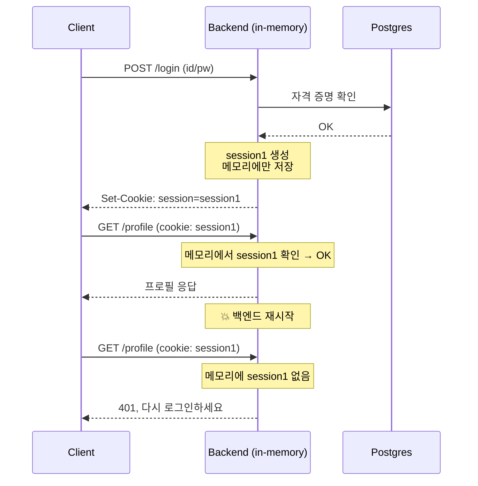
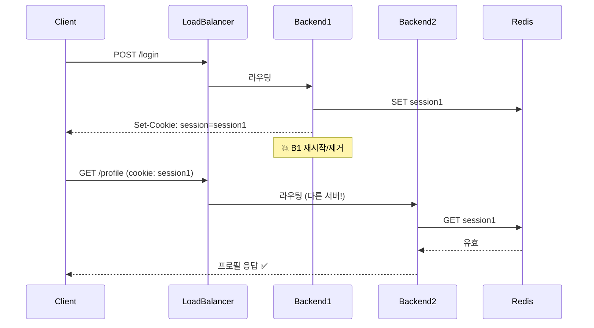
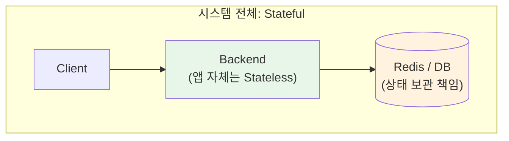
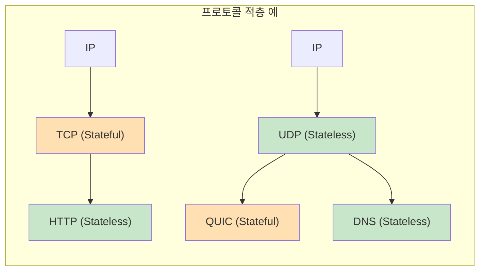

# 15. 상태 보존 vs 무상태 (Stateful vs Stateless)

## 개요

"Stateful이냐 Stateless냐"는 엔지니어링에서 가장 논쟁적인 주제 중 하나다. 강사가 강의 첫머리에서 강조하는 핵심 메시지는 한 가지다.

> **"정의 자체에 매몰되지 말고, 부수효과(side effects)에 집중하라."**

"이건 stateful이다", "저건 stateless다"라는 식의 정의 게임(definition game)에 빠지면 본질을 놓친다. 엔지니어가 정말 따져야 할 질문은 단 하나다.

> **"이 컴포넌트를 죽였다가 다시 띄웠을 때, 클라이언트가 아무 일 없었던 것처럼 작업을 이어갈 수 있는가?"**

이 한 줄을 기준 삼으면 stateful/stateless 논쟁의 90%는 정리된다.

이 문서에서 다루는 내용은 다음과 같다.

- Stateful / Stateless의 정의 (그리고 정의 게임의 함정)
- Stateful 백엔드 예시: 인메모리 세션
- Stateless 백엔드 예시: 외부 저장소 또는 JWT
- "유휴 시 백엔드를 재시작해도 클라이언트가 깨지지 않는가?"라는 리트머스 테스트
- 시스템 레벨 상태 vs 애플리케이션 레벨 상태
- Stateless 프로토콜 vs Stateful 프로토콜 (HTTP, TCP, UDP, QUIC, DNS, JWT)
- 트레이드오프 정리

---

## 1. 정의 — 그리고 정의 게임의 함정

### 정의

- **Stateful (상태 보존)**: 애플리케이션이 클라이언트 상태를 **자신의 메모리(또는 디스크)** 에 저장하고, **그 정보가 거기 있어야만 정상 동작**하는 스타일.
- **Stateless (무상태)**: 서버에 클라이언트 상태가 저장되지 않거나, 저장되더라도 **그것을 신뢰하지 않는** 스타일. 클라이언트가 매 요청마다 필요한 상태를 함께 실어 보낸다.

### 정의 게임의 함정

> "변수 하나도 상태 아니냐? 그럼 모든 앱이 stateful 아니냐?"

이런 식의 논쟁이 끝없이 나온다. 강사의 입장은 다음과 같다.

- **변수를 저장하는 것 자체는 stateful의 조건이 아니다.**
- 핵심은 **"그 상태가 사라졌을 때 시스템이 깨지느냐"** 다.
- 따라서 stateful/stateless는 흑백이 아니라 **"누구의 관점에서, 무엇에 의존하느냐"** 의 문제다.

이 분류는 시스템, 백엔드, 함수, 프로토콜 — 어떤 단위에도 적용할 수 있다.

> **요약**: 정의를 외우지 말고, **"이게 사라지면 깨지는가?"** 라는 질문을 던져라.

---

## 2. Stateful 백엔드 — 인메모리 세션의 함정

### 시나리오: 로그인 + 인메모리 세션

1. 사용자가 ID/PW로 `/login` 요청
2. 백엔드가 Postgres에 ID/PW 검증
3. 세션 ID(`session1`) 생성 → **백엔드 메모리에만 저장**
4. 클라이언트에 쿠키로 `session1` 반환
5. 이후 `/profile` 요청 시 쿠키로 `session1`이 들어옴 → 백엔드는 **메모리에서** 검증 후 응답

DB까지 가는 한 번의 왕복(round-trip)을 아끼려고 일부러 메모리에 둔 구조다. **캐시처럼 동작**하면서 빠르다.

### 어디서 깨지는가

- 백엔드가 **재시작/크래시**하면 메모리의 세션이 모두 날아간다.
- 사용자는 새로고침 한 번에 로그인 페이지로 튕긴다.
- **로드 밸런서 환경**에서는 더 가관이다 — 첫 요청은 서버 A에 가서 세션이 만들어졌는데, 다음 요청이 서버 B에 가면 세션이 없다. "어떤 요청은 되고 어떤 요청은 안 되는" 버그가 발생한다.

### Sticky Session

이를 우회하기 위해 로드 밸런서가 **"같은 클라이언트는 항상 같은 백엔드로"** 보내도록 강제하는 것이 **sticky session(또는 sticky load balancing)** 이다. Stateful 애플리케이션을 운영하려면 종종 이게 필요하다. 강사는 실제로 게이밍 앱을 만들 때 DB 부하를 줄이려고 일부러 sticky session을 쓴 경험을 언급한다.

> **요약**: Stateful 백엔드는 빠르지만, **재시작과 수평 확장에 매우 취약**하다.

---

## 3. Stateless 백엔드 — 상태를 바깥으로 밀어내기

### 해법 1: 외부 저장소 (DB/Redis)

세션을 백엔드 메모리가 아니라 **공유 저장소**(예: Postgres, Redis)에 둔다.

1. 로그인 시 세션을 **DB에 저장**하고 클라이언트에 쿠키로 전달
2. 이후 요청마다 백엔드는 **DB를 조회해** 세션 유효성 검증
3. 백엔드 자체에는 아무것도 저장하지 않음

- 백엔드를 **죽이거나, 늘리거나, 줄여도** 클라이언트는 영향이 없다.
- 어떤 백엔드에 도달하든 같은 Redis/DB를 보므로 일관된 동작을 한다.

### 해법 2: 클라이언트가 상태를 들고 다니기 (JWT)

상태를 아예 **토큰 자체에 담아** 클라이언트가 매 요청마다 실어 보낸다. 백엔드도, 외부 저장소도 세션을 보관하지 않는다.

- **장점**: 서버 측에 세션 저장소가 필요 없다. 완전히 stateless.
- **단점**: 한 번 발급된 토큰을 **즉시 무효화하기 어렵다**. 탈취된 토큰은 만료 시간까지 유효하다.
- 그래서 **짧은 access token + 긴 refresh token** 패턴이 등장한다. 하지만 refresh token이 탈취되면 같은 문제가 반복되므로, **TLS 등 전반적인 방어**가 전제되어야 한다.

> 강사 코멘트: "백엔드 엔지니어링이 다 풀린 문제라고 생각하지 마라. 구멍이 많다." JWT의 즉시 폐기 문제는 그 대표 예시다.

---

## 4. 시스템 레벨 상태 vs 애플리케이션 레벨 상태

여기서 정의 게임이 또 끼어든다. "Redis에 세션을 저장하면 시스템 전체는 stateful 아니냐?"

맞다. **시스템 전체로 보면 stateful**이다. Redis가 죽으면 시스템은 망가진다.

하지만 **백엔드 애플리케이션 자체는 stateless**다. 왜냐하면:

- 백엔드를 죽이고 새로 띄워도 동작한다.
- 상태를 보관하는 책임은 **다른 컴포넌트(Redis/DB)** 에 위임되어 있다.

> **요약**: "상태가 어디에 있느냐"보다 **"애플리케이션이 그 상태에 의존해서 자신의 메모리를 쥐고 있느냐"** 가 핵심이다. Stateless라는 속성은 **백엔드 애플리케이션 단위**에 부여되는 것이다.

---

## 5. 리트머스 테스트

> **유휴(idle) 시간에 백엔드를 재시작했을 때, 기존 클라이언트들이 작업 흐름을 깨지지 않고 이어갈 수 있는가?**

| 결과 | 진단 |
|------|------|
| 예 | 그 백엔드는 **stateless** |
| 아니오 | 어딘가 의존하던 상태가 사라졌다는 뜻 → **stateful** |

개발자가 단일 머신에서만 개발하면 이 문제를 영영 발견하지 못한다. **로드 밸런서를 끼우는 순간** 어김없이 드러난다.

---

## 6. Stateful 프로토콜 vs Stateless 프로토콜

같은 분류를 프로토콜에도 그대로 적용할 수 있다.

### TCP — Stateful

- 양 끝단(클라이언트 + 서버)에 **상태 기계(state machine)** 가 존재한다: CLOSED, LISTEN, SYN-SENT, ESTABLISHED, TIME-WAIT 등.
- 각 segment에 **시퀀스 번호**가 붙고, **윈도우 크기 / 흐름 제어 / 혼잡 제어 윈도우** 같은 상태가 유지된다.
- 이 상태들이 손실되면 커넥션은 **재설정(RESET)** 외에 답이 없다.

### UDP — Stateless

- 메시지 기반. 커넥션이라는 개념이 없다(connectionless).
- 같은 datagram을 여러 서버가 받을 수도 있다.

### DNS — Stateless 프로토콜 위의 동작

- UDP datagram으로 DNS 쿼리를 보낸다 → 커넥션이 없으므로 **응답이 어떤 요청에 대한 것인지** 구분할 방법이 필요.
- 그래서 DNS는 **Query ID**를 쿼리에 붙인다. 서버는 같은 Query ID로 응답.
- "DNS 클라이언트가 죽으면 응답을 받을 수 없으니 stateful 아니냐?"는 반박이 가능하지만, **프로토콜 자체는 stateless**다. "네가 끊긴 건 네 사정"이라는 식.

### QUIC — Stateless UDP 위에 Stateful 프로토콜 얹기

- QUIC는 TCP처럼 동작하는 **stateful 프로토콜**이지만, 운반 계층은 **stateless인 UDP**다.
- 매 UDP 패킷에 **동일한 Connection ID**를 실어 보내, "이 패킷들이 같은 커넥션에 속한다"는 정보를 **프로토콜 레벨에서 직접 전달**한다.
- 즉, **stateless한 매체 위에 상태를 얹는** 전형적인 사례.

### HTTP — Stateful TCP 위에 Stateless 프로토콜 얹기

- HTTP는 요청-응답 모델로 **stateless**다.
- 서버가 바뀌어도 다음 요청에 **쿠키가 들어 있으면** 클라이언트를 식별할 수 있다.
- TCP 커넥션이 끊겨도 HTTP는 신경 쓰지 않는다 — 그냥 새로 맺으면 그만이다.
- **쿠키**는 결국 "클라이언트가 상태를 들고 다니게 하는" 메커니즘이다 — Stateless 패러다임의 전형.

### JWT — 거의 완전한 Stateless 시스템

- 토큰 안에 모든 검증 정보가 들어 있다.
- 백엔드는 다른 서버와 통신하지 않고도 검증할 수 있다.
- **완전히 stateless한 시스템에 가장 가까운 예**.

> **요약**: Stateless 프로토콜 위에 Stateful 프로토콜을 올릴 수도 있고, 그 반대도 가능하다. **계층은 독립적**이다.

---

## 7. 트레이드오프 정리

| 항목 | Stateful | Stateless |
|------|----------|-----------|
| 성능(단일 요청) | 빠름 (메모리에서 처리) | 외부 저장소 조회 또는 토큰 검증 비용 발생 |
| 수평 확장 | 어려움 (sticky session 필요) | 쉬움 |
| 재시작/크래시 내성 | 약함 (상태 손실) | 강함 (어디서든 동일 동작) |
| 로드 밸런싱 | sticky 필수 | 자유로운 분산 |
| 즉시 무효화 (세션/토큰) | 쉬움 (메모리에서 제거) | 어려움 (특히 JWT) |
| 구현 난이도 | 단순 | 외부 저장소/토큰 설계 필요 |
| 시스템 전체 의존성 | 단일 백엔드 인스턴스에 강한 의존 | 외부 저장소(또는 토큰 신뢰)에 의존 |
| 대표 사례 | 인메모리 세션, 게이밍 서버 | JWT, REST API, HTTP, 마이크로서비스 |

### Stateless가 "훈장"은 아니다

> "내 앱은 stateless야!"는 자랑할 만한 것이 아니다. **그저 하나의 선택**일 뿐.

상황에 따라 stateful이 더 적합할 때도 있다. 게임 서버에서 DB 호출을 최소화해야 하는 짧은 시간 동안 sticky session을 쓰는 사례가 그렇다. 중요한 건 **트레이드오프를 알고 의도적으로 선택하는 것**이다.

---

## 8. 핵심 한 줄 정리

- **Stateful**: 그 상태가 **여기 있어야만** 동작한다. 사라지면 깨진다.
- **Stateless**: 상태가 **여기 있건 없건** 상관없다. 클라이언트가 들고 다니거나, 외부 저장소에 위임된다.
- 판별법: **"유휴 시 백엔드를 죽였다 살렸을 때, 클라이언트의 작업 흐름이 깨지지 않는가?"**
- 정의 자체보다 **부수효과(side effects)** 에 집중하라. 모든 단어에는 의미가 있지만, 엔지니어는 **"그래서 뭐가 깨지는데?"** 를 물어야 한다.

---

## 다음 학습 주제

다음 강의에서는 **Sidecar Pattern (16강)** 을 다룬다. 사이드카가 stateful/stateless 관점에서 어떻게 애플리케이션과 책임을 분리하는지, 그리고 왜 서비스 메시(Service Mesh)에서 사이드카가 사실상 표준이 되었는지를 살펴본다.
