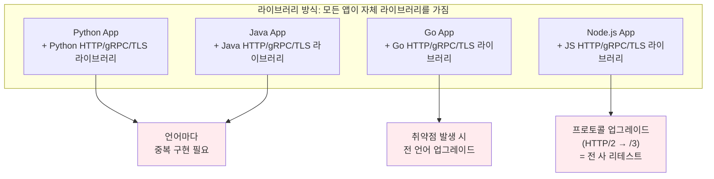
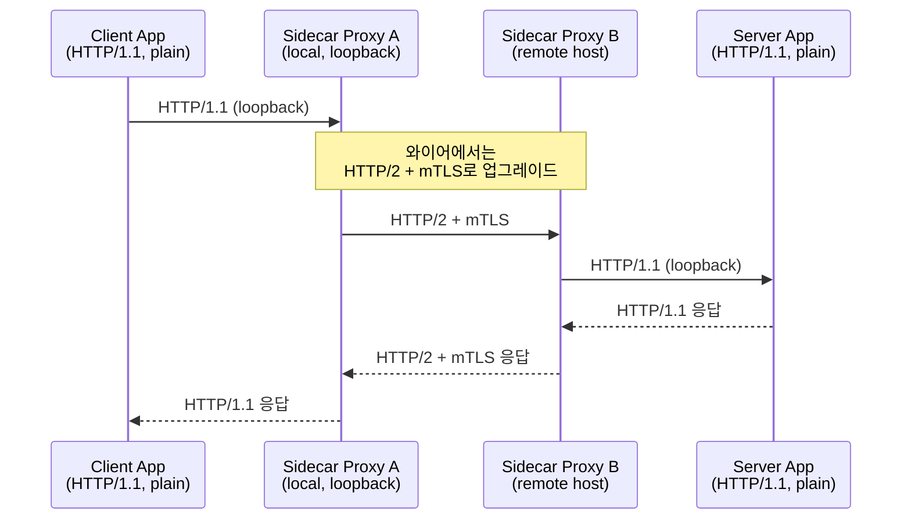
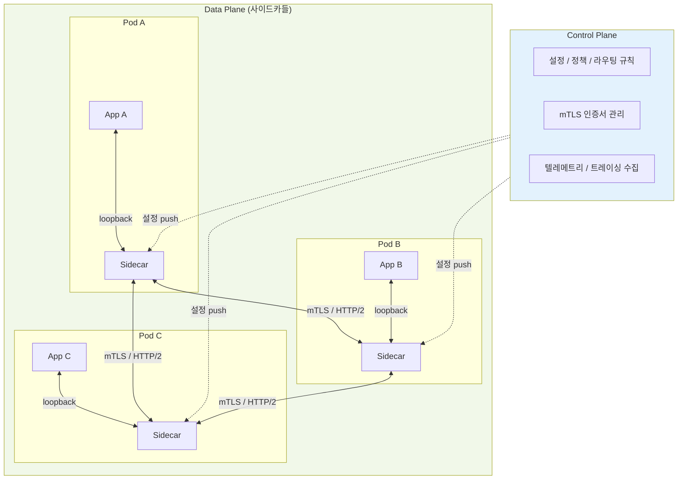

# 16. 사이드카 패턴 (Sidecar Pattern)

## 개요

마이크로서비스 환경에서 모든 서비스가 공통적으로 처리해야 하는 일들이 있다. **TLS 암복호화, 프로토콜 협상, 재시도, 회로 차단(circuit breaking), 트레이싱, 로깅, 서비스 디스커버리, 캐싱** 같은 것들이다. 이런 횡단 관심사(cross-cutting concerns)를 각 애플리케이션에 라이브러리 형태로 박아 넣으면, **언어 종속성**과 **업그레이드 비용**이라는 두 가지 큰 문제가 발생한다. 사이드카 패턴은 이 문제를 "통신 자체를 옆에 붙은 별도 프로세스(프록시)에 위임"하는 방식으로 푼다.

이 문서에서 다루는 내용은 다음과 같다.

- 라이브러리/SDK 방식의 한계와 사이드카 패턴이 등장한 배경
- 사이드카 프록시의 동작 원리
- 사이드카가 제공하는 기능 (HTTP/2 멀티플렉싱, mTLS, 관측성 등)
- 대표 구현체 (Envoy, Linkerd, Istio)
- 장점과 단점 (언어 비종속성 vs 복잡도/지연)
- 서비스 메시(Service Mesh)와 사이드카의 관계

---

## 1. 왜 사이드카 패턴이 필요한가? — 라이브러리 방식의 한계

### 1.1 모든 프로토콜은 라이브러리를 요구한다

HTTP/1.1, HTTP/2, HTTP/3, gRPC, Apache Thrift, SOAP, TCP, UDP — 어떤 프로토콜이든 그것을 말하려면 **그 프로토콜을 이해하는 라이브러리**가 필요하다. 라이브러리는 소켓에 어떻게 쓰고 어떻게 읽어야 하는지를 알고 있어야 한다.

- Python 앱이라면 Python HTTP 라이브러리
- C# 앱이라면 C# HTTP 라이브러리
- Node.js 앱이라면 Node.js HTTP 라이브러리

언어 표준에 내장된 모듈조차 결국 "라이브러리"다.

### 1.2 프로토콜이 복잡할수록 라이브러리도 두꺼워진다

gRPC, HTTP/2, HTTP/3, TLS 같은 프로토콜은 와이어 포맷이 복잡하다. HTTP/2와 HTTP/1.1은 와이어 상에서 완전히 다른 프로토콜이고, HTTP/3는 그 위에 또 QUIC이 깔린다. 클라이언트와 백엔드는 이걸 모두 처리해야 하므로 라이브러리가 점점 두꺼워지고 애플리케이션 코드와 강하게 얽힌다.

게다가 TLS를 쓴다면 OpenSSL 같은 또 다른 라이브러리가 필요하고, 이 라이브러리가 취약점(예: Heartbleed, Log4j 사례처럼)이 발견되면 **전 사 모든 서비스가 영향을 받는다.**

### 1.3 라이브러리는 언어를 강제한다

라이브러리는 사용하는 언어와 같은 언어여야 한다. C 인터롭 같은 트릭이 있긴 하지만, 대부분의 경우 **Java 앱은 Java 라이브러리, Python 앱은 Python 라이브러리** 를 써야 한다.

Twitter는 2010년 월드컵 트래픽으로 모놀리식 VM이 무너진 뒤 마이크로서비스로 전환하면서 **Finagle**이라는 자체 RPC 라이브러리를 만들었다. 그러나 Finagle은 Scala 기반이었기 때문에, **Twitter 내부의 모든 마이크로서비스는 Scala로 작성되어야 했다.** 시스템은 동작하지만 언어 선택의 자유가 사라진다.

### 1.4 라이브러리 업그레이드가 곧 전사 리테스트

라이브러리 하나를 올리려면:

- 모든 앱에서 의존성을 갱신하고
- 호환성/회귀 테스트를 다시 돌리고
- 깨지는 변경(breaking change)이 있으면 코드를 고쳐야 한다.

Log4j 사례에서 보았듯, 수많은 앱에 깊이 박힌 라이브러리는 한번 자리잡으면 빼내기가 매우 어렵다.

> **요약**: 횡단 관심사를 "앱 안에 임포트한 라이브러리"로 처리하면 언어 종속성과 업그레이드 비용이 폭발한다.

---

## 2. 아이디어 — 통신을 옆 프로세스에 위임하자

핵심 아이디어는 단순하다.

> **풍부한 통신 로직(두꺼운 라이브러리)을 앱이 아니라, 앱 옆에 별도의 프로세스로 띄운 프록시에 넣자.**

- 앱은 매우 **얇은 라이브러리**(가장 단순한 HTTP/1.1 같은 것)만 가진다.
- 모든 외부 통신은 "옆에 있는 프록시"에게 위임한다.
- 그 프록시가 HTTP/2, HTTP/3, mTLS, gRPC, 재시도, 트레이싱 같은 복잡한 일을 대신 한다.

여기서 "옆에 있다"는 것이 핵심이다. 보통 **같은 머신/Pod의 loopback** 으로 붙어 있어 IP 변동이나 네트워크 비용이 거의 없다. 이렇게 앱 옆에 붙어서 통신을 대리하는 프록시를 **사이드카(sidecar)** 라고 부른다.

---

## 3. 사이드카 패턴 — 동작 흐름

HTTP/1.1 클라이언트가 HTTP/1.1 서버에 요청을 보낸다고 하자. 그런데 두 사이드카가 중간에 끼어 있다면, 사실 와이어 위에서는 HTTP/2 + mTLS로 통신할 수도 있다.

흐름을 단계별로 정리하면 다음과 같다.

1. 앱은 자신의 사이드카 프록시(loopback)로 요청을 보내도록 설정되어 있다.
2. 사이드카 A는 요청을 받고, **Host 헤더** 등을 기반으로 최종 목적지를 결정한다.
3. 사이드카 A는 사이드카 B에게 **자신이 선택한 더 좋은 프로토콜**(HTTP/2, h2 멀티플렉싱, mTLS 1.3 등)로 다시 요청을 보낸다.
4. 사이드카 B는 자신의 앱(서버)이 이해할 수 있는 프로토콜(예: HTTP/1.1)로 다시 풀어서 전달한다.
5. 응답은 반대 방향으로 동일하게 흐른다.

> **요약**: 앱 입장에서는 그냥 HTTP/1.1 요청을 하나 쏘았을 뿐이지만, 실제 두 머신 사이에서는 최신 보안과 멀티플렉싱이 적용된 통신이 일어난다.

### 왜 loopback인가?

- loopback(127.0.0.1)은 절대 바뀌지 않는다.
- IP 주소는 환경에 따라 바뀌지만, "같은 머신/Pod 안에서 옆 컨테이너에게 말한다"는 의미는 그대로 유지된다.
- 컨테이너 오케스트레이션(예: Kubernetes)에서는 **사이드카 컨테이너**가 앱 컨테이너와 같은 Pod에 묶여 네트워크 네임스페이스(loopback)를 공유한다.

---

## 4. 사이드카가 제공하는 기능

사이드카는 단순한 프로토콜 변환기가 아니다. **Layer 7 프록시** 로서 다음과 같은 일들을 한다.

- **프로토콜 업그레이드**: 앱은 그대로 둔 채로 사이드카 버전만 올리면 HTTP/3 + QUIC 같은 최신 프로토콜로 옮겨갈 수 있다.
- **mTLS / 보안**: 평문으로 말하는 앱도 사이드카가 mTLS로 감싸 주면 자동으로 상호 인증된 암호화 통신이 된다. 취약한 cipher가 발견되면 사이드카 설정만 바꿔서 즉시 전 사 적용 가능.
- **트레이싱(Tracing)**: 사이드카가 trace ID를 자동으로 부여하고 전파한다. A → B → C → D → E → F로 흐르는 요청의 단계별 지연을 측정할 수 있다.
- **모니터링/메트릭**: 모든 트래픽이 사이드카를 통과하므로 RPS, 지연, 에러율 등을 일관되게 수집할 수 있다.
- **서비스 디스커버리**: 사이드카가 서비스 디스커버리(중앙 DNS/레지스트리)와 통신하여 백엔드 위치를 자동으로 알아낸다.
- **재시도 / 회로 차단 / 타임아웃**: 네트워크적 회복 로직을 사이드카가 담당.
- **캐싱**: 응답 캐싱도 사이드카 단에서 처리 가능.
- **정책 제어**: "서비스 A는 서비스 C와 통신 불가" 같은 접근 정책을 사이드카 설정으로 부여.

이 모든 것을 **앱 코드 한 줄 안 고치고** 적용할 수 있다는 점이 사이드카 패턴의 핵심 가치다.

---

## 5. 대표 구현체

| 구현 | 역할 | 비고 |
|------|------|------|
| **Envoy** | 데이터 플레인 프록시 | C++ 기반, Lyft가 만든 고성능 Layer 7 프록시. Istio의 기본 데이터 플레인. |
| **Linkerd** | 서비스 메시 | Rust 기반 사이드카 프록시 (linkerd2-proxy). 가벼움과 단순함 강조. |
| **Istio** | 서비스 메시 (컨트롤 플레인 + Envoy 데이터 플레인) | 정책, 텔레메트리, 트래픽 관리를 위한 컨트롤 플레인 제공. Google이 주도. |

> Envoy, Linkerd 같은 사이드카 프록시는 반드시 **Layer 7**(애플리케이션 계층)에서 동작한다. 트래픽을 복호화해 들여다보고, 라우팅/리트라이/메트릭 같은 결정을 한 뒤 다시 암호화해서 내보내야 하기 때문이다.

---

## 6. 라이브러리 방식 vs 사이드카 방식 — 비교

| 항목 | 라이브러리(SDK) 방식 | 사이드카 방식 |
|------|---------------------|---------------|
| 위치 | 앱 프로세스 내부 | 앱 옆 별도 프로세스 (loopback) |
| 언어 종속성 | **있음** (앱과 동일 언어 라이브러리 필요) | **없음** (polyglot, 어떤 언어 앱이든 동일 사이드카 사용) |
| 프로토콜 업그레이드 | 모든 앱 코드/의존성 갱신 + 리테스트 | 사이드카 버전만 업그레이드 |
| 보안 패치 (TLS 등) | 앱마다 라이브러리 교체 필요 | 사이드카 설정/이미지 교체로 일괄 적용 |
| 관측성 (트레이스/메트릭) | 앱이 직접 구현하거나 라이브러리 의존 | 사이드카가 자동 수집/전파 |
| 재시도/회로차단 | 라이브러리/앱 코드에 분산 | 사이드카에 집중 |
| 운영/개발 책임 | 개발자가 통신 로직까지 책임 | 운영(플랫폼) 팀이 통신 계층 담당, 개발자는 비즈니스 로직에 집중 |
| 성능 | 추가 hop 없음 | **로컬 hop 2회 추가** (지연 비용 발생) |
| 디버깅 | 단일 프로세스 → 비교적 단순 | 사이드카/컨트롤 플레인까지 합쳐져 복잡 |

> **요약**: 사이드카는 **언어 비종속성과 운영-개발 분리**라는 큰 이득을 주는 대신, **지연**과 **시스템 복잡도**를 비용으로 지불한다.

---

## 7. 서비스 메시 (Service Mesh) — 사이드카의 집합

사이드카 패턴이 **개별 앱 단위**의 개념이라면, **서비스 메시(Service Mesh)** 는 그 사이드카들을 클러스터 전체로 묶어 일관되게 제어하는 시스템이다.

서비스 메시는 보통 두 계층으로 나뉜다.

- **데이터 플레인 (Data Plane)**: 실제 트래픽을 처리하는 사이드카 프록시들 (예: Envoy, linkerd2-proxy)
- **컨트롤 플레인 (Control Plane)**: 모든 사이드카를 중앙에서 설정/관리하는 컴포넌트 (라우팅 규칙 배포, 인증서 관리, 정책 적용, 텔레메트리 수집 등)

- 클러스터에 새로운 라우팅 규칙을 적용하고 싶다면? **컨트롤 플레인에만 설정**하면 모든 사이드카로 자동 전파된다.
- mTLS 인증서를 회전(rotate)하고 싶다면? 컨트롤 플레인이 사이드카에게 새 인증서를 배포한다.
- "서비스 A는 B만 호출 가능"이라는 정책을 걸고 싶다면? 컨트롤 플레인 규칙으로 정의하면 끝.

> **요약**: **서비스 메시 = 사이드카(데이터 플레인) + 컨트롤 플레인.** 사이드카 패턴이 클러스터 차원으로 확장된 것이다.

---

## 8. 단점

사이드카 패턴이 모든 문제를 푸는 것은 아니다.

### 8.1 복잡도

- 앱, 사이드카, 컨트롤 플레인, 인증서 관리, 트레이싱 백엔드 등 운영해야 할 컴포넌트가 늘어난다.
- 장애 디버깅이 어려워진다. "내 요청이 실패했는데, 앱 문제인가 사이드카 문제인가 컨트롤 플레인 문제인가?"

### 8.2 지연(Latency)

- 호출당 **로컬 hop이 2번** 추가된다 (앱 → 로컬 사이드카, 원격 사이드카 → 원격 앱).
- 같은 머신/Pod 안의 loopback이라 네트워크 자체 비용은 작지만, **요청 파싱/재작성/프로토콜 업그레이드/트레이싱/캐싱 처리** 등의 CPU 비용이 매 요청마다 든다.

### 8.3 리소스 비용

- 모든 Pod마다 사이드카가 떠 있으므로 메모리/CPU 오버헤드가 누적된다.
- 작은 서비스가 많을수록 비율적 비용이 커진다.

---

## 9. 핵심 한 줄 정리

> **사이드카 패턴은 통신 로직(프로토콜, 보안, 관측성, 재시도, 트레이싱)을 앱에서 떼어 옆 프로세스(프록시)로 옮긴다. 앱은 얇은 HTTP/1.1만 알면 되고, 모든 횡단 관심사는 사이드카가 처리한다.**

이 한 줄에서 Envoy, Linkerd, Istio, 서비스 메시, mTLS 자동화, polyglot 마이크로서비스, 컨트롤/데이터 플레인 분리 같은 개념들이 모두 파생된다. 라이브러리 vs 사이드카의 트레이드오프(지연·복잡도를 받아들이는 대신 언어 비종속성과 운영 일관성을 얻음)를 이해하는 것이 출발점이다.

---

## 다음 학습 주제

여기까지가 "백엔드 통신 디자인 패턴" 섹션의 마지막 강의다. 다음 섹션에서는 본격적으로 **프로토콜 자체**(`03-protocols`)를 다룬다. 지금까지 패턴 차원에서 다뤘던 요청-응답, 비동기 메시징, 게시-구독, 사이드카 같은 추상을, 실제 와이어 위에서 동작하는 **TCP, UDP, TLS, HTTP/1.1, HTTP/2, HTTP/3, gRPC, WebSocket** 같은 구체적인 프로토콜로 풀어보게 된다. 사이드카가 왜 Layer 7에서만 동작하는지, HTTP/2의 멀티플렉싱은 어떻게 가능한지, mTLS 핸드셰이크는 어떤 흐름인지 — 이런 질문들에 다음 섹션에서 답을 채워나가게 된다.
