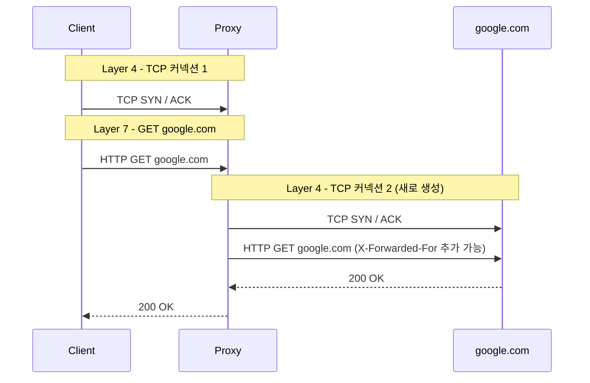
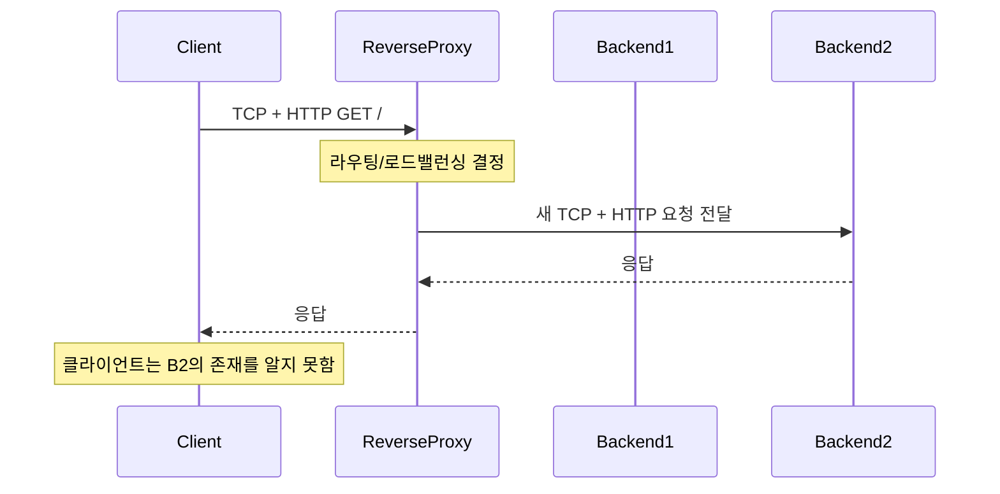
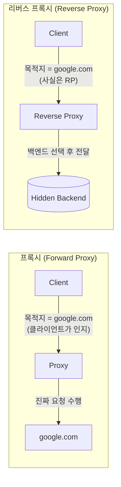
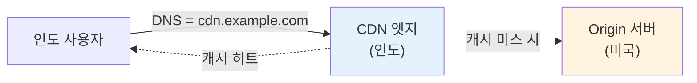
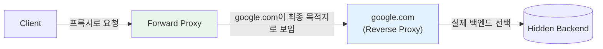
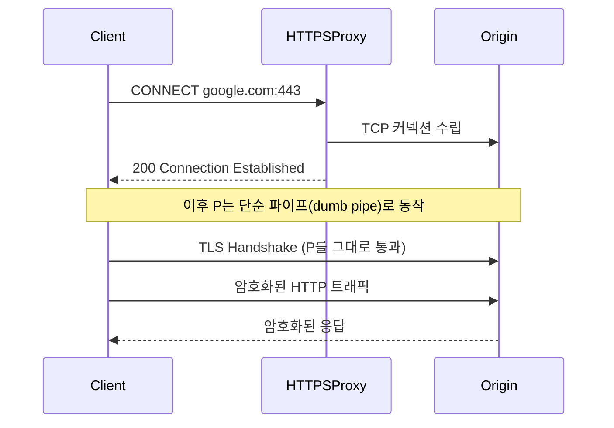

# 51. 프록시(Proxy) vs 리버스 프록시(Reverse Proxy)

## 개요

백엔드 엔지니어가 네트워킹을 다룰 때 가장 자주 헷갈려 하는 주제 중 하나가 **프록시(Proxy)** 와 **리버스 프록시(Reverse Proxy)** 의 차이다. 이 둘은 API Gateway, Load Balancer, 사이드카(sidecar) 컨테이너, Envoy, Linkerd 같은 여러 인프라 용어가 결국 귀결되는 기본 개념이기도 하다. 새로운 마케팅 용어가 끊임없이 쏟아지는 시대일수록, 이런 기본 빌딩 블록을 명확히 이해해 두면 어떤 기술이 등장하더라도 "결국 프록시인가, 리버스 프록시인가?"라는 관점에서 빠르게 정리할 수 있다.

이 문서에서 다루는 내용은 다음과 같다.

- 프록시의 정의와 동작 원리 (네트워크 계층 관점 포함)
- 프록시의 사용 사례
- 리버스 프록시의 정의와 동작 원리
- 리버스 프록시의 사용 사례
- 프록시와 리버스 프록시의 동시 사용
- 자주 묻는 질문 (VPN과의 차이, HTTP 외 트래픽, CONNECT 터널 등)

---

## 1. 프록시란?

### 정의

> **프록시(Proxy)는 클라이언트를 대신해 요청을 보내주는 서버다.**

클라이언트가 가고자 하는 최종 목적지(예: `google.com`)는 분명히 정해져 있지만, 실제로 그 목적지까지 요청을 전달하는 일은 프록시가 대신 수행한다.

### 동작 흐름 (네트워크 계층 관점)

클라이언트 머신에 프록시가 설정되어 있다고 가정하자. (운영체제 또는 브라우저 설정에서 프록시 구성을 확인할 수 있다.)

1. **Layer 4 (TCP)**: 클라이언트의 TCP 커넥션은 Google이 아니라 **프록시와** 먼저 맺어진다.
2. **Layer 7 (HTTP)**: TCP 커넥션 위에서 클라이언트는 `GET google.com` 같은 요청을 전송한다. 요청 본문(Layer 7 페이로드)은 여전히 "google.com에 가고 싶다"는 의도를 담고 있다.
3. **프록시의 처리**: 프록시는 그 요청을 받아 **자신과 google.com 사이에 새로운 TCP 커넥션을 맺는다.**
4. **목적지 서버의 시각**: google.com 입장에서는 **프록시의 IP 주소**만 보인다. 클라이언트의 진짜 IP는 알 수 없다.
5. Layer 7 데이터(애플리케이션 페이로드)는 거의 그대로 전달되지만, HTTP 프록시의 경우 `X-Forwarded-For` 같은 헤더를 추가하기도 한다. 이 헤더가 있다면 Layer 7 수준에서 원래 클라이언트를 식별할 수는 있지만, Layer 4 관점에서는 여전히 프록시만 보인다.

### 핵심 정리

| 관점 | 클라이언트 | 서버(google.com) |
|------|-----------|------------------|
| 최종 목적지 인지 | 알고 있음 (google.com) | — |
| 상대방 식별 | TCP 커넥션 상으로는 프록시만 보임 | **프록시만 보임** (X-Forwarded-For가 없으면 진짜 클라이언트를 알 수 없음) |

> **요약**: 프록시 환경에서는 **클라이언트가 서버를 알지만, 서버는 클라이언트를 모른다.**

---

## 2. 프록시의 사용 사례

### 2.1 익명성 (Anonymity)

자신의 IP를 노출하고 싶지 않을 때 사용한다. 다만 프록시가 `X-Forwarded-For` 같은 헤더로 원래 IP를 전달하면 익명성은 깨지므로, **프록시를 신뢰할 수 있어야** 한다.

### 2.2 캐싱 (Caching)

조직(회사) 단위 프록시가 모든 HTTP 요청을 가로채는 구조에서 특히 유용하다.

- 사용자 A가 어떤 정적 페이지를 요청 → 프록시가 응답을 캐시
- 사용자 B가 같은 페이지를 요청 → 프록시가 캐시에서 바로 응답

원본 서버까지 가지 않고 캐시 히트로 처리되므로 트래픽과 응답 시간이 줄어든다. (이 캐싱은 곧 다룰 리버스 프록시의 캐싱과는 구분된다.)

### 2.3 로깅 / 모니터링 (서비스 메시)

사이드카 컨테이너와 서비스 메시(Service Mesh)는 본질적으로 프록시 모델 위에 세워져 있다.

- 애플리케이션 옆에 프록시가 사이드카로 배치된다.
- 애플리케이션은 다른 서비스(A, B, C)에 접근할 때 항상 이 프록시를 거치도록 설정된다.
- 모든 요청이 프록시를 통과하므로 캐싱, 지연 시간 측정, 모니터링, 로깅을 일관되게 수행할 수 있다.

서비스 메시 환경에서 익명성은 중요하지 않다. 프록시끼리 서로를 알고 통신하기 때문이다. 핵심 가치는 **관측성(observability)** 이다.

### 2.4 사이트 차단

조직 프록시는 사용자가 접근하려는 사이트 정보를 가지고 있으므로, 정책에 따라 특정 사이트로의 요청을 차단할 수 있다.

> 단, 차단하려면 어떤 사이트인지 식별할 수 있어야 하므로, HTTPS의 경우 일부 프록시는 **TLS를 종단(terminate)** 하고 트래픽을 복호화하기도 한다.

### 2.5 디버깅 (Fiddler, mitmproxy 등)

Fiddler나 mitmproxy 같은 도구는 본질적으로 프록시다.

- 머신에 설치한 뒤, 애플리케이션 트래픽이 이 도구를 거쳐 가도록 설정한다.
- TLS 트래픽을 복호화하도록 구성하면 애플리케이션이 실제로 어떤 요청을 주고받는지 모두 들여다볼 수 있다.

### 비용에 대한 고려

모든 요청이 프록시를 거치면 당연히 추가 지연이 발생한다. "공짜 점심은 없다"는 점을 잊지 말고, 얻는 이득(관측성, 캐싱, 보안 정책 등)이 추가 비용보다 큰지 따져 봐야 한다.

---

## 3. 리버스 프록시란?

### 정의

> **리버스 프록시는 클라이언트가 알고 있는 "최종 목적지"가 사실은 진짜 백엔드가 아닌, 그 앞단에 위치한 서버다.**

프록시와 정확히 반대 방향의 비대칭이 발생한다.

- 프록시: 클라이언트는 서버를 알고, 서버는 클라이언트를 모른다.
- **리버스 프록시: 클라이언트는 진짜 백엔드 서버를 모르고, 리버스 프록시는 클라이언트를 안다.**

클라이언트는 `google.com`을 최종 목적지로 알고 있지만, `google.com`이 가리키는 서버는 사실 리버스 프록시일 수 있다. 그 리버스 프록시가 뒤에서 진짜 백엔드 서버에 요청을 전달한다.

### 용어

- **Backend server / Origin server**: 실제 처리를 담당하는 뒤쪽 서버
- **Edge server / Front-end server**: 클라이언트와 직접 마주보는 리버스 프록시 역할의 서버

### 동작 흐름

1. 클라이언트가 리버스 프록시(예: `google.com`)와 TCP 커넥션을 맺는다.
2. 리버스 프록시가 요청을 받고, 백엔드 서버군 중 하나를 골라 새로운 커넥션으로 요청을 전달한다.
3. 클라이언트는 어떤 백엔드가 자신의 요청을 처리했는지 끝까지 알 수 없다.

---

## 4. 프록시 vs 리버스 프록시 비교

| 항목 | 프록시 (Forward Proxy) | 리버스 프록시 |
|------|------------------------|---------------|
| 클라이언트가 진짜 서버를 아는가? | **알고 있음** | **모름** |
| 서버가 진짜 클라이언트를 아는가? | 모름 (헤더 없으면) | 알고 있음 (TCP 커넥션의 출발지) |
| 일반적인 위치 | 클라이언트 측 / 조직 내부 | 서버 측 / 인프라 앞단 |
| 설정 위치 | 클라이언트가 직접 설정 | 인프라 운영자가 구성, 클라이언트는 인지 못 함 |
| 대표 구현 | HTTP 프록시, Fiddler, SOCKS, 사이드카 | nginx, HAProxy, API Gateway, CDN, Load Balancer |

---

## 5. 리버스 프록시의 사용 사례

### 5.1 로드 밸런싱 (Load Balancing)

같은 도메인으로 들어오는 요청을 여러 백엔드 서버에 분산한다. 라운드 로빈 등의 알고리즘으로 트래픽을 고르게 분배할 수 있다.

> **로드 밸런서는 리버스 프록시의 한 종류이지만, 모든 리버스 프록시가 로드 밸런서인 것은 아니다.**

### 5.2 API Gateway / Ingress

URL 경로별로 서로 다른 마이크로서비스로 라우팅할 수 있다.

| 경로 | 라우팅 대상 | 설명 |
|------|------------|------|
| `/post` | Post 서비스 | 쓰기 중심, OLTP 데이터베이스 |
| `/read-messages` | Read 서비스 | 읽기 전용, 읽기 최적화 DB |
| `/analytics` | Analytics 서비스 | 컬럼 스토어 기반 분석 DB |

각 서비스가 완전히 다른 데이터베이스(행 저장소 vs 컬럼 저장소 등)를 사용하더라도, 클라이언트 입장에서는 단일 도메인처럼 보인다.

### 5.3 캐싱 / CDN (Content Delivery Network)

Fastly 같은 CDN은 본질적으로 **거대한 리버스 프록시** 다.

- 인도에 있는 사용자는 가장 가까운 CDN 엣지에 접속한다.
- 콘텐츠가 캐시되어 있으면 엣지가 바로 응답한다.
- 캐시 미스인 경우 CDN이 미국에 있는 오리진 서버에서 콘텐츠를 가져와 응답한다.
- 사용자는 오리진 서버의 위치나 존재를 의식하지 않는다.

### 5.4 인증 (Authentication)

리버스 프록시 단계에서 인증/인가를 일괄 처리하면, 뒤쪽 서비스들은 비즈니스 로직에만 집중할 수 있다. (대표적인 API Gateway 패턴.)

### 5.5 Canary / A/B 배포

신규 기능을 일부 트래픽에만 노출하는 점진적 배포가 가능하다.

- 100개 요청 중 10개는 새 버전 서버로, 90개는 기존 서버로 라우팅
- 룰 기반으로 비율을 조정하면 위험을 통제하면서 신기능을 검증할 수 있음

> **주의**: 동일 사용자라도 요청마다 다른 서버로 갈 수 있으므로, 애플리케이션은 **무상태(stateless)** 로 설계되어야 한다. 그렇지 않으면 세션이 끊기거나 데이터 정합성이 깨질 수 있다.

### 5.6 마이크로서비스

위 사례들이 결합되면서, 마이크로서비스 환경에서 리버스 프록시는 사실상 필수 컴포넌트로 자리잡았다.

---

## 6. 프록시와 리버스 프록시는 동시에 쓸 수 있는가?

쓸 수 있다. 그리고 클라이언트는 보통 그 사실을 모른다.

- **클라이언트는 자신의 프록시 설정만 알 수 있다** (직접 설정했기 때문).
- 자신이 통신하는 상대(예: nginx)가 그 뒤에서 또 다른 백엔드로 라우팅하는 리버스 프록시인지는 알 수 없다.

- Layer 4 / Layer 7 모두에서 클라이언트의 "최종 목적지"는 google.com이다.
- 그러나 google.com 뒤에 무엇이 있는지는 클라이언트가 영원히 알 수 없다.

---

## 7. 자주 묻는 질문 (FAQ)

### Q1. 프록시와 리버스 프록시를 동시에 사용할 수 있나?

가능하다. 다만 **프록시는 클라이언트가 명시적으로 설정**해야 사용되므로 본인은 인지할 수 있고, **리버스 프록시는 인프라 측의 구성**이므로 클라이언트는 인지할 수 없다.

- nginx, HAProxy 같은 도구는 일반적으로 리버스 프록시로 동작한다.

### Q2. 익명성을 위해 VPN 대신 프록시를 써도 되나?

권장하지 않는다.

| 항목 | VPN | Proxy |
|------|-----|-------|
| 동작 계층 | IP 계층 (Layer 3) | Layer 4 이상 |
| 페이로드 인지 | IP 패킷 전체를 터널링/암호화하므로 내용에 관여하지 않음 | 프로토콜을 알아야 동작하므로 HTTP/TCP/SOCKS 등 종류별로 나뉨 |
| TLS 처리 | 관여하지 않음 | 일부 HTTPS 프록시는 TLS를 종단해 콘텐츠를 들여다봄 |

VPN은 IP 패킷 단위로 터널링하므로 애플리케이션 콘텐츠에 관여하지 않지만, 프록시는 프로토콜을 이해해야 동작하기 때문에 콘텐츠를 처리할 수 있다. 따라서 익명성과 보안 측면에서는 VPN이 더 적합하다.

### Q3. 프록시는 HTTP 트래픽 전용인가?

아니다. HTTP 프록시가 가장 흔하지만 TCP 프록시, SOCKS 프록시 등 여러 종류가 존재한다.

### Q4. HTTPS는 프록시에서 어떻게 처리되나? (CONNECT / Tunnel 모드)

HTTPS 트래픽을 프록시 경유로 보낼 때는 보통 **HTTP `CONNECT` 메서드**를 통한 **터널 모드**가 사용된다.

- 클라이언트가 먼저 프록시와 평문 HTTP 커넥션을 맺고, `CONNECT google.com:443` 요청으로 "google.com:443까지 연결을 열어 달라"고 요청한다.
- 프록시는 오리진 서버와 TCP 커넥션을 만든 뒤 클라이언트에게 `200 Connection Established`로 응답한다.
- 응답 이후로는 같은 TCP 커넥션이 raw TCP 터널로 전환되어, 프록시는 양 끝단 사이의 **단순 파이프(dumb pipe)** 역할만 한다.
- 따라서 TLS는 클라이언트와 오리진 서버 간 **end-to-end** 로 협상되며, 프록시는 콘텐츠를 복호화할 수 없다.

---

## 8. 핵심 한 줄 정리

- **프록시**: 클라이언트는 서버를 알지만, 서버는 클라이언트를 모른다. (사용자 측 대리인)
- **리버스 프록시**: 서버는 클라이언트를 알지만, 클라이언트는 진짜 서버를 모른다. (서버 측 대리인)

이 두 빌딩 블록을 익혀두면 nginx, HAProxy, Envoy, Linkerd, API Gateway, CDN, Service Mesh, 사이드카 컨테이너 같은 용어들을 새로 만났을 때 "이건 프록시인가, 리버스 프록시인가, 둘 다인가?"라는 질문 하나로 정리할 수 있다.

---

## 다음 학습 주제

다음 강의에서는 프록시와 리버스 프록시를 **Layer 4** 와 **Layer 7** 관점에서 더 자세히 분류하여 다룬다.
