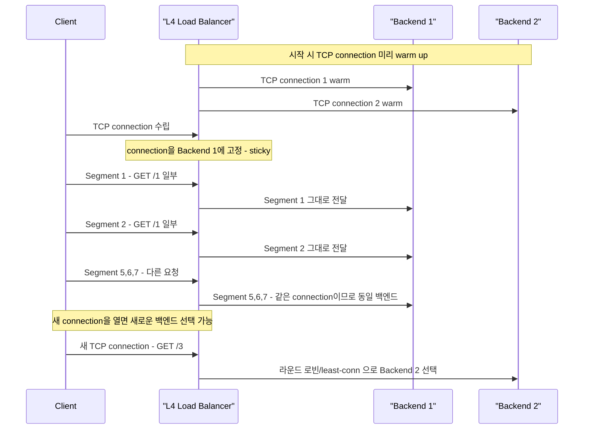
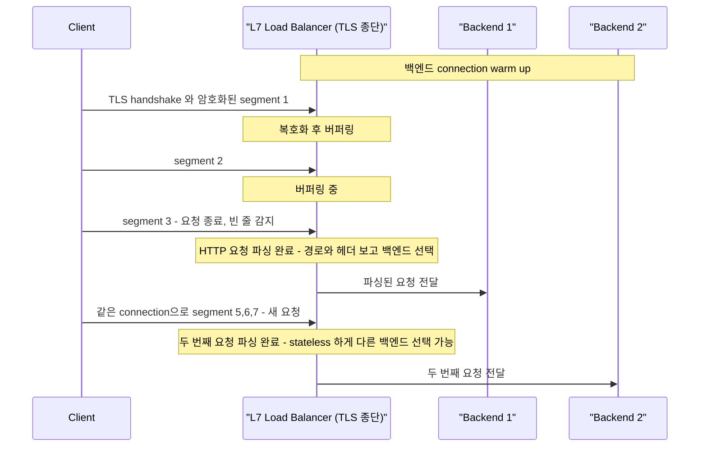
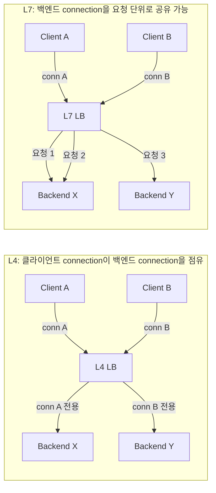

# 52. Layer 4 vs Layer 7 Load Balancers

## 강의 개요

백엔드 엔지니어라면 프록시(proxy)와 리버스 프록시(reverse proxy)의 동작 방식을 반드시 이해해야 한다. 프록시를 사용할 때 실제로 어떤 connection이 형성되고, 누가 누구와 통신하는지를 파악할 수 있어야 한다. 그 위에서 한층 더 중요한 개념이 바로 **Layer 4 / Layer 7 프록시(또는 리버스 프록시, 로드 밸런서)** 의 차이다.

이 강의에서는 다음을 다룬다.

- Layer 4 vs Layer 7의 본질적 차이
- 로드 밸런서란 무엇인가
- L4 로드 밸런서의 동작 원리, 장점과 단점
- L7 로드 밸런서의 동작 원리, 장점과 단점

> **로드 밸런서 vs 리버스 프록시**
> - 모든 로드 밸런서는 리버스 프록시이지만, 모든 리버스 프록시가 로드 밸런서는 아니다.
> - 리버스 프록시는 클라이언트 대신 백엔드에 요청을 전달할 뿐, 반드시 부하 분산 로직을 가질 필요는 없다.
> - 로드 밸런서는 여러 백엔드 사이에서 요청을 분산하는 로직을 갖춘 리버스 프록시의 한 형태다.
> - 단순한 "프록시(proxy)" 개념은 이와 별개의 주제다.

또한 로드 밸런서를 "리버스 프록시"로 바꿔 읽어도 본질적으로 동일하므로, 이 강의 내용은 리버스 프록시 일반에도 적용된다.

---

## OSI 모델 복습

| Layer | 이름 | 비고 |
|-------|------|------|
| 7 | Application | HTTP, gRPC, WebSocket 등 |
| 6 | Presentation | |
| 5 | Session | connection의 상태(state) 보관 (file descriptor, segment 수, byte 수 등) |
| 4 | Transport | TCP/UDP, port |
| 3 | Network | IP |
| 2 | Data Link | |
| 1 | Physical | |

백엔드 엔지니어가 주로 다루는 영역은 **Layer 7(애플리케이션)** 과 **Layer 4(전송)** 이다. 일부 엔지니어는 Layer 5(세션 계층)에서 file descriptor 관리, connection이 받은 segment/byte 수 추적 같은 작업도 한다. 이러한 connection 관련 상태 정보(stateful information)는 세션 계층에 저장된다.

---

## 로드 밸런서란

로드 밸런서는 **fault tolerant(장애 내성)** 한 시스템을 구축하기 위한 장치다. 클라이언트는 로드 밸런서에 요청을 보내고, 로드 밸런서는 하나 또는 여러 백엔드와 통신한다. 클라이언트는 백엔드가 몇 개인지 신경 쓸 필요가 없다. 바로 이 점이 리버스 프록시의 핵심 가치다.

---

## Layer 4 로드 밸런서

### 동작 원리

L4 로드 밸런서는 시작 시점에 백엔드 서버들과 **여러 개의 TCP connection을 미리 열어둔다 (warming up)**. 백엔드당 1개일 수도 있고 10개일 수도 있다. connection을 "따뜻하게" 유지하는 이유는 매 요청마다 SYN / SYN-ACK / ACK 3-way 핸드셰이크 비용을 지불하지 않기 위해서다. 이미 열려 있는 connection 위로 segment만 흘려보내면 되기 때문이다.

클라이언트가 L4 로드 밸런서와 connection을 맺으면, 그 connection에는 상태(state)가 부여되고 **백엔드 쪽 단 하나의 connection에 1:1로 묶인다 (tagging)**. L4는 port와 IP 주소만 다룰 뿐 데이터(segment)의 내용을 들여다보지 않는다는 계약(contract)을 따르기 때문에, 이 매핑이 깨지면 안 된다.

> **왜 1:1이어야 하는가?**
> L4는 stateful하다. TCP segment에는 sequence number가 있는데, 만약 같은 클라이언트의 segment를 백엔드 A와 B로 나눠 보내면 양쪽의 sequence가 어긋나 데이터가 깨진다. 따라서 segment를 받으면 데이터를 추출해 **묶여 있는 백엔드 connection 위에 그대로 다시 써준다 (rewrite)**. 클라이언트↔LB 와 LB↔백엔드는 엄연히 서로 다른 두 개의 TCP connection이다.



### 두 가지 모드

L4 로드 밸런서에는 크게 두 가지 동작 모드가 있다.

1. **일반 모드 (rewrite 모드)**
   - 클라이언트↔LB, LB↔백엔드의 **두 개의 TCP connection**을 유지한다.
   - 데이터를 읽어서 백엔드 connection으로 다시 써준다.

2. **NAT 모드**
   - 로드 밸런서가 클라이언트의 게이트웨이 역할을 한다 (흔하지는 않음).
   - 사실상 라우터처럼 동작하여 IP 패킷의 destination IP만 백엔드 IP로 바꿔준다.
   - 결과적으로 **클라이언트와 백엔드 사이에 단일 TCP connection**이 유지된다 (LB는 별도의 TCP 종단점을 만들지 않는다).
   - 비슷한 변형으로 **DR(Direct Routing) / DSR(Direct Server Return)** 모드가 있다. 이 모드에서는 요청만 LB를 거치고, 백엔드의 응답은 LB를 우회하여 클라이언트로 직접 돌아간다. 응답 트래픽이 큰 워크로드(예: 비디오 스트리밍)에서 LB 부담을 크게 줄여준다.

### 패킷 흐름 예시 (rewrite 모드)

- 클라이언트가 `44.1.1.2`(LB)로 IP 패킷을 보냄.
- LB는 데이터를 추출해 백엔드(`44.1.2.3`)로 가는 별도의 TCP connection 위에 그대로 다시 작성한다. 이때 source는 LB가 된다.
- 백엔드는 응답을 LB로 보낸다(destination=LB, source=백엔드).
- LB는 자신이 보유한 매핑 테이블을 보고 해당 응답을 원래 클라이언트 connection에 실어 보낸다(destination=클라이언트).
- 클라이언트는 이 모든 과정을 인지하지 못한다.

### 프로토콜 무지(無知)성과 그 의미

L4 LB는 데이터 내용을 전혀 모른다.

- HTTP인지, TLS로 암호화되었는지, gRPC인지, WebSocket인지, MySQL 프로토콜인지, Postgres인지 알지 못한다.
- 단지 "TCP segment의 묶음"으로 취급한다.

이 무지함은 **장점이자 단점**이다. 어떤 프로토콜이든 지원할 수 있게 해주지만, 동시에 데이터 기반의 똑똑한 결정은 할 수 없다.

### 성능 최적화 — MTU 활용

L4 LB가 단순히 read→write 만 하는 것은 아니다. 어느 정도 **버퍼링**을 활용하면 성능을 끌어올릴 수 있다. 예를 들어 클라이언트 쪽 MTU가 1500이고 백엔드 쪽 MTU가 9000(점보 프레임)이라면, LB가 작은 segment들을 모아 더 큰 단위로 백엔드에 전달하는 방식이 유리할 수 있다.

### L4 LB 장점

- **단순함과 효율성**: 데이터를 들여다보지 않으므로 처리 비용이 매우 낮다. port, IP, connection만 본다.
- **데이터 lookup 없음**: 대부분의 경우 segment를 그대로 백엔드에 전달한다.
- **보안성**: TLS를 종단(decrypt)할 필요가 없으므로 end-to-end 암호화가 그대로 유지된다. 서드파티 LB를 사용할 때 인증서와 개인키를 넘기지 않아도 된다는 것이 큰 장점이다.
- **프로토콜 무관(agnostic)**: WebSocket, gRPC, 데이터베이스 프로토콜 등 어떤 프로토콜이든 지원한다.
- **NAT/DSR 모드에서는 단일 TCP connection**으로 클라이언트와 백엔드를 직접 연결할 수 있다.

### L4 LB 단점

- **스마트한 부하 분산 불가**: 데이터를 모르므로 "이 요청은 무거우니 큰 서버로 보내자" 같은 결정을 내릴 수 없다. 다만 여러 IP/port를 노출하고 "이 port로 들어오면 저 백엔드로" 같은 트릭은 쓸 수 있다.
- **마이크로서비스에 부적합**: 더 똑똑한 라우팅 로직이 필요한 환경에는 맞지 않다 (IP/port 트릭으로 일부 우회는 가능).
- **Sticky connection (private connection)**: 한 connection의 모든 segment는 단 하나의 백엔드로 가야 하고, 그 백엔드 connection을 다른 클라이언트가 재사용할 수 없다. 결과적으로 **백엔드 connection이 고갈될 위험**이 있다.
- **요청 단위 부하 분산 불가**: 한 connection으로 100개의 요청을 보내도 모두 같은 백엔드로 간다.
- **캐싱 불가**: 데이터의 의미를 모르므로 동일한 바이트라도 그것이 무슨 요청인지 알 수 없다 (같은 hash라도 의미는 다를 수 있다). 따라서 응답 캐싱이 불가능하다.
- **L7→L4 다운그레이드 위험**: HTTP `Upgrade` 헤더로 connection을 WebSocket 이나 cleartext HTTP/2로 업그레이드하면, L7 LB는 종종 L4 모드로 다운그레이드된다. 그 순간 L7 단계에서 적용하던 헤더 차단, 인증 차단 등의 보안 룰이 모두 무력화된다.

---

## Layer 7 로드 밸런서

### 동작 원리

L7 LB도 시작 시 백엔드와의 TCP connection을 warm up 해 두는 구조 자체는 같다. 다만 클라이언트가 연결되면 **프로토콜에 특화된 (protocol-specific)** 처리를 수행한다. 즉, "클라이언트가 무엇을 보내고 있는지"를 LB가 이해해야 한다.

L7 LB는 클라이언트가 보낸 **하나의 "논리적 요청(logical request)" 단위**를 버퍼링하여 파싱한 뒤, 그 시점에 백엔드를 선택해 전달한다.

### "논리적 요청"이란?

HTTP를 예로 들면 다음과 같다.

```
GET /path HTTP/1.1
Header1: value1
Header2: value2
<빈 줄>
```

- start line(`GET /path HTTP/1.1`) + 헤더들 + 빈 줄(연속된 CRLF)이 있어야 한 요청이 완성된다 (요청 본문이 있다면 `Content-Length` 또는 `Transfer-Encoding: chunked` 로 길이를 결정한다).
- 이 요청은 1개의 segment에 담길 수도 있고 100개의 segment에 걸쳐 도착할 수도 있다.
- LB는 segment들을 계속 읽어 버퍼링하다가, **요청의 끝**을 인식한 시점에야 비로소 "어느 백엔드로 보낼지"를 결정한다.

### TLS 종단(termination)

데이터를 파싱하려면 **암호화된 콘텐츠를 복호화**해야 한다.

- 따라서 L7 LB는 TLS를 종단해야 하며, 그래서 **"TLS Terminator"** 라고도 불린다.
- 즉, 웹사이트의 인증서와 **개인키가 L7 LB 안에 존재**해야 한다. 그래야만 LB가 클라이언트 입장에서 해당 도메인을 대신 응대할 수 있다.
- 보안상의 이유로 이 방식을 꺼리는 조직도 있다.
- LB↔백엔드 구간을 다시 TLS로 감싸는 **"re-encryption"** 구성으로 내부 구간까지 암호화를 유지할 수도 있다.

### 동작 흐름



### Connection 모델: L4 vs L7



L4에서는 클라이언트 connection이 **백엔드 connection을 사실상 독점(private)** 한다. 반면 L7에서는 백엔드 connection을 여러 클라이언트의 요청이 나누어 쓸 수 있어 connection 자원을 효율적으로 활용한다.

### HTTP Smuggling 주의

L7 LB와 백엔드가 "요청의 시작과 끝"을 다르게 해석하면 **HTTP smuggling 공격**이 발생할 수 있다. 예를 들어 LB는 `Content-Length` 를 기준으로 요청을 끊고 백엔드는 `Transfer-Encoding: chunked` 를 기준으로 끊는 식의 불일치가 대표적이다. 자세한 내용은 강의 범위를 벗어나므로 별도 학습이 필요하다.

### L7 LB 장점

- **스마트한 부하 분산**: 경로, 헤더, 인증 정보 등을 보고 라우팅을 결정할 수 있다.
  - `/pictures` → 이미지 서버
  - `/comments` → 댓글 서버
  - `/post-comment` → 쓰기 워크로드용 서버
  - 분석 요청 → SAP HANA, Postgres, MariaDB ColumnStore 등 워크로드에 맞는 서버
- **백엔드 connection의 효율적 사용**: 요청 단위로 분배되므로 connection 풀을 잘 활용한다.
- **캐싱 가능**: 콘텐츠를 이해하므로 응답을 캐싱할 수 있다.
- **마이크로서비스/API Gateway 에 적합**: 인증, 권한, 헤더 조작 등 API Gateway가 담당할 일을 LB 단에서 처리할 수 있다.

### L7 LB 단점

- **비용과 리소스 부담이 큼**: 버퍼링, 파싱, 복호화 같은 추가 작업이 따라온다.
- **TLS 종단 필요**: 인증서와 개인키를 LB가 보유해야 하므로 보안 정책상 부담이 된다.
- **버퍼링으로 인한 지연**: 요청을 끝까지 받아야 백엔드로 보낼 수 있으므로 LB가 병목이 될 수 있다.
- **프로토콜을 반드시 이해해야 함**: HAProxy, nginx 같은 LB에 "WebSocket 지원해 달라", "gRPC 지원해 달라", "Postgres 프로토콜 지원해 달라"는 요구가 끊이지 않는 이유가 여기에 있다. LB가 모르는 프로토콜은 L7 방식으로 분산할 수 없으며, 이 경우 L4로 내려서 처리해야 한다.

> **참고**: HAProxy 와 nginx 모두 L4(TCP/stream)와 L7(HTTP) 모드를 지원한다. HAProxy 는 `mode tcp` / `mode http` 로 전환하고, nginx 는 `http` 블록으로 L7 을, `stream` 블록(1.9.0 이상)으로 L4 를 처리한다.

---

## L4 vs L7 비교 표

| 항목 | Layer 4 LB | Layer 7 LB |
|------|------------|------------|
| 다루는 데이터 단위 | TCP segment | 논리적 요청 (예: HTTP 요청) |
| 콘텐츠 파싱 | 하지 않음 | 필수 |
| TLS 종단 | 불필요 (end-to-end 유지) | 필요 (TLS Terminator) |
| 인증서/개인키 위치 | 백엔드 | 로드 밸런서 |
| 프로토콜 의존성 | 무관 (어떤 프로토콜이든 OK) | LB가 프로토콜을 이해해야 함 |
| 부하 분산 단위 | TCP connection | 개별 요청 |
| Sticky 여부 | 항상 sticky (connection 단위) | 기본 stateless |
| 백엔드 connection | 클라이언트가 점유(private) | 여러 클라이언트가 공유 |
| 스마트 라우팅 (path/header) | 불가 (port/IP 트릭만) | 가능 |
| 캐싱 | 불가 | 가능 |
| API Gateway 기능 | 불가 | 가능 (인증/권한/헤더) |
| 리소스 사용량 | 낮음 | 높음 (버퍼링·복호화·파싱) |
| 보안 | 데이터를 보지 않으므로 안전 | 인증서 노출 부담 |
| 마이크로서비스 적합도 | 부적합 | 적합 |
| 단일 TCP connection 모드 | NAT/DSR 모드에서 가능 | 불가 (항상 두 개의 connection) |
| 알려진 위험 | L7→L4 다운그레이드 시 보안 룰 무력화 | HTTP smuggling 공격 가능성 |

---

## 선택 기준

| 상황 | 추천 |
|------|------|
| 프로토콜이 LB에서 해석 불가 (커스텀 바이너리, 새로운 프로토콜) | **L4** |
| TLS를 end-to-end로 유지해야 하는 보안 요구 | **L4** |
| WebSocket / 데이터베이스 / gRPC over plain TCP 등 임의 프로토콜 다중 지원 | **L4** |
| 최대한의 처리 성능과 낮은 LB 오버헤드 | **L4** |
| 마이크로서비스 환경에서 path/header 기반 라우팅 필요 | **L7** |
| API Gateway 기능(인증/요율 제한/헤더 조작) | **L7** |
| 응답 캐싱 활용 | **L7** |
| 백엔드 connection 풀을 효율적으로 공유해 사용 | **L7** |
| 요청 단위로 가장 한가한 백엔드에 분산하고 싶음 | **L7** |

> 정답은 없다. 각각의 로드 밸런서가 적합한 상황이 다르므로, 시스템의 요구사항과 보안 정책에 맞게 선택해야 한다.

---

## 요약

- **로드 밸런서**는 부하 분산 로직을 갖춘, 한층 똑똑한 리버스 프록시이다.
- **L4 LB**는 TCP segment 수준에서 동작하며, 프로토콜에 무지하기에 어디에나 쓸 수 있고 빠르지만, 똑똑한 결정과 캐싱은 불가능하다. connection이 sticky하다.
- **L7 LB**는 애플리케이션 프로토콜을 이해해 똑똑한 라우팅·캐싱·API Gateway 기능을 제공하지만, TLS 종단이 필요하고 비용이 크며 프로토콜 지원에 제약이 있다.
- L7 LB가 `Upgrade`로 인해 L4로 다운그레이드되는 순간, 적용해 두었던 L7 보안 룰이 모두 무력화될 수 있다는 점은 운영상 반드시 인지해야 한다.
