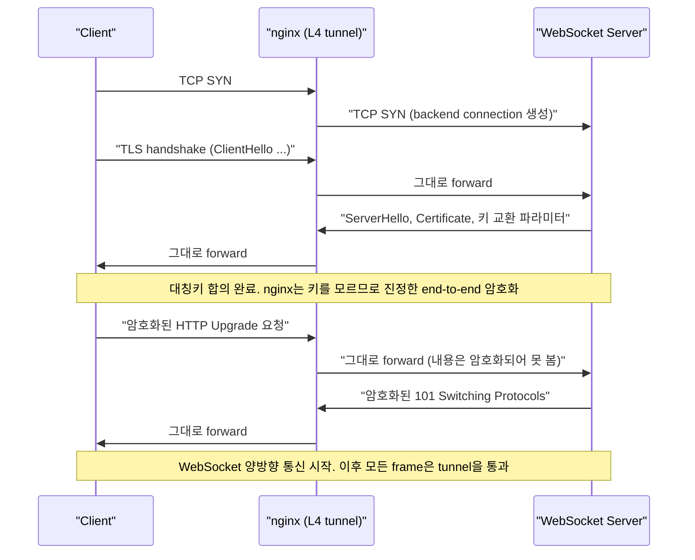
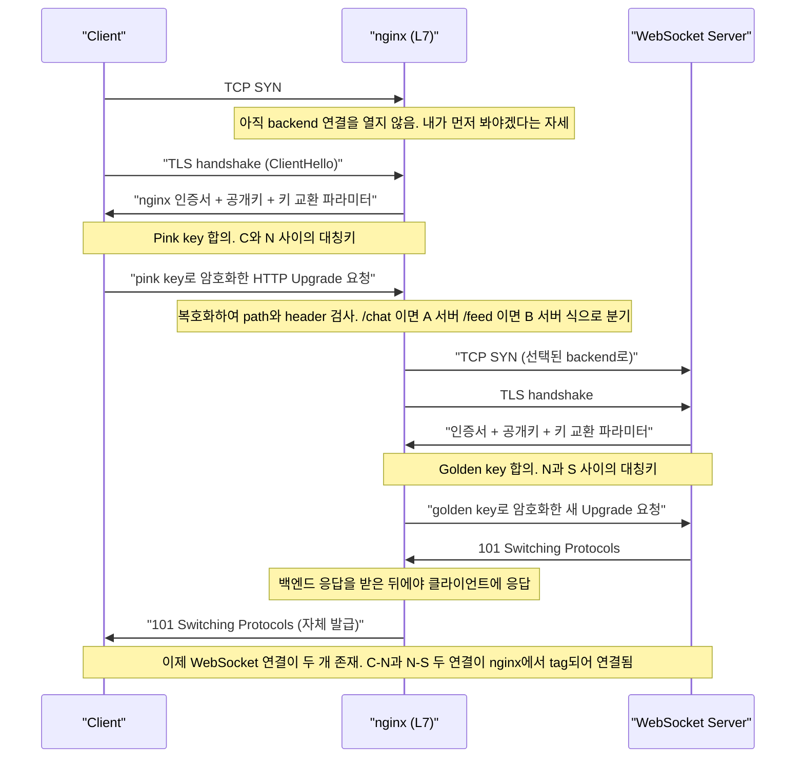
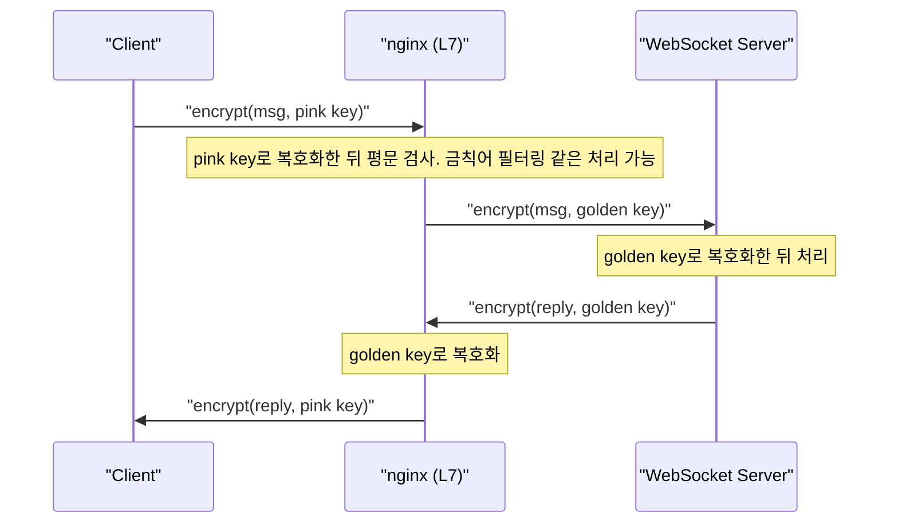
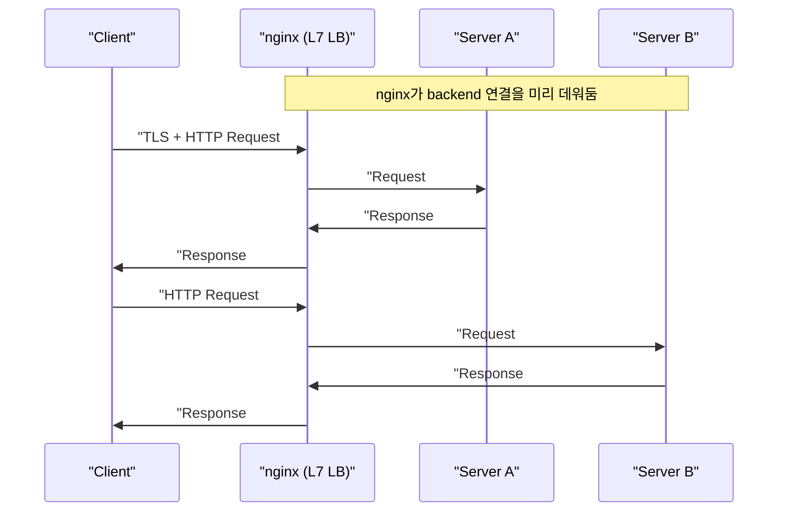
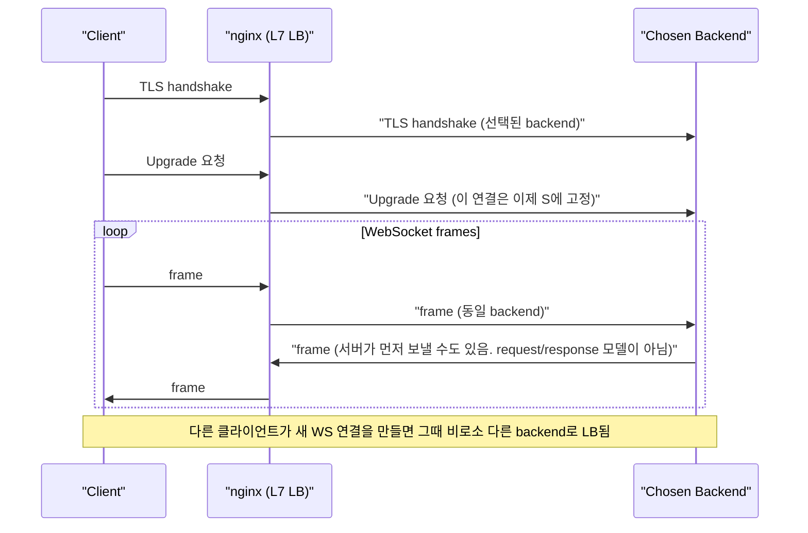

# 53. WebSocket Proxying (한국어 학습 노트)

WebSocket을 reverse proxy 또는 load balancer 뒤에 두고 운영할 때, 동작 방식은 프록시가 **L4(전송 계층)**에서 동작하는지 **L7(애플리케이션 계층)**에서 동작하는지에 따라 완전히 달라진다. 이 문서는 두 계층의 차이부터 정리하고, 각 계층에서 WebSocket 트래픽이 실제로 어떻게 흘러가는지, TLS termination은 어디서 일어나는지, 그리고 load balancing이 어느 수준에서 이루어지는지를 살펴본다.

---

## 1. L4 vs L7: 프록시는 무엇을 볼 수 있는가

### 1.1 L4 (Transport Layer, TCP/IP)

OSI 모델의 4계층은 TCP/IP 영역이다. 엔지니어 관점에서 풀어 쓰면 다음과 같다.

- **IP (Layer 3)**: destination IP, source IP, 그리고 데이터를 실은 packet.
- **TCP (Layer 4)**: 그 위에서 source port와 destination port를 추가하고, SYN·ACK·sequence number 등으로 **stateful한 connection** 개념을 부여한다. 흔히 말하는 "TCP segment"는 결국 IP packet 안에 TCP 헤더가 얹힌 형태다.

따라서 L4 프록시가 볼 수 있는 정보는 다음 정도로 한정된다.

| 항목 | 볼 수 있나? |
|---|---|
| Source / Destination IP | O |
| Source / Destination Port | O |
| Connection / Sequence 상태 | O |
| TCP 페이로드(애플리케이션 데이터) | **보면 안 됨** |

페이로드를 들여다보지 않는 것이 원칙이다. TLS handshake가 먼저 이루어졌다면 데이터가 암호화되어 있어 **볼 수 없고**, 평문 포트(예: port 80)라 하더라도 규칙상 들여다보지 않는다. 일부 라우터나 미들박스가 이 규칙을 어기기도 하지만, 그렇게 되는 순간 더 이상 순수한 L4 장비가 아니다.

### 1.2 L7 (Application Layer)

L5와 L6은 이 논의에서 큰 의미가 없으므로 건너뛴다. **L7은 애플리케이션 계층**이다. L7 프록시는 정의상 다음을 모두 한다.

- L4에서 보던 정보 + 애플리케이션 페이로드를 **모두 본다**.
- TLS를 **반드시 termination** 한다 (자기 인증서를 직접 서빙).
- HTTP method, header, path 등 애플리케이션 컨텍스트를 활용한다.

이 덕분에 L7 프록시는 다음과 같은 "스마트한" 라우팅이 가능하다.

- `/chat` 으로 오는 요청 → A 서버
- `/media` 로 오는 요청 → 더 강력한 B 서버 (미디어가 채팅보다 무거우므로)
- `/index.html` → 정적 파일 서버

L4 프록시는 페이로드를 보지 못하므로 이런 경로 기반 라우팅이 불가능하다.

---

## 2. 용어 정리: Proxy vs Load Balancer

- **Reverse Proxy**: 클라이언트 연결을 종료(terminate)한 뒤 백엔드로 전달.
- **Load Balancer**: reverse proxy의 한 종류. 여러 백엔드 중 하나를 "스마트하게" 골라서 보낸다.

> 모든 load balancer는 reverse proxy지만, 모든 reverse proxy가 load balancer는 아니다.

이 문서에서 "proxy"라고 하면 reverse proxy(그리고 그 부분집합으로서 load balancer / API gateway)를 의미한다.

---

## 3. L4 Proxy에서의 WebSocket

### 3.1 핵심 아이디어: Dumb Tunnel

L4 프록시(예: nginx의 stream 모듈)가 WebSocket을 처리하는 방식은 단순하다. **모든 것을 그냥 터널로 흘려보낸다.**

- 클라이언트가 SYN을 보내 연결을 요청하면, 프록시는 백엔드로 새로운 연결을 만든다.
- 이후 이 frontend 연결로 들어오는 모든 데이터는 그냥 backend 연결로 그대로 흘려보낸다.
- 프로토콜이 HTTP인지, gRPC인지, WebSocket인지 **신경 쓰지 않는다.**

> 이는 한 가지 구현 방식이며, 일부 프록시는 stateful한 연결 예약이 비싸기 때문에 더 똑똑한 최적화를 하기도 한다. 다만 개념적으로는 "blind tunnel"이라고 이해하면 된다.

따라서 nginx가 WebSocket 프로토콜을 알 필요조차 없다. 백엔드만 WebSocket을 이해하면 된다. 그리고 backend 연결은 해당 클라이언트 전용으로 **private하게** 유지된다.

### 3.2 L4 프록시 + TLS + WebSocket 시나리오

구성: Client ↔ nginx(L4, port 443) ↔ WebSocket Server(port 443)



핵심 포인트:

- **TLS는 클라이언트와 서버 사이에서 직접 종료된다.** (EC)DHE 등 키 교환으로 합의된 공유 비밀에서 파생된 대칭키는 클라이언트와 서버만 가진다.
- nginx는 키가 없으므로 데이터를 복호화할 수 없다. 이것이 진정한 end-to-end encryption이다(미들박스가 페이로드를 보지 못함).
- nginx는 "이게 Upgrade 요청이다"라는 사실조차 모른다. 그저 포트로 들어온 바이트를 백엔드로 그대로 흘려보낼 뿐이다.
- backend 연결은 해당 클라이언트의 frontend 연결과 1:1로 묶여 있다.

### 3.3 운영상 주의점

- **Timeout 설정이 매우 중요하다.** WebSocket은 한참 동안 데이터가 흐르지 않을 수 있다. 기본 타임아웃이 짧으면 nginx가 idle 상태로 판단해 연결을 끊어버린다.
- 클라이언트가 연결을 닫으면, 그에 묶인 private backend 연결도 안전하게 닫을 수 있다.

---

## 4. L7 Proxy에서의 WebSocket

### 4.1 핵심 아이디어: 두 개의 독립된 WebSocket 연결

L7 프록시는 페이로드를 봐야 하므로 TLS를 직접 종료한다. 즉 클라이언트와 nginx 사이, 그리고 nginx와 백엔드 사이에 **각각 독립된 두 개의 TLS 세션과 WebSocket 연결**이 만들어진다. 두 연결은 nginx 내부에서 서로 매핑(tagged)되어 데이터를 주고받는다.

> 이 문서에서 등장하는 **pink key / golden key**는 비유적인 색깔 라벨일 뿐, 기술적 용어가 아니다. 클라이언트-프록시 구간의 대칭키를 pink, 프록시-백엔드 구간의 대칭키를 golden으로 부르며 두 키가 서로 다르다는 점을 강조한 것이다.

### 4.2 L7 프록시 + TLS + WebSocket 시나리오



### 4.3 메시지 단위 데이터 흐름



### 4.4 인증서/키 운영

- L7 프록시는 클라이언트에 자기 인증서를 보여줘야 하므로 **인증서와 private key를 nginx에 두어야 한다.**
- 서버 인증서/키를 nginx에도 그대로 공유하는 방식과 nginx 전용 인증서를 따로 발급하는 방식이 있다. 전자는 키가 노출될 수 있는 표면이 늘어나므로 일반적으로 권장하지 않는다.
- 백엔드와 nginx 사이도 TLS로 암호화하는 편이 권장된다. 특히 클라우드 환경에서는 software-defined networking 등으로 트래픽이 어디서 sniff될지 모르므로, 사설 LAN이 아니라면 백엔드 구간도 암호화하는 편이 안전하다.

### 4.5 L7만 가능한 것들

- **Path 기반 라우팅**: `/chat` → WebSocket 서버, `/index.html` → 정적 페이지 서버.
- **콘텐츠 기반 정책**: 평문을 볼 수 있으므로 금칙어 필터, 메시지 변환, 헤더 주입 등이 가능하다.
- L4에서는 위 어느 것도 할 수 없다.

---

## 5. HTTP Upgrade Handshake

WebSocket은 결국 HTTP 위에서 시작된 뒤 프로토콜을 전환하는 방식이다(RFC 6455). 핵심 헤더는 다음과 같다(강의에서는 단순화해서 "upgrade request"와 "switching protocols"로만 표현했다).

```http
GET /chat HTTP/1.1
Host: example.com
Upgrade: websocket
Connection: Upgrade
Sec-WebSocket-Key: <base64 nonce>
Sec-WebSocket-Version: 13
```

서버 응답:

```http
HTTP/1.1 101 Switching Protocols
Upgrade: websocket
Connection: Upgrade
Sec-WebSocket-Accept: <hash>
```

- `Sec-WebSocket-Accept` 값은 클라이언트가 보낸 `Sec-WebSocket-Key`에 고정 GUID(`258EAFA5-E914-47DA-95CA-C5AB0DC85B11`)를 이어 붙인 뒤 SHA-1 해시를 base64로 인코딩해 만든다. 단순한 echo가 아니라 핸드셰이크가 정상적으로 이루어졌음을 검증하는 용도다.
- **L4 프록시**는 이 헤더를 보지도 이해하지도 않는다. 그저 바이트를 흘려보낼 뿐이다.
- **L7 프록시**는 이 헤더를 직접 해석하고, 백엔드를 향해 **새로운 Upgrade 요청을 별도로 발급**한다. 즉 클라이언트가 받은 `101 Switching Protocols` 응답은 nginx가 자체적으로 발급한 것이지, 서버 응답을 그대로 통과시킨 것이 아니다.
- 참고로 nginx가 HTTP 모드에서 WebSocket을 정상적으로 프록시하려면 `proxy_set_header Upgrade $http_upgrade;`와 `proxy_set_header Connection "upgrade";` 설정이 필요하다. HAProxy는 hop-by-hop 헤더를 자동으로 처리하지만 `timeout tunnel` 같은 별도 타임아웃 튜닝이 권장된다.

---

## 6. 일반 HTTP Load Balancing과의 비교

WebSocket의 특이점을 이해하려면 일반 HTTP request에서 L7 load balancer가 어떻게 동작하는지와 비교해 보면 좋다.

### 6.1 일반 HTTP의 L7 load balancing

- nginx는 보통 백엔드로의 TCP connection을 **미리 여러 개 열어 두고(preheat)** 재사용한다(단, 항상 그런 것은 아니며 메모리, 설정, 상황에 따라 달라진다).
- 클라이언트가 새 TCP 연결을 열어 TLS handshake 이후 request를 보내면, nginx는 그 요청을 복호화해서 본 뒤 round robin 등의 알고리즘으로 **요청 단위로** 백엔드를 고를 수 있다.
- 같은 클라이언트의 다음 요청은 **다른** 백엔드로 갈 수도 있다. request/response 모델이기 때문에 가능한 일이다.



### 6.2 WebSocket의 L7 load balancing

WebSocket은 다르다.

- 한 번 Upgrade가 일어나면 그 연결은 **특정 백엔드 한 대에 묶인다**. 이후 모든 frame은 그 백엔드로만 흘러간다. 사실상 tunnel처럼 동작한다.
- Load balancing은 **메시지 단위가 아니라 connection 단위**로만 일어난다.
- 즉 클라이언트 N명이 붙으면 백엔드 연결도 N개가 점유된다. **풀링이나 공유는 없다.**



> 왜 메시지 단위로 LB하지 않는가? WebSocket은 stateful하고 순서가 보장되어야 하는 프로토콜이다. 같은 세션의 frame을 다른 서버로 보내면 받는 서버 입장에서는 컨텍스트가 없어 처리할 수 없다. 따라서 같은 연결의 메시지는 항상 같은 서버로 간다.

### 6.3 진짜 메시지 단위 load balancing이 필요하다면

원하면 **WebSocket 메시지 단위로 분산하는 시스템을 직접 만들 수는 있다.** 단, 프록시가 해주는 것이 아니라 애플리케이션 레이어에서 만들어야 한다. 예를 들어 다음과 같이 설계할 수 있다.

- 모든 메시지가 흘러드는 중앙 메시지 브로커를 두고
- 백엔드 워커들이 각자의 컨텍스트와 무관하게 메시지를 꺼내서 처리

이런 패턴은 "각 메시지가 독립적이며, 어떤 서버가 받든 상관없는" 유스케이스(예: 다자 채팅 fan-out)에서 효과적이다. 어디까지나 use case에 따라 다르다.

---

## 7. 정리: L4 vs L7 WebSocket 프록시 비교표

| 항목 | L4 Proxy | L7 Proxy |
|---|---|---|
| 페이로드를 보는가 | 못 봄 (그리고 봐서도 안 됨) | 봄 (TLS 종료 후) |
| TLS 종료 위치 | **백엔드** (프록시는 그냥 통과) | **프록시** (그리고 백엔드와 또 한 번) |
| 대칭키 보유자 | Client, Server | Client+Proxy(pink), Proxy+Server(golden) |
| WebSocket 프로토콜 이해 필요 | X | O (Upgrade 헤더 처리) |
| Path/Header 기반 라우팅 | 불가 | 가능 |
| 연결 모델 | 1개의 end-to-end tunnel | 2개의 독립된 WS 연결을 묶음 |
| Load balancing 단위 | connection | connection (WebSocket인 경우에도) |
| Backend 연결 풀링 | 없음 (1:1 전용) | WebSocket은 없음 (HTTP는 가능) |
| 백엔드별 인증서/키 운영 | 백엔드만 보유 | 프록시도 인증서/키 보유 필요 |
| 콘텐츠 필터링/변환 | 불가 | 가능 (예: 금칙어 필터) |

---

## 8. 모범 사례 / 운영 팁

- **Timeout**: WebSocket은 idle 시간이 길어질 수 있다. L4든 L7이든 read/send timeout을 충분히 늘리거나 keep-alive ping을 설정해 연결이 끊어지지 않게 한다.
- **백엔드 구간 암호화**: 클라우드 환경이라면 nginx와 백엔드 구간도 TLS를 사용한다. 데이터 민감도에 따라 결정한다.
- **인증서 공유 정책**: 가능하면 nginx에 별도 인증서를 두고, 서버의 private key를 그대로 복사해 쓰지 않는다.
- **연결 수 산정**: L7에서 N명의 동시 클라이언트는 곧 N개의 백엔드 연결을 의미한다. 풀링이 없다는 점을 capacity planning에 반영한다.
- **언제 L4를 쓸까**: end-to-end TLS를 그대로 유지하고 싶거나 단순한 fan-out tunneling만 필요한 경우.
- **언제 L7을 쓸까**: path 기반 라우팅, 콘텐츠 기반 정책, A/B 라우팅 등 애플리케이션 컨텍스트가 필요한 경우.
- **메시지 단위 분산이 필요하면**: 프록시에 의존하지 말고 애플리케이션 레이어에서 별도 메시지 브로커와 워커 구조로 설계한다.
